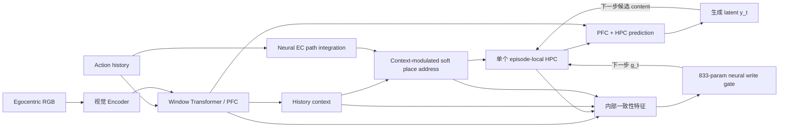

# M1b 3D Neural Write Gate：架构、训练与验证结果

## 当前结论

在冻结的 20k-step M1b 上，只增加一个 `833` 参数的因果神经写门，可以学出“早期写入、预测失真后停止”的策略。进一步用训练集上的无标签 gate-logit 统计消除 seed 间尺度漂移，并在三 seed validation 上冻结唯一共享阈值 `z=-0.35`。

完整 512-test 的三训练 seed 结果为 `27.059 / 28.137 / 28.321 e-3`，即 `27.839 ± 0.682 e-3`。它们都优于原始全程写入 `29.933 e-3`，三 seed 平均改善 `7.00%`；但平均仍比固定 K16 的 `27.157 e-3` 高 `2.51%`。因此当前最准确的结论是：**无标签标准化解决了 hard gate 的阈值尺度漂移，神经 gate 能稳定改善 full-write，但实例选择质量尚未稳定超过固定 K16。**

## 固定的 M1b

- 数据：MemoryMaze3D paper-aligned open `9x9`，`4096 / 512 / 512` train/val/test。
- base checkpoint：`runs/remap_former/memorymaze3d_paper_open9_m1b_seed1701/next_frame/checkpoint_final.pt`。
- 评估：20 步真实 context，随后 44 步只输入 action。
- PFC：window Transformer，window `32`。
- EC/place/HPC：action 驱动的 neural EC、soft sparse place address、episode-local covariance-corrected fast weights。
- 不增加 memory slots，不增加第二套 fast weights，不改 base M1b 权重。

## Neural Write Gate

每个生成状态得到一个因果置信度：



```text
f_t = internal_features(PFC_t, HPC_t, context_t, place_t, address_t)
h_t = 0.8 h_(t-1) + 0.2 f_t
g_t = sigmoid(MLP([f_t, h_t]))
```

`MLP` 为 `24 -> 32 -> 1`，共 `833` 个参数。`g_t` 在当前状态预测完成后产生，并只控制该状态在下一步是否写入 HPC：

```text
content_update_t    <- g_t * content_update_t
covariance_update_t <- g_t * covariance_update_t
write_count_t       <- g_t * write_count_t
```

soft 模式直接使用 `g_t in [0,1]`。hard 模式先在训练集上估计每个 gate 的 logit 均值与标准差，再使用三个 seed 共享的标准化阈值：

```text
z_t = (logit(g_t) - mean_train) / std_train
hard_write_t = 1[z_t >= -0.35]
```

训练统计不读取目标帧或标签；`z=-0.35` 只按三 seed validation 平均 MSE 选择一次，随后在三个 test512 上冻结。

### Gate 只读取的 12 个内部量

1. PFC 与 HPC prediction cosine。
2. PFC 与 HPC relative RMSE。
3. fused prediction 与 PFC relative RMSE。
4. fused prediction 与 HPC relative RMSE。
5. PFC/HPC norm ratio。
6. fused prediction RMS。
7. HPC retrieval RMS。
8. 当前与上一 context cosine。
9. context relative RMSE。
10. place peak。
11. place entropy。
12. address peak。

不存在显式 rollout age、固定 K16 token、位置、朝向、room id、context label、place id 或未来 RGB 输入。

## 因果边界

- 真实 context 帧始终可读、可写。
- rollout 开始后，未来 RGB read/write 都严格为 `0`。
- gate 在预测 `y_t` 后计算；它不能影响已经产生的 `y_t`，只决定 `y_t` 是否进入下一步 HPC state。
- 训练时真值只用于 pixel rollout loss 和预测可靠性排序标签；推理时 gate 不读取真值。
- base M1b 全冻结，梯度只更新 `833` 参数 gate。

## 稳定训练配方

早期 `batch=1, 5 updates, lr=1e-2` pilot 能得到好单 seed，但会被第一批极端 rollout 劫持。正式稳定配方固定为：

| 项目 | 设置 |
|---|---:|
| updates | 20 |
| batch size | 2 |
| context / rollout | 20 / 44 |
| learning rate | `3e-3` |
| base model | frozen |
| rollout loss | pixel MSE |
| quality ranking weight | `0.05` |
| latent loss weight | `0` |
| open prior | `0` |
| train seeds | 1702 / 1703 / 1704 |

排序损失只要求同一 rollout 内，预测误差更低的生成状态应有更高 gate score。它不提供 K16 或时间标签；总写入强度仍由 rollout pixel loss 决定。

## 无标签 Score Calibration

三个 gate 都在 train split 的前 `256` 个 episode 上做 soft causal rollout，共收集 `11264` 个 gate 决策。只统计 gate 自身 logit，不读取未来 RGB、预测误差或任务标签。

| seed | train logit mean | train logit std | `z=-0.35` 对应原始概率 |
|---|---:|---:|---:|
| 1702 | 0.73048 | 0.08694 | 0.66820 |
| 1703 | 0.77237 | 0.04739 | 0.68044 |
| 1704 | 0.80792 | 0.02762 | 0.68960 |

原始尺度的标准差相差超过三倍，解释了同一 probability threshold 跨 seed 不稳定。标准化后的平均时间轨迹高度一致：三 seed 在 h16 的平均分数分别为 `z=-0.35/-0.33/-0.34`。因此这里校准的是模型输出尺度，而不是给每个 seed 单独挑任务最优阈值。

## Validation 64

所有数值为 44-step mean pixel MSE x `1e-3`。base、K0 和 K16 在同一批 64 条 validation episode、同一 fp32 evaluator 中重算。

| 方法 | seed1702 | seed1703 | seed1704 | 均值 ± sample std |
|---|---:|---:|---:|---:|
| 原始 full-write | 31.080 | 31.080 | 31.080 | 31.080 |
| 固定 K16 | 26.167 | 26.167 | 26.167 | 26.167 |
| **Neural soft** | **28.022** | **28.086** | **28.103** | **28.070 ± 0.043** |
| 旧 hard，各 seed 原始阈值 | 25.602 | 28.754 | 26.517 | 26.958 ± 1.621 |
| **校准 hard，共享 `z=-0.35`** | **25.441** | **28.428** | **25.900** | **26.589 ± 1.608** |

### 判断

1. 共享 `z=-0.35` 在 1703 和 1704 上都是扫描最优，在 1702 上与最优 `z=-0.30` 只差 `0.053 e-3`。
2. 校准 hard 三 seed 平均比 full-write 改善 `14.45%`，比旧的逐 seed 原始阈值平均再改善 `0.368 e-3`。
3. 校准 hard 的 validation 平均仍比 K16 高 `1.69%`，seed1703 仍是明确弱点。
4. soft gate 方差低，但平均比 K16 高 `7.27%`，且旧单 seed test 已证明它的 validation 收益没有可靠迁移。

## 冻结三 Seed Test512

根据三 seed validation 平均冻结 `z=-0.35`。随后每个训练 seed 在同一完整 `512`-episode test 上只运行这一条 hard 策略，不根据 test 继续调模型或阈值。

| 方法 | 44-step mean | sample std | 相对 full | 相对 K16 |
|---|---:|---:|---:|---:|
| 原始 full-write | 29.933 | 0 | 基准 | +10.22% |
| 固定 K16 | **27.157** | 0 | **-9.27%** | 基准 |
| hard seed1702 | 27.059 | - | -9.60% | -0.36% |
| hard seed1703 | 28.137 | - | -6.00% | +3.61% |
| hard seed1704 | 28.321 | - | -5.38% | +4.29% |
| **校准 hard 三 seed** | **27.839** | **0.682** | **-7.00%** | **+2.51%** |

| seed | h1–16 | post-window | h32 | h44 | 写入次数 / 44 |
|---|---:|---:|---:|---:|---:|
| 1702 | 10.027 | 43.642 | 39.351 | 44.715 | 17.89 |
| 1703 | 10.034 | 46.820 | 39.907 | 49.713 | 21.73 |
| 1704 | 10.045 | 46.460 | 40.727 | 48.383 | 18.57 |

### Test 判断

1. 三个 seed 都优于 full-write，改善范围为 `5.38%` 到 `9.60%`。
2. seed1702 略优于 K16，但 1703/1704 分别比 K16 高 `3.61%/4.29%`；三 seed 平均不能宣称追平 K16。
3. 三 seed 平均写入约 `19.40 / 44` 次。h1–16 写入率约 `94.95%`，h17–44 约 `15.02%`，符合“早写晚停”，但弱 seed 在后半程继续写得过多。
4. hard gate 没有 age/K 输入；不同 seed 的原始阈值由训练分布统计自动换算，不是手工塞入 K16。
5. `future_ground_truth_reads = 0`，`future_ground_truth_writes = 0`。
6. 旧 seed1702 `threshold=0.67` 的单 seed test `27.174 e-3` 仍保留为历史复现，但不再作为多 seed headline。

## 最终边界

- **成立**：现有单 HPC 上的 causal neural gate 可以在三个 held-out test 上稳定改善 full-write。
- **成立**：无标签 train-logit 标准化消除了 hard threshold 的输出尺度漂移；一个共享 `z` 可用于三个 seed。
- **未成立**：三 seed 平均追平或超过固定 K16。
- **未成立**：soft gate 的 validation 改善未迁移到 test。
- **当前瓶颈**：不是 threshold calibration，而是 gate 的实例选择质量，特别是后半程误写。
- **后续最值得做**：直接监督或蒸馏“写入的反事实收益”，并保持单一 HPC；不增加 memory slot、第二套 fast weights或 oracle 输入。

## 代码与产物

- gate 模块：`remap_former/memorymaze3d_write_gate.py`
- 训练：`train_memorymaze3d_write_gate.py`
- 无标签分数校准：`calibrate_memorymaze3d_write_gate_scores.py`
- 统一评估：`evaluate_memorymaze3d_write_gate.py`
- 回归测试：`test_memorymaze3d.py`
- 三 seed 机器汇总：`reports/memorymaze3d_write_gate_calibrated_3seed_summary.json`
- 正式三 seed：
  - `runs/remap_former/memorymaze3d_write_gate_pixel_rank005_init07_h44_b2_u20_lr3e3_seed1702/`
  - `runs/remap_former/memorymaze3d_write_gate_pixel_rank005_init07_h44_b2_u20_lr3e3_seed1703/`
  - `runs/remap_former/memorymaze3d_write_gate_pixel_rank005_init07_h44_b2_u20_lr3e3_seed1704/`
- 冻结 test：
  - `runs/remap_former/memorymaze3d_write_gate_pixel_rank005_init07_h44_b2_u20_lr3e3_seed1702/eval_test512_calibrated_zm035_fp32/`
  - `runs/remap_former/memorymaze3d_write_gate_pixel_rank005_init07_h44_b2_u20_lr3e3_seed1703/eval_test512_calibrated_zm035_fp32/`
  - `runs/remap_former/memorymaze3d_write_gate_pixel_rank005_init07_h44_b2_u20_lr3e3_seed1704/eval_test512_calibrated_zm035_fp32/`
