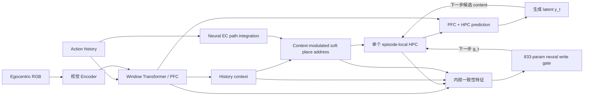

# M1b 3D Neural Write Gate：架构、训练与验证结果

## 当前结论

在冻结的 20k-step M1b 上，只增加一个 `833` 参数的因果神经写门，可以学出“早期写入、预测失真后停止”的策略。冻结选择的 seed1702 hard gate 在完整 512-test 上得到 `27.174 e-3`，相对原始全程写入的 `29.933 e-3` 改善 `9.22%`，与固定 K16 的 `27.157 e-3` 只差 `0.061%`。

边界同样明确：soft gate 在三 seed validation 上很稳定，但冻结 test 只比 full-write 改善 `0.81%`，validation 收益没有迁移；hard gate 在 validation 上校准方差较大，三 seed 为 `25.602 / 28.754 / 26.517 e-3`。因此当前可主张的是 **神经 gate 能在 held-out test 上复现固定 K16 的收益**，不能主张已经稳定超过 K16，也不能主张 soft 调制已经泛化。

## 固定的 M1b

- 数据：MemoryMaze3D paper-aligned open `9x9`，`4096 / 512 / 512` train/val/test。
- base checkpoint：`runs/remap_former/memorymaze3d_paper_open9_m1b_seed1701/next_frame/checkpoint_final.pt`。
- 评估：20 步真实 context，随后 44 步只输入 action。
- PFC：window Transformer，window `32`。
- EC/place/HPC：action 驱动的 neural EC、soft sparse place address、episode-local covariance-corrected fast weights。
- 不增加 memory slots，不增加第二套 fast weights，不改 base M1b 权重。

## Neural Write Gate

每个生成状态得到一个因果置信度：



```text
f_t = internal_features(PFC_t, HPC_t, context_t, place_t, address_t)
h_t = 0.8 h_(t-1) + 0.2 f_t
g_t = sigmoid(MLP([f_t, h_t]))
```

`MLP` 为 `24 -> 32 -> 1`，共 `833` 个参数。`g_t` 在当前状态预测完成后产生，并只控制该状态在下一步是否写入 HPC：

```text
content_update_t    <- g_t * content_update_t
covariance_update_t <- g_t * covariance_update_t
write_count_t       <- g_t * write_count_t
```

soft 模式直接使用 `g_t in [0,1]`；hard 模式使用验证集校准阈值后的 `1[g_t >= threshold]`。

### Gate 只读取的 12 个内部量

1. PFC 与 HPC prediction cosine。
2. PFC 与 HPC relative RMSE。
3. fused prediction 与 PFC relative RMSE。
4. fused prediction 与 HPC relative RMSE。
5. PFC/HPC norm ratio。
6. fused prediction RMS。
7. HPC retrieval RMS。
8. 当前与上一 context cosine。
9. context relative RMSE。
10. place peak。
11. place entropy。
12. address peak。

不存在显式 rollout age、固定 K16 token、位置、朝向、room id、context label、place id 或未来 RGB 输入。

## 因果边界

- 真实 context 帧始终可读、可写。
- rollout 开始后，未来 RGB read/write 都严格为 `0`。
- gate 在预测 `y_t` 后计算；它不能影响已经产生的 `y_t`，只决定 `y_t` 是否进入下一步 HPC state。
- 训练时真值只用于 pixel rollout loss 和预测可靠性排序标签；推理时 gate 不读取真值。
- base M1b 全冻结，梯度只更新 `833` 参数 gate。

## 稳定训练配方

早期 `batch=1, 5 updates, lr=1e-2` pilot 能得到好单 seed，但会被第一批极端 rollout 劫持。正式稳定配方固定为：

| 项目 | 设置 |
|---|---:|
| updates | 20 |
| batch size | 2 |
| context / rollout | 20 / 44 |
| learning rate | `3e-3` |
| base model | frozen |
| rollout loss | pixel MSE |
| quality ranking weight | `0.05` |
| latent loss weight | `0` |
| open prior | `0` |
| train seeds | 1702 / 1703 / 1704 |

排序损失只要求同一 rollout 内，预测误差更低的生成状态应有更高 gate score。它不提供 K16 或时间标签；总写入强度仍由 rollout pixel loss 决定。

## Validation 64

所有数值为 44-step mean pixel MSE x `1e-3`。base、K0 和 K16 在同一批 64 条 validation episode、同一 fp32 evaluator 中重算。

| 方法 | seed1702 | seed1703 | seed1704 | 均值 ± sample std |
|---|---:|---:|---:|---:|
| 原始 full-write | 31.080 | 31.080 | 31.080 | 31.080 |
| 固定 K16 | 26.167 | 26.167 | 26.167 | 26.167 |
| **Neural soft** | **28.022** | **28.086** | **28.103** | **28.070 ± 0.043** |
| Neural hard | 25.602 | 28.754 | 26.517 | 26.958 ± 1.621 |

### 判断

1. soft gate 的 seed 方差很低，稳定优于 full-write，证明连续神经写入控制成立。
2. soft 仍比固定 K16 高 `7.27%`，尚未吃完 oracle-like schedule 的收益。
3. hard gate 平均比 full-write 改善 `13.26%`，但阈值附近决策跳变导致高方差。
4. seed1702 hard 的 `25.602` 比 K16 好 `2.16%`，说明状态相关二值调用存在超过固定 cutoff 的可能；seed1703 的失败说明它还不能作为稳定 headline。

## 冻结 Test 结果

根据 validation 选择 seed1702，hard threshold 固定为 `0.67`。完整 `512`-episode test 只运行一次，不根据 test 结果继续调模型或阈值。

| 方法 | 44-step mean | h1–16 | post-window | h32 | h44 |
|---|---:|---:|---:|---:|---:|
| 原始 full-write | 29.933 | 10.043 | 51.718 | 42.082 | 57.267 |
| K0 | 33.435 | 18.734 | 44.615 | 42.634 | 43.703 |
| 固定 K16 | **27.157** | 10.043 | **43.488** | 39.817 | **44.405** |
| Neural soft | 29.691 | 10.900 | 47.926 | 42.441 | 50.850 |
| **Neural hard, threshold 0.67** | **27.174** | **10.017** | 43.682 | **39.678** | 44.564 |

### Test 判断

1. hard gate 相对 full-write 改善 `9.22%`。
2. hard gate 与 K16 的平均差仅 `0.017 e-3`，相对差 `0.061%`；两者在当前精度下基本持平。
3. hard gate 平均调用 `14.68 / 44` 次；h1–16 写入率 `86.96%`，h17–44 写入率 `2.73%`。
4. hard gate 不是显式 K16 计时器：它没有 age/K 输入，逐 horizon 写入率由不同 episode 的内部置信度决定。但其平均策略确实收敛为接近“早写晚停”。
5. soft gate 只相对 full-write改善 `0.81%`，说明 validation 上的连续强度最优点没有可靠迁移到 test。
6. `future_ground_truth_reads = 0`，`future_ground_truth_writes = 0`。
7. 同一 evaluator 重算的 K16 为 `27.1573277 e-3`，与旧冻结结果绝对差仅 `0.000393 e-3`，复现通过。

## 最终边界

- **成立**：现有单 HPC 上的 causal neural gate 可以在 held-out test 学出有效写入调用，并复现固定 K16 的长期收益。
- **未成立**：hard gate 跨训练 seed 的阈值校准仍不稳定。
- **未成立**：soft gate 的 validation 改善未迁移到 test。
- **未成立**：当前 neural gate 显著超过 K16。
- **后续最值得做**：改进 score calibration，而不是增加 memory slot、第二套 fast weights 或更多 oracle 输入。

## 代码与产物

- gate 模块：`remap_former/memorymaze3d_write_gate.py`
- 训练：`train_memorymaze3d_write_gate.py`
- 统一评估：`evaluate_memorymaze3d_write_gate.py`
- 回归测试：`test_memorymaze3d.py`
- 正式三 seed：
  - `runs/remap_former/memorymaze3d_write_gate_pixel_rank005_init07_h44_b2_u20_lr3e3_seed1702/`
  - `runs/remap_former/memorymaze3d_write_gate_pixel_rank005_init07_h44_b2_u20_lr3e3_seed1703/`
  - `runs/remap_former/memorymaze3d_write_gate_pixel_rank005_init07_h44_b2_u20_lr3e3_seed1704/`
- 冻结 test：
  - `runs/remap_former/memorymaze3d_write_gate_pixel_rank005_init07_h44_b2_u20_lr3e3_seed1702/eval_test512_t067_fp32/`
