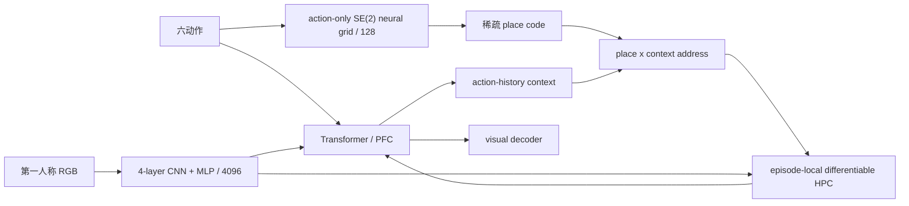

# MemoryMaze3D 视觉 3D Pilot（2026-07-18）

## 一句话结论

整条真实视觉 3D paper 管线已经跑通：官方 MemoryMaze3D/MuJoCo 第一人称 RGB、连续带噪平面运动、4096 维视觉特征、128 维 grid code、严格 32+32 free rollout、visible/non-visible、未来帧泄漏审计和未来动作反事实审计。当前仍是 **1 seed、25 train / 10 val 的工程 pilot**，不是论文最终结果。

## 任务与合法输入

- 环境：MemoryMaze3D 的 9x9 单开放房间，真实 3D 渲染；运动状态是 SE(2)，不是离散 XYZ 玩具网格。
- 模型输入：`egocentric_rgb` 与六维 one-hot action。
- 明确禁止：绝对位置、朝向、room id、place id、未来 RGB。
- `agent_pos` 与 `agent_dir` 只用于评测时的 `9x9x12` visible bin。
- imagination：前 32 步给真图像；后 32 步只给未来动作并回灌模型预测。

## 同协议结果

| 模型 | 参数 | 累计 pilot updates* | 一步 MSE | 32-step MSE | visible | non-visible | action advantage | future leak delta |
|---|---:|---:|---:|---:|---:|---:|---:|---:|
| Transformer | 20,361,411 | 310 | 0.02141 | 0.03360 | 0.02897 | 0.03519 | +0.00043 | 0.0 |
| Titans | 20,682,759 | 310 | 0.02178 | 0.03331 | 0.02562 | 0.03596 | +0.00199 | 0.0 |
| M1b | 21,135,606 | 526 | 0.02210 | 0.03920 | 0.03610 | 0.04027 | +0.00235 | 0.0 |
| mm-TEM | 18,888,972 | 150 | 0.03494 | 0.04204 | 0.03685 | 0.04382 | +0.00295 | 0.0 |
| Hippoformer | 27,502,732 | 100 | 0.02242 | 0.04925 | 0.04897 | 0.04935 | +0.00135 | 0.0 |

Persistence baseline 的 32-step MSE 是 **0.03321**。

## 怎么读这张表

1. 像素误差暂时最好的是 Titans/Transformer，分别为 0.03331 / 0.03360，但都只是在 persistence 附近。
2. 正确动作相对置换动作的收益，mm-TEM/M1b 更强，分别为 +0.00295 / +0.00235。结构模型更听动作，但视觉生成精度还没跟上。
3. M1b gain sweep 的开发结果显示，固定调用强度 4 优于 0/1/2/8；这说明 HPC 不是纯负担，但调用尺度需要匹配视觉模态。
4. Hippoformer 从头训练在第 50 步出现 NaN。缩窄 3D fusion MLP、加载已训 mm-TEM 和短窗 Transformer、用 residual zero-init 后，100-step staged pilot 稳定完成；训练量仍远低于论文的 20k steps。
5. 五个模型的未来帧扰动差都为 0；这证明结果不是 future-observation leak。

## 不能声称什么

- 不能把这些数与 Hippoformer 论文表格直接比较：数据量、训练步数、作者实现与随机种子均不相同。
- 不能声称 M1b 已胜过 Transformer/Titans；当前 M1b 像素 MSE 更高。
- 不能把 PyPI `hippoformer` 当官方代码。当前公开搜索只找到明确标为 unofficial 的实现；这里使用的是 paper-spec reimplementation。
- 不能根据 1 seed 排名。当前结果只用于验证任务、模型、训练、评测和审计整条链条。

## 正式租卡实验

1. 先生成至少 4096 train / 512 dev / 512 test episodes；每条 64 steps，test 在任何选择前冻结。
2. 每模型至少 3 seeds，主表最好 5 seeds；同一视觉前后端、同一数据索引、同一 context/horizon。
3. mm-TEM/Hippoformer 按论文 warm-up 5000、总训练 20000，并保留 staged Hippoformer 作为稳定性对照。
4. 同时报 pixel MSE、visible/non-visible、persistence、action counterfactual advantage、horizon curve 和 wall-clock。
5. M1b 的 gain 只在 dev 选择一次；候选 `2, 4, 6, 8`，test 不再调整。

注：`累计 pilot updates` 包含 checkpoint 祖先阶段，预算并不匹配，因此本表不是正式公平排名。
