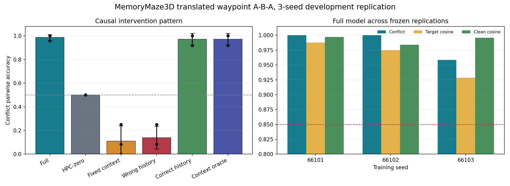

# MemoryMaze3D 真实平移 Waypoint A-B-A 三种子结果

**日期：2026-07-27**

**状态：`PASS_3SEED_WITH_SECONDARY_STABILITY_NOTES`**

**冻结协议：**
`protocols/memorymaze3d_simulator_translated_waypoint_aba_dev_v1.json`

## 结论

冻结配置在 seed `66101/66102/66103` 上完成开发集三种子复现，三个种子
都通过预注册模型 gate **`9/9`**。Full delayed conflict 为
**`0.9861 ± 0.0241`**
（sample SD，最差种子 `0.9583`），
conflict target cosine 为
**`0.9637 ± 0.0312`**，
clean cosine 为
**`0.9923 ± 0.0072`**，
latent context re-entry 为 **`1.0000 ± 0.0000`**。

结构化干预也在三个种子中保持同一方向：HPC-zero 固定回到 chance；
fixed context 与 wrong history 破坏正确调用；wrong history 平均以
`0.8611`
的比例转向另一 context。因而当前最稳妥的机制结论是：

> Window Transformer/PFC 从视觉历史形成动态 latent context；
> action-only 周期 EC 生成 neural place；place × context 共同寻址唯一一套
> episode-local neural HPC。返回相同物理 waypoint、当前目标隐藏时，
> 历史 context 因果控制 visual content 的调用方向。

这是 **development 三种子描述性复现**，不是 fresh sealed test。`n=3`
只报告均值、sample SD 和最差种子，不做显著性推断。

## 1. 冻结任务合同

| 项目 | 值 |
|---|---:|
| 连续 simulator episode | `384` actions |
| 真实 outbound 路径 | `3.0 m` |
| 物理 waypoint | `4` |
| 写入 / query | `8 / 4` |
| 最大 waypoint / revisit 误差 | `0.1793 / 0.2425 m` |
| Current-query context probe | `0.5000` |
| 反事实 query pixel / action mismatch | `0 / 0` |
| 反事实 query pose 最大差 | `0.00000000` |
| Train/validation layout / route overlap | `0 / 0` |

模型仍只有当前官方六动作 one-hot 与当前 frozen DINO feature 两个输入。
room/context/phase ID、simulator pose、绝对位置、waypoint/place ID 和 future
feature 均不存在于模型输入。每条 sequence 只有一张从零开始的
episode-local factorized HPC，无 slot、无第二套 fast weights。

## 2. 逐种子结果

三个训练均使用完全相同的模型、目标、`300` steps、batch size `4`、
每 `10` 步评估和既定 checkpoint selection；只改变训练 seed。

| Seed | 选中 step | Full | Target cosine | Clean | Fixed | Wrong→other | 最大 raw grad | Gate |
|---|---:|---:|---:|---:|---:|---:|---:|---:|
| `66101` | 20 | 1.0000 | 0.9877 | 0.9971 | 0.2500 | 0.7500 | 27.98 | 9/9 |
| `66102` | 60 | 1.0000 | 0.9749 | 0.9840 | 0.0833 | 0.9167 | 1447.72 | 9/9 |
| `66103` | 280 | 0.9583 | 0.9284 | 0.9959 | 0.0000 | 0.9167 | 39.49 | 9/9 |

66103 的 Full 为 `0.9583`，低于另两个种子的 `1.0000`，但仍超过冻结
`0.85` 门槛。它的 static correct-history anchor 与 context oracle 都为
`0.9167`，比动态 Full 低 `0.0417`；因此总状态保留 dynamic-context
次级备注，不把“静态 anchor/oracle 与 Full 完全等价”写成 3/3 结论。

## 3. 六条件聚合

| 条件 | Conflict mean ± sample SD | 最差种子 | Target cosine | Clean cosine | Other target |
|---|---:|---:|---:|---:|---:|
| Full | 0.9861 ± 0.0241 | 0.9583 | 0.9637 | 0.9923 | 0.0139 |
| HPC-zero | 0.5000 ± 0.0000 | 0.5000 | 0.0000 | 0.0000 | 0.5000 |
| Fixed context | 0.1111 ± 0.1273 | 0.0000 | 0.9334 | 0.9514 | 0.8889 |
| Wrong history | 0.1389 ± 0.0962 | 0.0833 | 0.9489 | 0.9582 | 0.8611 |
| Correct history | 0.9722 ± 0.0481 | 0.9167 | 0.9825 | 0.9921 | 0.0278 |
| Context oracle | 0.9722 ± 0.0481 | 0.9167 | 0.9855 | 0.9973 | 0.0278 |

关键 paired contrast：

- Full − HPC-zero：
  `0.4861 ± 0.0241`；
- Full − fixed context：
  `0.8750 ± 0.1102`；
- Correct history − wrong history：
  `0.8333 ± 0.0833`。

## 4. 冻结 Gate

| Gate | 结果 |
|---|---:|
| `three_distinct_seeds` | PASS |
| `all_preflight_pass` | PASS |
| `all_model_gates_9_of_9` | PASS |
| `all_full_conflict_at_least_085` | PASS |
| `all_target_cosine_at_least_085` | PASS |
| `all_clean_cosine_at_least_085` | PASS |
| `all_context_reentry_at_least_085` | PASS |
| `all_hpc_zero_at_most_060` | PASS |
| `all_fixed_context_at_most_060` | PASS |
| `all_wrong_history_other_at_least_075` | PASS |
| `all_exactly_eight_writes` | PASS |
| `all_future_ground_truth_zero_zero` | PASS |
| `all_logged_training_values_finite` | PASS |

主结论 gate 全部通过。每个 episode 恰好写 `8` 次，严格
read-before-write；future ground-truth read/write 为 `0/0`。

## 5. 视觉审计

同-waypoint 两个历史候选中的主视觉选择为
**`1.0000 ± 0.0000`**
（三个种子均 `3/3`）。

更严格但未预注册为 acceptance gate 的全八写入 global-nearest 为
**`0.7778 ± 0.1925`**；
逐种子为
`[0.6666666666666666, 1.0, 0.6666666666666666]`。它仍显示 broad-ROI
DINO feature 会被其他 waypoint 的背景/视点吸引，因此不能把主任务结果
改写成“全局视觉检索或 RGB 预测已经解决”。

## 6. 优化稳定性

三个种子的最大 raw gradient norm 分别为
`{'66101': 27.984140396118164, '66102': 1447.7177734375, '66103': 39.48877716064453}`。66102 在 step 20
出现 `1447.72` 尖峰；所有 optimizer step 前均执行 global norm clip
`1.0`，三个训练均跑满、无 NaN/Inf、stderr 为空且最终通过机制 gate。

这说明尖峰没有使本轮机制结果失效，但训练动力学并不平滑。sealed
实验应继续冻结 clip 与 checkpoint rule，并把 raw gradient trajectory
作为审计项；不能只报告选中 checkpoint。

## 7. 证据边界与下一步

当前支持：

- 真实 `3 m` 平移、转向和同一 waypoint 复访；
- 三个独立训练 seed 上 context-controlled HPC recall；
- HPC-zero、fixed-context、wrong-history 的因果方向稳定；
- 无 room/pose/place ID 输入、future GT 为 `0/0`。

当前不支持：

- 未见 layout/route/object 的 sealed 泛化；
- learned-policy free rollout；
- RGB 生成或完整 3D world model；
- 在统一预算下击败 Hippoformer、Titans 或纯 Transformer。

下一步不再调整这一 development protocol：固定代码、数据生成规则、
超参数与 selection rule，生成预留的 fresh sealed
layout/route/object split；只有 sealed 通过后，再进入 learned-policy
free rollout 与 matched baselines。
