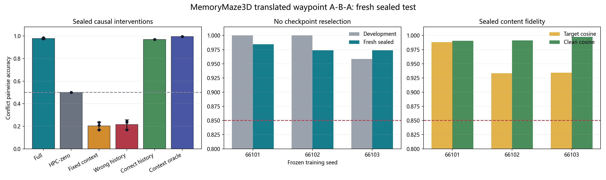

# MemoryMaze3D 真实平移 Waypoint A-B-A Fresh Sealed 结果

**状态：`PASS_SEALED_3SEED`（通过）**

**协议 SHA256：** `29ea24092a7bbd4b969d92074dd134345ace9c953410cd888f845219247bb5c4`

**数据锁 SHA256：** `fbf45a25c3f80715a4ff322836b856effdbd7917ded33088ecddde76900dddde`

## 核心结论

三个 development checkpoint 原样冻结，没有重新训练，也没有使用 sealed
test 选择 checkpoint。它们在 `32` 个全新 simulator layout、`32` 条唯一
物理 waypoint 路径、`32` 个 canonical object assignment 和保留 test
route bank 上一次性评估。

Full conflict 为
**`0.9774 ± 0.0060`**
（sample SD；最差 seed
`0.9740`），target cosine 为
**`0.9519 ± 0.0314`**，
clean cosine 为
**`0.9931 ± 0.0037`**。

## Sealed 数据合同

| 检查 | 结果 |
|---|---:|
| Sequence / unique layout | `64 / 32` |
| Unique physical route | `32` |
| Unique canonical assignment | `32` |
| Dev-test layout overlap | `0` |
| Dev-test physical-route overlap | `0` |
| Dev-test context-route overlap | `0` |
| Dev-test assignment overlap | `0` |
| Counterfactual action / pixel mismatch | `0 / 0` |
| Query target visible / nonhidden geom | `0 / 0` |

task-only preflight 在读取任何模型正确率前写盘并锁定；三个 checkpoint
均通过 `17/17` 结构与防泄漏 gate。

## 逐 Frozen Checkpoint

| Seed | Full | Target cosine | Clean | HPC-zero | Fixed | Wrong→other | Gate |
|---|---:|---:|---:|---:|---:|---:|---:|
| `66101` | 0.9844 | 0.9882 | 0.9906 | 0.5000 | 0.2344 | 0.7656 | 9/9 |
| `66102` | 0.9740 | 0.9332 | 0.9913 | 0.5000 | 0.1667 | 0.8333 | 9/9 |
| `66103` | 0.9740 | 0.9342 | 0.9973 | 0.5000 | 0.2083 | 0.7552 | 9/9 |

## 六条件聚合

| 条件 | Conflict mean ± sample SD | Target cosine | Clean cosine | Other target |
|---|---:|---:|---:|---:|
| Full | 0.9774 ± 0.0060 | 0.9519 | 0.9931 | 0.0226 |
| HPC-zero | 0.5000 ± 0.0000 | 0.0000 | 0.0000 | 0.5000 |
| Fixed context | 0.2031 ± 0.0342 | 0.9454 | 0.9663 | 0.7969 |
| Wrong history | 0.2153 ± 0.0424 | 0.9534 | 0.9686 | 0.7847 |
| Correct history | 0.9688 ± 0.0000 | 0.9833 | 0.9929 | 0.0312 |
| Context oracle | 0.9948 ± 0.0000 | 0.9896 | 0.9969 | 0.0052 |

## 因果解释

- HPC-zero 若回到 chance，说明 PFC 不能绕过 memory 直接输出答案。
- Fixed context 若显著下降，说明同一 place 必须由历史 context 重映射。
- Wrong history 若定向选择 other target，说明调用方向由历史控制，而非
  当前 RGB、pose 或 waypoint metadata。
- 每个 checkpoint 的 future ground-truth read/write 仍为 `0/0`。

## 边界

- 这是 fresh sealed associative visual-memory test，不是 RGB 生成。
- checkpoint 来自 development selection，但 sealed 从未参与 selection。
- 物体仍是 MemoryMaze3D 的三类彩色球；本结果不等于未见物体类别 OOD。
- 路径由 generator-only controller 执行，不是 learned-policy free rollout。
- 主指标是所有 hidden conflict query 的 feature pairwise recall；视觉板只
  是少量可读样例，不能替代全量指标。

## 下一步

下一步解锁同一 sealed task 的 matched Transformer、普通 fast-weight、Hippoformer 与 Titans/MAC 基线；模型主线不再回看 sealed 调参。
