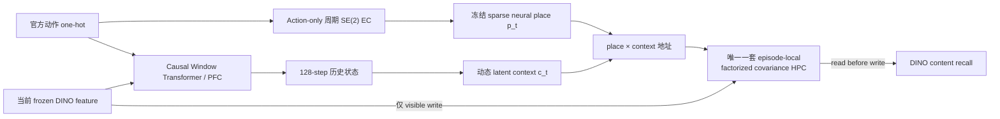
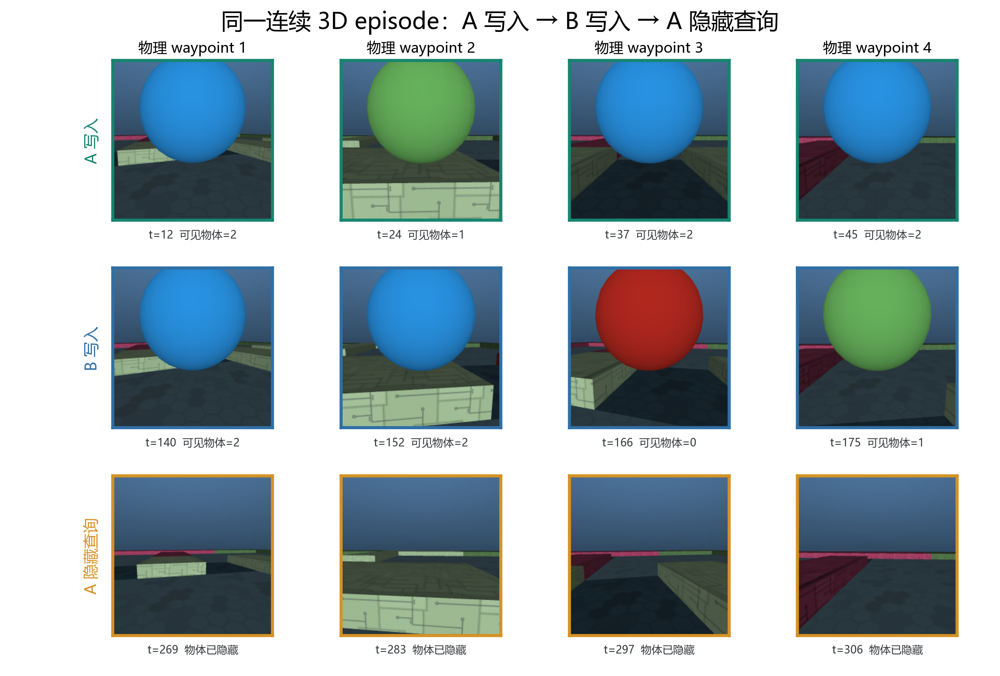
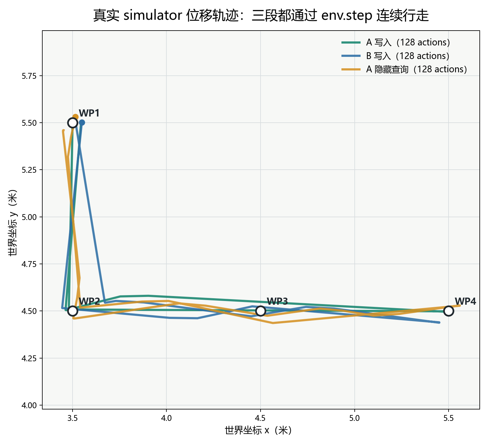
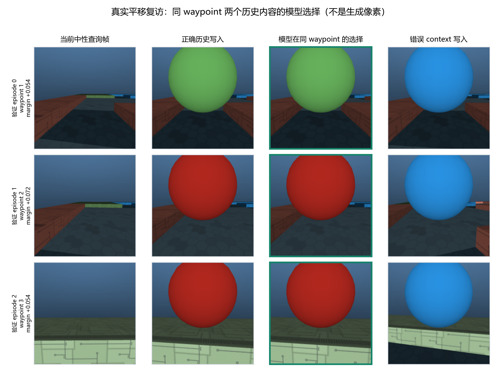
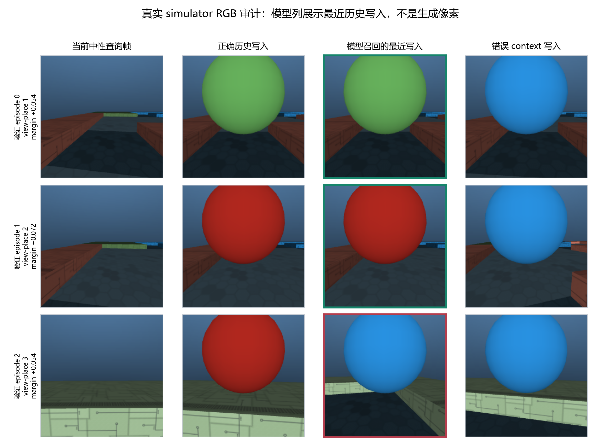
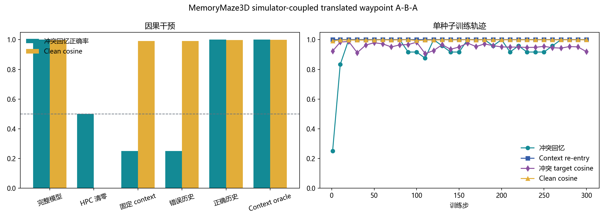

# MemoryMaze3D 真实平移 Waypoint A-B-A 单种子结果

**日期：2026-07-26**

**状态：`PASS_SINGLE_SEED`**

**冻结协议：**
`protocols/memorymaze3d_simulator_translated_waypoint_aba_dev_v1.json`

## 结论

这一阶段通过。

模型在同一个连续 MemoryMaze3D episode 中真实移动并复访四个物理
waypoint。每一步模型 action 都实际调用 `env.step`，模型看到对应的
post-action RGB；四个 waypoint 的累计 outbound 路径为 `3.0 m`，三段
各 `128` 个 simulator actions，共 `384` 步。query 时目标球完全隐藏，
当前 query RGB、action 和物理 pose 在 A-B-A / B-A-B 反事实配对中完全
相同。

单种子 `66101` 的冻结模型 gate 为 **`9/9`**：

| 指标 | Validation | 冻结门槛 |
|---|---:|---:|
| Full delayed conflict accuracy | **`1.0000`** | `>= 0.85` |
| Conflict target cosine | **`0.9877`** | `>= 0.85` |
| Clean cosine | **`0.9971`** | `>= 0.85` |
| Latent context re-entry | **`1.0000`** | `>= 0.85` |
| HPC-zero conflict | **`0.5000`** | `<= 0.60` |
| Fixed-context conflict | **`0.2500`** | `<= 0.60` |
| Wrong-history other-target rate | **`0.7500`** | `>= 0.75` |
| Writes per episode | **`8`** | `8` |
| Future ground-truth read / write | **`0 / 0`** | `0 / 0` |

当前最稳妥的机制结论是：

> Window Transformer/PFC 从可观察视觉历史形成动态 latent context；
> action-only 周期 EC 在真实平移和转向中生成位置结构；稀疏 place 与
> context 共同寻址唯一一套 episode-local neural HPC。返回相同物理
> waypoint、且当前 RGB 不含目标时，模型能按历史调用对应 context 的
> DINO visual content。换错历史会把调用方向推向另一 context。

这不是完整 3D 导航或 world-model 结论。当前轨迹由 generator-only
闭环控制器生成，不是模型自己学会导航；模型预测的是 frozen DINO
feature，不是 RGB 像素。

## 1. 任务

### 1.1 一条 episode

每条 sequence 在同一个 simulator 实例中完成：

1. context A 可见历史；
2. 依次真实走到四个 waypoint，在各 waypoint 写入 A 内容；
3. 沿物理路径返回起点并恢复 heading；
4. context B 可见历史；
5. 再次真实走到同四个 waypoint，写入 B 内容；
6. 再次返回；
7. context A 历史重入；
8. 第三次真实复访四个 waypoint，在目标隐藏时 query。

配对成员把顺序换成 B-A-B。两个成员共享 layout、waypoint、动作序列、
pose trajectory 和 target assignment，但 return context 相反。

### 1.2 数据规模

| 项目 | 设置 |
|---|---|
| 环境 | MemoryMaze3D variable `9 × 9` |
| RGB | 原生 `224 × 224` |
| 序列长度 | `384` actions / frames |
| Phase | `3 × 128` |
| Waypoint | `4` 个真实物理位置 |
| Outbound 累计路径 | `3.0 m` |
| 写入 / query | `8 / 4` |
| Delayed conflict / clean | `3 / 1` |
| Train | 6 layouts × 2 counterfactual members = `12` |
| Validation | 4 layouts × 2 counterfactual members = `8` |

waypoint 是从 reset cell 到最远可达 cell 的确定性 BFS 路径上取前四个
cell。控制器只在 generator 中使用 simulator pose 选择官方 action
`noop / forward / left / right`；pose 不保存为模型输入。

## 2. 模型输入与禁用信息

模型只有两个输入：

1. 当前官方六动作 one-hot；
2. 当前 post-action RGB 的 frozen `dinov2_vits14_reg` broad-ROI
   spatial feature，维度 `384`。

以下信息明确不存在于模型输入：

- room/context/phase/environment ID；
- simulator pose、绝对坐标、waypoint cell 或 place ID；
- route family、target label、target color mask；
- controller error、target write index；
- future RGB 或 future DINO feature。

当前 query feature 的 context probe balanced accuracy 为 `0.5000`。
反事实 paired query 的 pixel mismatch、action mismatch 和 pose difference
均为 `0`。

## 3. 模型架构



### 3.1 Transformer / PFC

- hidden dim `96`，4 heads；
- causal attention window `32`；
- context state history window `128`；
- context dim `8`；
- `pfc_residual_gain = 0.0`，PFC 不能绕过 HPC 直接输出答案。

### 3.2 EC / place

- EC 只读动作；
- forward scale 固定为 `0.25`；
- turn scale 固定为 `π/10`；
- 两个 scale 来自生成任务前的 controller/action 校准，训练时冻结；
- place population dim `64`，temperature `0.25`；
- waypoint/place ID 从不进入模型。

### 3.3 HPC

- 只有一套 episode-local factorized covariance fast-weight memory；
- 每条 sequence 开始从零初始化，episode 结束丢弃；
- 没有 memory slot、第二套 fast weights 或持久内容查找表；
- 地址由 neural place 与 latent context 分解构成；
- 严格 read-before-write；
- 只有 `write_mask=1` 的可见事件写入；
- query target 只来自严格更早的 visible write；
- future ground-truth read/write 为 `0/0`。

## 4. Preflight：17/17

| 检查 | 结果 |
|---|---:|
| Action 与 post-action frame 一一对应 | PASS |
| Target/competitor 严格来自过去 | PASS |
| Query 目标全部隐藏 | PASS |
| 每 episode 写入/query | `8 / 4` |
| Train/validation layout overlap | `0` |
| Train/validation route overlap | `0` |
| Current-query context probe | `0.5000` |
| Counterfactual query pixel mismatch | `0` |
| Counterfactual action mismatch | `0` |
| Counterfactual query pose max difference | `0` |
| 最大 waypoint 中心误差 | `0.1793 m` |
| 最大同-waypoint 复访误差 | `0.2425 m` |
| Same-waypoint place cosine | `0.9135` |
| Same-segment cross-place cosine | `0.1811` |
| 最大 active phase actions | `100 <= 128` |
| DINO feature finite | PASS |
| Future GT read/write | `0 / 0` |

action-only EC 的最大复访位置 drift 为 `0.5475`，heading drift 为
`0.6283 rad`。这两个是保留诊断，不是用 simulator pose 修正模型状态；
模型实际仍只靠动作积分。

## 5. 训练

| 项目 | 值 |
|---|---|
| Seed | `66101` |
| Device | CUDA |
| Steps | `300` |
| Batch size | `4` |
| Eval interval | `10` |
| Best checkpoint | step `20` |
| Wall time | 约 `869 s` |

content objective 由三项组成，权重均为 `1.0`：

1. conflict target-vs-other pairwise cross-entropy；
2. conflict target cosine alignment；
3. clean target cosine alignment。

checkpoint selection 依次按 conflict accuracy、conflict target cosine、
clean cosine 和 context re-entry 排序。step `20` 达到
`1.0000 / 0.9877 / 0.9971 / 1.0000`，因此被保留。

训练中 raw gradient norm 有尖峰，最大观测包括 step 10 的 `27.98` 和
step 300 的 `15.74`；优化器前执行 global norm clip `1.0`。全程无 NaN，
但多种子复现必须继续监视这一项。

## 6. 因果干预

| 条件 | Conflict acc | Other target | Target cosine | Context re-entry |
|---|---:|---:|---:|---:|
| **Full** | **`1.000`** | `0.000` | **`0.988`** | **`1.000`** |
| HPC zero | `0.500` | `0.500` | `0.000` | `1.000` |
| Fixed context | `0.250` | **`0.750`** | `0.932` | `0.500` |
| Wrong history | `0.250` | **`0.750`** | `0.948` | `0.000` |
| Correct history anchor | **`1.000`** | `0.000` | `0.988` | `1.000` |
| Orthogonal context oracle | **`1.000`** | `0.000` | `0.990` | `1.000` |

这组干预比“Full 数字高”更重要：

- HPC 清零后回到 chance，排除纯 PFC 直接输出；
- fixed context 和 wrong history 都把 `75%` conflict 推向另一 context；
- correct-history anchor 与动态 full 都为 `1.0`，说明这一阶段的长路径
  context stationarity 比上一阶段 view-place 更健康；
- oracle 不比 Full 更好，当前 HPC/address 容量不是明显瓶颈。

## 7. 视觉审计

### 7.1 任务事件



第三行四个 query frame 都没有目标球。该图来自冻结 validation NPZ，
不是手工示意。

### 7.2 真实位移



展示 episode 4。waypoint 为
`(3.5,5.5) → (3.5,4.5) → (4.5,4.5) → (5.5,4.5)`，包含真实拐弯。
三段都通过 `env.step` 连续行走；phase 起终点距离分别为
`0.049 / 0.045 / 0.095 m`。

### 7.3 模型在同一 waypoint 的内容选择



主视觉审计只比较同一物理 waypoint、两个严格历史 context 写入：
展示的三行均选中正确历史，`3/3`。绿色“模型选择”列显示的是 recalled
DINO feature 在这两个候选中的较高 cosine，不是模型生成的 RGB。

### 7.4 诚实保留的 global-nearest 弱点



如果把 recalled feature 与本 episode 全部八个历史写入做 global-nearest，
展示行为 `2/3`。第三行正确同-waypoint 候选 cosine 为 `0.9431`，错误
context 候选为 `0.8890`，所以主任务判定正确；但另一个物理 waypoint
的蓝球帧在 broad-ROI DINO 空间更近，导致全局最近邻图选错。

这说明：

- context-controlled same-waypoint recall 已通过；
- 当前 broad-ROI feature 仍混有背景/视点信息；
- 不能把本结果夸成全局视觉检索已经解决；
- 下一阶段若做完整 world model，需要更明确的 object/spatial feature
  分解或 decoder，而不是藏掉这项诊断。

### 7.5 指标图



## 8. 可复现产物

| 文件 | SHA256 |
|---|---|
| Frozen protocol | `058eb798ef2b5022e290eaca237daf7ccccb5613d4ece857f52f097007cb5db0` |
| Train NPZ | `6b315f3ed953eb367e342392c466cbe6fe64eb371e772acf0806ba7036aff26e` |
| Validation NPZ | `430b09bb78574b98fc390e18dbb3a660ac8a2b927f4d644cd0cc23de41890657` |
| Train DINO cache | `a7c653c27d889c0e144f687383a7c78c1dc83b5a84ef95f00a427efb323ae19b` |
| Validation DINO cache | `63b1e545ba16ac06ba5bee212ad619adff6f74b4010888a224473c9d21d384da` |
| Best checkpoint | `6bd10ebfc3b85eef9a7a6dff109e045f9f04d2bd2fa6b4803cda2b08e2655bf8` |

核心文件：

- `generate_memorymaze3d_simulator_waypoint_aba_data.py`
- `remap_former/visual_simulator_waypoint_aba.py`
- `train_memorymaze3d_simulator_waypoint_aba.py`
- `summarize_memorymaze3d_simulator_waypoint_aba.py`
- `render_memorymaze3d_simulator_waypoint_visuals.py`
- `runs/memorymaze3d/simulator_translated_waypoint_aba_seed66101/result.json`
- `runs/memorymaze3d/simulator_translated_waypoint_aba_seed66101/best_full.pt`

正式复现命令：

```powershell
python train_memorymaze3d_simulator_waypoint_aba.py `
  --data-dir data/memorymaze3d_simulator_translated_waypoint_aba_dev_v1 `
  --cache-dir runs/memorymaze3d/simulator_translated_waypoint_aba_dino_dev_v1 `
  --output-dir runs/memorymaze3d/simulator_translated_waypoint_aba_seed66101 `
  --seed 66101 `
  --steps 300 `
  --batch-size 4 `
  --eval-every 10 `
  --conflict-alignment-weight 1.0 `
  --device cuda
```

相关回归测试：`13 passed`。

## 9. 证据边界

现在可以说：

- 模型在真实 simulator 平移和转向下完成多 waypoint hidden-context
  associative recall；
- 当前 query 不能靠 RGB、action 或 pose 区分 context；
- HPC 与历史 context 对结果具有方向明确的因果作用；
- 单种子冻结 gate 通过。

现在还不能说：

- 已完成模型自主 learned-policy free rollout；
- 已生成准确 RGB；
- 已解决完整 3D visual world model；
- 已在 sealed split 上泛化；
- 已稳定跨训练 seed；
- 已公平击败 Hippoformer、Titans 或 matched Transformer baseline。

## 10. 下一步

按冻结协议，下一步不是继续改 seed `66101`，而是：

1. 冻结当前 protocol、data、code path 与 checkpoint selection；
2. 顺序运行 seed `66102`、`66103`，不再依据当前 validation 调参；
3. 三种子同时通过后，才生成预留的未见 layout/route/object sealed split；
4. sealed 之后再进入 learned-policy/free-rollout 与 feature world-model
   阶段；
5. formal baseline 在相同动作、视觉特征、训练预算和 split 下统一实现。

若任一新 seed 未通过，先报告方差与失败模式，不回头把 seed `66101`
当作唯一 headline。
