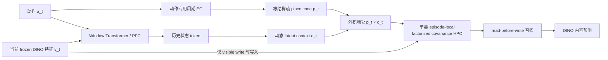

# MemoryMaze3D Simulator-Coupled View-Place A-B-A 单种子结果

**日期：2026-07-26**

**状态：`PASS_SINGLE_SEED_WITH_DYNAMIC_CONTEXT_NOTE`**

**冻结协议：** `protocols/memorymaze3d_simulator_coupled_viewplace_aba_dev_v2.json`

## 结论

这一阶段已经通过。

在真实 MemoryMaze3D 模拟器中，每个动作都实际调用一次
`env.step(action)`，模型接收对应的 post-action RGB，经冻结
DINOv2 编码后完成 A-B-A / B-A-B 的隐藏上下文内容召回：

| 指标 | 单种子 validation |
|---|---:|
| Full delayed conflict pairwise accuracy | **`1.0000`** |
| Full conflict target cosine | **`0.9983`** |
| Full clean cosine | **`0.9968`** |
| Latent context re-entry accuracy | **`1.0000`** |
| HPC-zero conflict | `0.5000` |
| Fixed-context conflict | `0.0000` |
| Wrong-history other-context target rate | **`1.0000`** |
| Orthogonal context oracle conflict | `1.0000` |
| Future ground-truth read / write | **`0 / 0`** |

冻结协议中的单种子模型 gate 为 **`9/9`**。结果说明：

> Transformer/PFC 能从更早的视觉历史形成动态 latent context；周期 EC
> 给出动作驱动的位置结构；place × context 地址控制同一套 episode-local
> HPC 的写入和调用。在当前 query RGB 完全相同的反事实配对中，换错历史会
> 系统性调用另一 context 的内容。

这不是完整 3D 导航结论。当前阶段只验证原地旋转得到的四个
view-place，尚未验证平移 waypoint、长距离复访、sealed test、RGB
生成或 free rollout。

## 1. 为什么 V1 没有训练

V1 使用 action-history cue。正式训练前的当前 query context probe 为
`0.6667`，超过预注册上限 `0.60`：

- 失败记录：
  `runs/memorymaze3d/simulator_viewplace_aba_smoke_seed65101/preflight.json`
- 决策：按 stop rule 停止，没有用 V1 数据训练模型。

V2 改成成对反事实视觉历史。每个 layout 生成两个成员：

- `A-B-A`
- `B-A-B`

两个成员使用相同 layout、相同物理动作、相同 target assignment；
query 时刻的 RGB 必须逐像素一致，但返回 context 相反。因而当前帧不能
泄漏答案，模型只能利用更早的视觉历史。

## 2. 任务与数据

| 项目 | V2 设置 |
|---|---|
| 环境 | MemoryMaze3D variable `9 × 9` |
| RGB | 原生 `224 × 224` |
| 序列 | `114` 步，三段各 `38` 步 |
| 模拟器 | 一个连续 env，reset 后不 teleport |
| 动作 | 官方 6-action one-hot |
| 视觉输入 | 同一步 RGB 的 frozen DINOv2 broad-ROI spatial feature |
| View-place | 原地左转；每 5 步一个视角，20 步闭环 |
| 写入 | 每 episode `8` 次可见写入 |
| Query | `4` 次，含 `3` 个 delayed conflict |
| Train | 6 个独立 layout × 2 个反事实成员 = 12 sequences |
| Validation | 4 个独立 layout × 2 个反事实成员 = 8 sequences |

所有 query target geom 都缩到不可见尺寸。每个 query 的监督 target
都复制自严格更早的 visible write frame。

模型输入只有：

1. 官方六动作 one-hot；
2. 当前 simulator RGB 对应的 frozen DINO feature。

以下量不存在于模型输入：

- room/context/phase/environment ID；
- simulator pose、绝对位置、place ID；
- route family、target label、target write index；
- target color mask；
- future RGB 或 future DINO feature。

颜色 mask 只做离线可见性 QA，不参与 DINO pooling、模型输入或训练。

## 3. 当前模型



### PFC

- 主干是 causal window Transformer；
- window size `32`；
- hidden dim `96`，4 heads；
- PFC history state window `64`；
- context dim `8`；
- 当前实验中 `pfc_residual_gain = 0.0`，PFC 不能绕过 HPC 直接输出答案。

### EC / place

- EC 只读动作，不读 pose；
- 旋转相位按 `π/10` 校准，20 次左转闭环；
- EC 与 place population 在本阶段冻结；
- place code 为连续稀疏 neural population，不输入人工 place ID。

### HPC

- 只有一套 episode-local fast-weight matrix；
- 每条 sequence 开始时从零初始化，episode 结束即丢弃；
- 没有 memory slot、索引查表或第二套 fast weights；
- 地址把 place 与 latent context 分解，再构造 dual place/context write key；
- 每一步先 read，只有 visible write mask 为 1 时才执行 delta write；
- value 是 frozen DINO feature，value encoder/decoder 在本阶段为冻结恒等通路。

## 4. 预训练防泄漏 Gate

| Gate | 结果 |
|---|---:|
| Simulator action/frame 一一对应 | PASS |
| Target/competing source 严格来自过去 | PASS |
| Query target geom 全部隐藏 | PASS |
| 反事实 query RGB pixel mismatch | **`0`** |
| 每 episode 写入/query | **`8 / 4`** |
| Train/validation layout overlap | **`0`** |
| Train/validation route-family overlap | **`0`** |
| Current-query context probe | **`0.5000`** |
| DINO 全部 finite | PASS |
| 模型输入 tensor 数 | **`2`** |
| Future GT read/write | **`0 / 0`** |

结构地址 sanity check：

- same-place cross-context place cosine：`1.0000`
- same-segment cross-place cosine：`0.1555`

这确认 context 没有偷偷改写 EC/place；remapping 发生在
`place × context` 的联合地址上。

## 5. 训练

单种子：`65101`

训练步数：`200`

batch size：`6`

设备：`CUDA`

训练目标仍是一套 content objective，由三部分组成：

1. conflict target-vs-other pairwise cross-entropy，权重 `1.0`；
2. conflict target cosine alignment，权重 `1.0`；
3. clean target cosine，权重 `1.0`。

加入 conflict cosine alignment 的原因是：前一个相同模型的 run 已达到
pairwise `1.000`，但 target cosine 只有约 `0.187`。这只能证明排序正确，
不能证明忠实召回。冻结协议随后记录该质量强化，并要求 conflict target
cosine 至少 `0.85`。

最佳 checkpoint 在 step `50` 被选中。selection tuple 依次为：

1. conflict pairwise accuracy；
2. conflict target cosine；
3. clean cosine；
4. context re-entry accuracy。

## 6. 因果干预

| 条件 | Conflict pairwise | Other-context rate | 含义 |
|---|---:|---:|---|
| **Full** | **`1.000`** | `0.000` | 完整动态历史正确调用 |
| HPC zero | `0.500` | `0.500` | 去掉 HPC 后回到 chance |
| Fixed context | `0.000` | **`1.000`** | 去掉动态 context 后系统性调用错误 |
| Wrong history | `0.000` | **`1.000`** | 换错历史会定向切换内容 |
| Correct static anchor | `0.375` | `0.625` | 单个锚点不足以替代完整动态历史 |
| Orthogonal oracle | `1.000` | `0.000` | HPC/address 容量上界健康 |

`correct static anchor = 0.375` 是保留披露的次级诊断，不属于冻结 V2
acceptance。它说明当前 PFC context 是随整个视觉轨迹演化的动态状态，
而不是一个时间不变、任意时刻都可以互换的 room vector。

这个结果不推翻因果调用结论：

- Full 为 `1.000`；
- HPC-zero 为 chance；
- fixed/wrong history 都定向选择另一内容；
- oracle 为 `1.000`。

但它会约束下一阶段的设计：平移复访时必须测试 context 在更长路径上的
稳定性，不能把一个静态 anchor probe 当成已解决。

## 7. 视觉结果怎么读

视觉看板每行依次显示：

1. 当前中性 query RGB；
2. 正确历史写入 RGB；
3. 模型召回 feature 在本 episode 更早写入中的最近邻 RGB；
4. 错误 context 的竞争写入 RGB。

三个展示 query 的 nearest earlier-write accuracy 为 **`3/3`**。

“模型召回”不是模型生成的像素。当前模型没有 RGB decoder；图像只用于
把召回的 DINO feature 反查成可读的历史帧，避免把特征预测误说成清晰
图像生成。

## 8. 可复现文件

| 文件 | SHA256 |
|---|---|
| V2 protocol | `3c4fe22ffab98c8250191df8b4302e93b8b29db365706623a28c3dbe25abca88` |
| Train NPZ | `972117f88d0f67b45a26b6126c439d6ab9c9264302e5a240ee9ba5785c681f4e` |
| Validation NPZ | `326a34c5767bb909021864cc950fe7f27f75d35c966647a44bf6648129e708d1` |
| Best checkpoint | `aa6091908fe1ee2d94b9ce2b740c31b5df01a7dbd654c255b0d1164717137919` |

核心产物：

- `runs/memorymaze3d/simulator_viewplace_aba_v2_align1_seed65101/result.json`
- `runs/memorymaze3d/simulator_viewplace_aba_v2_align1_seed65101/REPORT_CN.md`
- `runs/memorymaze3d/simulator_viewplace_aba_v2_align1_seed65101/simulator_viewplace_metrics.png`
- `runs/memorymaze3d/simulator_viewplace_aba_v2_align1_seed65101/simulator_viewplace_visual_board.png`

复现实验：

```powershell
python train_memorymaze3d_simulator_aba.py `
  --data-dir data/memorymaze3d_simulator_viewplace_aba_dev_v2 `
  --cache-dir runs/memorymaze3d/simulator_viewplace_aba_dino_dev_v2 `
  --output-dir runs/memorymaze3d/simulator_viewplace_aba_v2_align1_seed65101 `
  --seed 65101 `
  --steps 200 `
  --batch-size 6 `
  --eval-every 10 `
  --conflict-alignment-weight 1.0 `
  --device cuda
```

回归测试：

```text
11 passed in 3.88s
```

## 9. 下一步

下一阶段不扩 seed，也不立刻开 sealed test。先把当前四个旋转
view-place 升级成真实平移 waypoint/revisit：

1. 在同一个连续 simulator episode 中行走到 3–4 个物理 waypoint；
2. A/B 两个隐藏 context 在相同 waypoint 存不同内容；
3. 返回段复走到旧 waypoint，query RGB 做成反事实一致或严格匹配；
4. 保持仅 action one-hot + frozen DINO 输入；
5. 保持一套 episode-local HPC、read-before-write、future GT `0/0`；
6. 新增 context drift、waypoint revisit 与 translation EC 闭环 gate；
7. 单种子通过后再扩 3 seed，随后冻结并开启未见 layout/route/object 的
   sealed split。

这一步通过后，项目才从“真实 simulator 耦合的视角位置记忆”进入
“真实 3D 平移导航中的上下文重映射记忆”。
