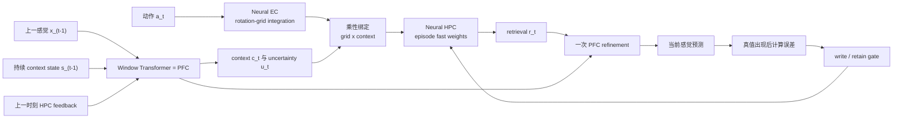

# ReMAP-Former：先推断，再寻址

> ICLR 风格模型设计与预注册实验计划，评审合并冻结稿 v3，2026-07-13

## 摘要

本课题研究一个比“给 Hippoformer 加 gate”更明确的问题：在没有 room ID、context 标签、切换标志、绝对位置或 place ID 的条件下，Transformer/PFC 能否仅根据动作与感觉历史推断当前隐情境，并用该情境调用 episode 内的正确海马内容？我们提出 **ReMAP-Former**（Recurrent Memory Addressing and Plasticity Transformer）。模型使用窗口 Transformer 作为 PFC，以动作驱动的 rotation-grid network 作为 EC，以 episode-local differentiable fast synaptic matrix 作为 HPC。PFC 维护低维持续 context state；sparse place 与 context 通过乘性绑定形成地址；HPC 先读后写。最终 M1b 使用 context covariance 的正则化逆方向构造 dual write key，抑制相似 context 的顺序写入串扰。模型只训练 sensory CE，不包含显式 slots、按位置索引的内容表、oracle context、write gate 或额外 context loss。

旧 controller-only pilot 构成本工作的动机而非正结果：任务的原始历史 room probe 为 1.000，但训练后的 emitted context room probe 仅为 0.548；controller 将 shared-conflict accuracy 从 0.641 提高到 0.719，却把 clean recall 从 1.000 降到 0.922，A-return conflict 仍为 0。这说明一般性的 query/plasticity 调节可以降低串扰，却没有完成情境推断和旧记忆重返。

## 0. 当前实施状态（2026-07-13）

- random-return generator 的 path/cue/time episode-relative matching 分别为 `1.000/0.500/0.500`，固定 schedule shortcut 已被移除。
- sparse neural place 容量门通过：fixed clean `1.000`，oracle re-entry conflict `1.000`；dense 地址因 clean 掉 `7.5 pp` 淘汰。
- M-delta 单房间与 true free rollout 非劣效门通过。
- M1 当前实现为 `cyclic_signature_retention_v5`：只从动作形成 cyclic transition signature，低维 state 只控制地址，不直达 decoder。
- 三个 M1 dev seeds 的 raw arm 有 `2/3` 通过；context matching 均值 `0.90625`，seed 713 为 `0.89453 < 0.900`。
- 预注册的 EMA `0.99` 稳定化 arm 仍只有 `2/3` 通过；context matching 均值 `0.89844`，seed 713 为 `0.88281`。clean、content-probe 和 HPC-zero gates 全部健康，但 EMA 没有修复 context 稳定性。
- 原预注册 M1 阶段曾触发 `STOP_AT_M1_UNSTABLE`；M2/M3 仍保持停止。随后依据冻结因果诊断另立单机制 M1b，不追溯修改原 M1 停止结论。
- 停止规则触发后另行开启的 exploratory M2 write-gate 单 seed pilot 已完成：gate 收敛到 `0.999983` 的 nearly-always-write，learned / Raw / matched-constant re-entry conflict 都是 `0.33594`。该 arm 未通过 continue gate，未铺三 seed，也不属于正式模型。见 `REMAP_FORMER_M2_WRITE_GATE_PILOT_CN.md`。
- 后续 oracle suppressibility diagnostic 显示 `no_segment2/reference_only` 可把 re-entry conflict 从 `0.26953` 提到 `0.57422` 且 clean 保持 `1.0`，但 context-aligned oracle 最多只提高 `5.1 pp`。正式诊断为 `SCHEDULE_ONLY_WRITE_PROTECTION_SPACE`：当前 generator 存在固定阶段写保护捷径，随机化 segment 顺序/长度/probe 位置前不得继续训练 M2 gate。见 `REMAP_FORMER_M2_ORACLE_SUPPRESSIBILITY_CN.md`。
- 独立 interleaved-revisit generator 已消除该捷径：time/segment 与 current-path probe 都为 `0.500`，history novelty oracle 为 `1.000`。但 shortcut-free 任务上 always-write re-entry 已为 `0.82292`；first-exposure-only 为 `0.81771` 且明显伤 clean，context oracle 仅提高约 `2 pp`。正式决策 `NO_HISTORY_NOVELTY_WRITE_SPACE`，因此不重训 M2。见 `REMAP_FORMER_INTERLEAVED_REVISIT_RESULT_CN.md`。
- 冻结三 seed 的 return-probe context 因果审计通过：`full/correct/wrong/shuffle/fixed` 的 return-conflict 分别为 `0.2969/0.2682/0.0000/0.1719/0.0026`；错误 context 的 other-room target rate 为 `1.000`。决策 `CAUSAL_CONTEXT_EFFECTIVE`，说明 M1 context 确实控制 HPC 地址，而不是只被 probe 解码。
- 使用正确的 `torch.no_grad()` 协议，健康冻结 Hippoformer 与 M-delta 的 clean 都是 `1.000`、return-conflict 都是 `0.000`；Raw M1 三 seed 均值为 clean `1.000`、return-conflict `0.3411`。100-step Hippoformer T2 CE pilot 将普通 conflict 提高到 `0.7688`，但 return-conflict 仍为 `0.0000`。该结果支持继续做预算匹配 baseline，但尚不是正式主表。见 `REMAP_FORMER_M1_CAUSAL_BASELINE_RESULT_CN.md`。
- T2 数据预算匹配的 context-free M-delta 已完成：独立 seed711 仅按 dev loss 选择 LR `3e-4`，随后 seeds `712/713/714` 与 Raw M1 使用完全相同的 `600×batch4` 训练 episodes。256 个配对 validation episodes 上，M-delta return 三颗均为 `0`，Raw M1 为 `0.3164/0.2891/0.3398`，平均增益 `+31.51 pp`，clean delta 为 `0`，HPC-zero drop 与增益同幅。决策 `PAIRED_T2_DATA_ADVANTAGE_CONFIRMED`。但绝对 return `0.3151 < 0.50`，H3 仍失败，不进入 8-seed headline。见 `reports/REMAP_FORMER_MDELTA_M1_PAIRED_T2_CN.md`。
- 冻结地址重放诊断已完成：place 对正确/错误 reference 的 cosine 都为 `1.0`；正确完整 address 重放的 fused/raw-HPC return-conflict 都只有 `0.2812`，retrieval 偏向正确 value 仅 `0.2839`，而错误 address 的 other-room rate 为 `1.0`。决策 `HPC_CONTENT_CROSSTALK`，排除 EC/place 漂移和融合读出。M1b 唯一允许改动冻结为无 slot、episode-local covariance-corrected fast-weight HPC；Transformer、context、EC 与主 CE 不变。见 `reports/REMAP_FORMER_M1_ADDRESS_REPLAY_DIAGNOSTIC_CN.md`。
- M1b covariance substrate 已通过：ridge 仅在 dev seed891 的 `1.0/0.3/0.1/0.03` 网格中选择并冻结为 `0.03`。同 slow weights、同 validation seed892 episodes 下，Delta 与 Covariance return-conflict 分别为 `0.3008/0.8073`，逐 seed 净增益 `+48.05/+53.91/+50.00 pp`，clean 最低 `0.9883`，正确地址 raw HPC 均值 `0.9648`。三颗 100-step warm-start 虽降低 CE loss，却使 holdout return 全部回退，故拒绝微调并保留 frozen converted M1b。见 `reports/REMAP_FORMER_M1B_COVARIANCE_RESULT_CN.md`。
- 预算匹配 Hippoformer 终审已完成：独立 seed711 只按固定 dev CE 在 `1e-4/3e-4` 中选择 `1e-4`；正式 seeds `712/713/714` 各训练 `600×batch4`，全参数、单一 all-token CE，best steps 为 `550/600/600`。同一批 validation seed892 episodes 上，Hippoformer 与 M-delta 的 return-conflict 三颗均为 `0`，M1b 为 `0.7969/0.8047/0.8203`，均值 `0.8073`；M1b - Hippoformer 逐 seed 配对增益均为正，clean 均值差仅 `-0.34 pp`。逐 probe 中 M1b-only 正确 `408/412/420`，Hippoformer-only 均为 `0`。决策 `M1B_ADVANTAGE_CONFIRMED_VS_MATCHED_HIPPOFORMER_AND_MDELTA`。见 `reports/REMAP_FORMER_MATCHED_HIPPOFORMER_M1B_CN.md`。
- 评估协议新增硬约束：Hippoformer online write 依赖 `torch.func.grad`，因此只能在 `torch.no_grad()` 下评估；`torch.inference_mode()` 会静默关闭 fast-weight 更新，对该模型禁止使用。
- 新干扰容量与外部基线阶段已完成 dev pilot：Window Transformer 和机制对齐的 Titans-MAC 已按同预算训练并接入统一 evaluator，但 return-conflict 都为 `0`；M1b covariance 只在 K=1 为 `0.75`。ridge `0.001` 的 exact-address ceiling 在 K=1..12 全为 `1.0`，瓶颈定位到 context re-entry。动作硬规则 M1c 虽在单一顺序上达到 `1.0`，反转 target order 后全档掉到 `0.5`；动作-only 神经事件门也未通过 precision/recall/误触发门，因此二者均不升级。正式 validation/test 继续封存。见 `reports/REMAP_FORMER_NOVEL_CAPACITY_BASELINES_20260713_CN.md`。
- M1d 因果递归 context 调用探索已完成：模型只读动作、因果 PFC hidden、上一时刻 prediction error 与 HPC surprise，并在抖动时序上训练。balanced-cycle proposal 对真边界覆盖为 `1.000`，但最佳 PFC acceptance 仅为 `precision=0.347/recall=0.786`，误调用 `12.4/episode`；预注册 detector gates 未通过，因此不访问 stress seed、不铺多 seed，正式模型仍为 frozen M1b。见 `reports/REMAP_FORMER_M1D_RECURRENT_CONTEXT_RESULT_CN.md`。

完整结果与失败审计见 `REMAP_FORMER_M1_RANDOM_RETURN_RESULT_CN.md` 和 `reports/REMAP_FORMER_M1_EMA099_PAIRED_STABILITY_CN.md`。

## 1. 核心命题

> 一个可靠的外部记忆系统必须在写入前推断“当前是哪种情境”，并让该情境同时决定地址、读取和可塑性。

论文只在以下三件事同时成立时形成主 claim：

1. PFC 从历史而非当前 cue 解码出隐情境。
2. 情境化地址和写保护显著减少 A-B-A 覆盖。
3. context swap、错误 context 和关闭写保护产生结构化因果退化。

单纯提高 conflict accuracy、增加参数量或降低平均 loss 都不构成上述 claim。

## 2. 无 Oracle 合同

模型在时刻 t 的外部输入严格限定为：

```text
动作 a_t
上一时刻感觉 x_(t-1)
```

模型内部允许使用：

```text
上一时刻低维 PFC context state s_(t-1)
上一时刻 HPC retrieval / prediction error
```

严格禁止：

- room ID、context 标签或 context embedding lookup；
- switch flag、segment ID、dwell phase 或固定时间表；
- 绝对位置、局部位置、place ID；
- 当前目标 x_t 在当前预测前进入任意分支；
- room 分类辅助 loss 或用 room 标签训练 context head；
- 为每个 room 分配独立 memory slot、expert 或参数表。

所有 episode 使用完全相同的 `s_0`（零向量或单个全局学习常量）。room 和 switch metadata 只在模型外计算指标与冻结表示 probe，不参与反向传播。

## 3. 完整架构



### 3.1 时间顺序

预测和写入严格分开：

1. PFC 根据历史产生初始 context。
2. EC 根据动作更新 grid code。
3. HPC 在旧 fast weights 上读取。
4. HPC retrieval 返回 PFC，执行至多一次 refinement。
5. 模型输出当前感觉预测。
6. 环境揭示当前真值。
7. 仅此时计算写入 gate 并更新 fast weights。

该顺序保证当前目标不能通过“先写再读”泄漏。

### 3.2 PFC：带低维持续状态的窗口 Transformer

令输入 token 为

\[
z_t=[E_a(a_t),E_x(x_{t-1}),E_r(r_{t-1}),E_e(e_{t-1})].
\]

窗口 Transformer 接收最近 W 个 token 和一个低维持续状态 `s_(t-1)`：

\[
(h_t,s_t^{(0)})=\mathrm{PFC}_\theta(z_{t-W+1:t},s_{t-1}).
\]

当前 M1 的可执行实现进一步固定一个只读动作的 cyclic relation token。对最近 `L=12` 个动作形成首尾闭合的有向转移统计：

\[
q_t=\mathrm{norm}\left(\sum_{i=t-L+1}^{t-1}a_i\otimes a_{i+1}+a_t\otimes a_{t-L+1}\right),
\qquad
\tilde s_t=\mathrm{TransformerPool}(a_{t-W+1:t})+W_q q_t.
\]

持续状态使用可学习 retention，而不是每步无条件覆盖：

\[
r_t=\sigma(w_r^\top[s_{t-1};\tilde s_t]+b_r),
\qquad
s_t=r_t s_{t-1}+(1-r_t)\tilde s_t.
\]

`q_t` 只由可观察动作计算，不读取 approach mask、segment、time、room 或位置。当前 M1 训练冻结已验证的 cyclic summary，只用主 sensory CE 学习 retention gate 和 context projection。

`s_t` 维度固定为 16，但低维本身不构成防泄漏证明。正式 gate 使用 episode-relative same/different context probe，而不是要求跨 episode 对齐任意的 A/B 标签；同时用 held-out `state + query -> object` probe 和 `HPC-zero` 干预检查 `s_t` 是否偷存 object map。probe 只诊断，不反向传播；主模型不加入 room/object 对抗辅助 loss。

### 3.3 EC：动作驱动的 neural grid code

EC 不读取位置：

\[
\theta_t^{(m)}=\theta_{t-1}^{(m)}+\langle d(a_t),q_m\rangle,
\qquad
g_t^{(m)}=[\cos\theta_t^{(m)},\sin\theta_t^{(m)}].
\]

相反动作共享同一组参数并取反，因此 inverse cycle 由参数化精确保证，不作为辅助 loss。loop consistency 只作单元测试和诊断。EC structural code 只表达可迁移关系结构，不直接承担 room identity。

### 3.4 乘性 grid-context 地址

新地址不是 additive offset 或简单 concat，而是因子化 tensor-product binding：

\[
\bar g_t=\phi_g(g_t),\qquad \bar c_t=\phi_c(c_t),
\]

\[
k_t=\mathrm{norm}\left(\mathrm{vec}(\bar g_t\bar c_t^\top)\right).
\]

实际冻结配置使用 `dim(place)=256`、`dim(context)=16`，得到 4096 维 conjunctive key；sparsemax place 平均约 6 个单元激活。若两个 context 表示近正交，则同一 place 地址的跨情境干扰与 `inner_product(c_A,c_B)` 成比例下降；该关系是地址实现的 sanity check，不作为论文 novelty headline。

乘性绑定只降低 across-context 干扰，不能自动保证同一情境内的地址容量。因此在 M-delta 前运行 fixed/oracle-context 容量 gate。若目标负载下 fixed-context recall 比健康单房间 baseline 低超过 2 pp，或 oracle-context A-return 低于 0.70，则 dense `phi_g` 被一次性替换为 learned sparse neural place projection，再重新运行容量 gate。该兜底仍写入同一个 DeltaHPC synaptic matrix，不引入 `[n_place,value]` store、slot 或位置索引。

### 3.5 HPC：无 slot 的 covariance-corrected fast weights

HPC 内容状态仍是 episode-local synaptic matrix `M_t in R^(d_value × d_address)`，每个 forward 从零开始。读取使用原始 conjunctive key，并严格发生在当前真值写入之前：

\[
r_t=M_tk_t,\qquad v_t=E_x(x_t).
\]

令 `k_t=vec(p_t c_t^T)`。M1b 维护不含内容的 16×16 context covariance：

\[
C_t=\frac{1}{t}\sum_{i=1}^{t}c_ic_i^\top,
\]

并用 ridge `lambda=0.03` 的正则化逆方向构造归一化 dual context：

\[
u_t=\frac{(C_t+\lambda I)^{-1}c_t}
{c_t^\top(C_t+\lambda I)^{-1}c_t},\qquad d_t=\mathrm{vec}(p_tu_t^\top).
\]

写入仍是可微的 prediction-error fast-weight update：

\[
M_{t+1}=M_t+(v_t-r_t)d_t^\top/(k_t^\top d_t+\epsilon).
\]

`M_t` 和 `C_t` 都是 forward 内现场建立、episode 结束即丢弃的神经状态；不存在 `[batch, slot, content]`、按 place index 查表或跨 episode 内容累积。M1b 没有 learned write gate。协方差只改变写入方向，不携带 object value。

### 3.6 一次 HPC 到 PFC 的闭环修正

PFC 先产生 `c_t^(0)` 并读取 `r_t^(0)`，然后将 retrieval 作为 memory token：

\[
\Delta h_t,\Delta c_t,\alpha_t^{ref}=\mathrm{Refine}(h_t,c_t^{(0)},r_t^{(0)},p_t^{PFC}),
\]

\[
h_t^{(1)}=h_t+\alpha_t^{ref}\Delta h_t,\qquad
c_t^{(1)}=\mathrm{norm}(c_t^{(0)}+\alpha_t^{ref}\Delta c_t).
\]

`alpha_ref` 由预测不确定度和 retrieval disagreement 决定，零初始化为接近 0，使 M3 从 M2 的 no-op 扩展开始。随后最多重读一次 HPC。refinement 看不到 `x_t`；若它降低 clean recall 超过 2 pp，或没有提高独立 dev 的 A-return，则 M3 不进入完整模型。

### 3.7 串行预测，不再静态并联融合

最终预测由加入 memory token 后的 PFC state 解码：

\[
\hat x_t=D_{PFC}(h_t^{(1)}).
\]

这不同于 Hippoformer 将 Transformer 和 HPC 两支在末端静态拼接。HPC 是被 PFC 调用的外部记忆，retrieval 真正改变 PFC 内部预测状态。

## 4. 与旧方案的区别

| 维度 | Hippoformer baseline | 旧 PFC controller | ReMAP-Former |
|---|---|---|---|
| PFC/HPC 关系 | 并行后融合 | PFC 单向 additive control | 先寻址、HPC 读、回到 PFC |
| PFC 状态 | 固定窗口 | 固定窗口、单房间预训练后冻结 | 窗口 + 低维持续 context state，联合训练 |
| context 来源 | 不存在 | 当前 frozen PFC hidden | 历史、持续状态、HPC feedback |
| context 监督 | 无 | 无 | 无，room 只用于评估 |
| HPC 地址 | grid key | grid key + context offset | grid 与 context 乘性绑定 |
| HPC substrate | meta-MLP 全局梯度更新 | 同一 meta-MLP | 无 slot neural delta fast weights |
| 写保护 | 无 | plasticity delta，但错误 context 仍可写 | uncertainty-aware read-before-write |
| re-entry | 无专门机制 | 无 HPC→PFC callback | 一次闭环 refinement |
| 最终输出 | 静态 combiner | 静态 combiner | memory token 更新 PFC 后解码 |
| 主要风险 | 长程覆盖 | context 不可解码、clean 退化 | context collapse、state 偷存内容、闭环不稳 |

### 4.1 Related-work 定位与 novelty 边界

Delta fast weights、tensor-product binding 和 surprise/write gating 分别与 fast-weight programmers、TEM/mmTEM 和 Titans 等现有机制相邻，单独都不构成本文新意。本文的 headline 限定为：**在 room/context 真值完全不可用且 path families 跨 split 不相交时，Transformer/PFC 从历史形成 episode-relative context，并在当前真值出现前用它共同控制地址、读取与后续可塑性。** 外部 matched fast-weight baseline 因此是主表对照，而不是附录消融；乘性 key overlap 定律只作实现 sanity check。即使模型主张失败，procedural re-entry benchmark、no-oracle gates 与 dense-vs-sparse capacity 曲线仍作为独立可复现交付物。

## 5. 任务设计

### T1：单房间 Hippoformer 2D

复现 observed revisit 和 context-64 true free rollout。该任务只检查 neural EC/HPC 的基本能力与非劣效，不用于证明 context inference。

### T2：Procedural Re-entry Navigation

每个 episode 随机采样两个共享局部几何的房间、两套随机 object maps 和两条闭合 approach-path families。所有 family 具有相同动作直方图、相同净位移和固定长度，但循环转移结构不同；每次进入使用同一 family 的不同 cyclic variant。path family 到物理 room 的分配在每个 episode 内重新随机，起始 room 通过 gauge-pair 精确平衡。

任务使用四段 random-return。前两段分别建立 reference 0/1；第三段使用最终 return 的另一个 context；第四段平衡随机地返回 reference 0 或 1。这样末段正确 reference 不能由固定 `A-B-A` 段号或绝对时间决定。每个 segment 的 approach 只出现一次，后续 target loops 形成约 32 步的持久状态压力。

因此不存在可跨 episode 学习的“这条路径等于 room A”分类规则。任务需要的是 episode-relative context matching：当前 return path 是否与本 episode 早先的第一或第二个 context 属于同一 family。训练、go/no-go dev、checkpoint validation、一次性 test 使用四个 canonical-family hash 完全不相交的 pools；当前 cue、前一感觉、局部查询动作和 action-only EC 地址在配对房间间保持匹配。

### T3：超过 PFC window 的延迟重返

query delay 为 16/32/64/128，窗口默认 32。超过窗口后，只有低维持续 context state 和 HPC feedback 能维持情境。

### T4：扩展与噪声

房间数 2/4/8，object 数 64/128，入口轨迹噪声、动作丢失和感觉 corruption 分别扫描。只有 T2 主结果成立后才进入 T4。

## 6. 正式建模前 Gates

1. **Split integrity**：train/dev/validation/test canonical family hashes 与所有 variants 零重叠。
2. **Episodic history solvability**：仅用可观察 action history，将 held-out return variant 匹配到本 episode 的正确早期 context，normalized accuracy 至少 0.8。
3. **No global signature**：当前 approach path 到绝对 room ID 的跨 episode probe 不高于 chance+0.05。
4. **Cue ambiguity**：cue-only 的 episode-relative reference matching 不高于 chance+0.05。
5. **Time non-oracle**：只看绝对时间的 episode-relative reference matching 不高于 chance+0.05；不能只测 gauge-randomized 物理 room 分类。
6. **True ambiguity**：conflicting label rate 位于 0.25--0.60。
7. **EC overlap**：相同局部 query 的跨 room 与 A-return grid cosine 均至少 0.95。
8. **SEM health**：健康 baseline 的 route-matched clean reference 至少 0.70，conflict generator 引起的 clean drop 不超过 2 pp。
9. **Within-context capacity**：目标负载下 fixed-context recall 相对健康 baseline 下降不超过 2 pp，oracle-context A-return 至少 0.70。

其中 1--7 先做 generator-only 检查，8 使用冻结健康 baseline，9 决定 dense 或 sparse neural address。任一 gate 红灯都先修对应 substrate，不允许训练 M1。

## 7. 分阶段模型执行

| 阶段 | 模型 | 新增变量 | 继续条件 |
|---|---|---|---|
| M0 | 健康 Hippoformer | 无 | T1 健康 |
| M-delta | context 固定常量的 serial PFC + DeltaHPC | memory substrate 与串行调用 | 单房间不低于 M0 2 pp |
| M1 | M-delta + cyclic-signature retention state + 乘性地址 | context inference/address | 三个 dev seeds 各自满足 raw matching >=0.9；HPC-zero drop >=15 pp；content probe <=chance+0.05；clean drop <=2 pp |
| M1b | Frozen M1 + covariance dual write key | 修复相似 context 的内容串扰 | 三 seed absolute return >=0.50；clean drop <=2 pp；同权重优于 Delta |
| Matched baseline | 原 Hippoformer 全参数 T2 训练 | 排除训练数据与优化预算解释 | 同 600×batch4、同 validation 上，M1b 逐 seed 优于 Hippoformer 与 M-delta |
| M1d exploratory | Frozen M1b + balanced-window structural trigger | 新奇干扰下的 context 重入 | 固定同 episode paired return 增益>=10 pp；clean 不降超过2 pp；event precision 只作诊断 |
| M1f candidate | Frozen M1b + 零参数 context hold/refresh | 删除 hard gate 与第二套 context memory | 三 seed 平均增益>=10 pp；3/3 正向；最差>=5 pp；clean drop<=2 pp；no-refresh drop>=10 pp |
| M2 | M1 + uncertainty write protection | 写保护 | 三个 go/no-go dev seeds 的平均 A-return 提高且 crosstalk 不升 |
| M3 | M2 + gated residual HPC→PFC refinement | 闭环 re-entry | 独立 dev A-return 提高、clean drop <=2 pp；否则保留 M2 |

实现时严格按 generator→capacity→M-delta→M1→M2→M3，不允许一次打开全部机制。M1 还必须通过 `HPC-zero` 因果门：完整模型的 A-return 至少高 15 pp，否则 persistent state 可能正在替代 HPC 存内容。某阶段未通过继续条件，该机制不进入完整模型。

截至 2026-07-13，原 M1 的 raw 与 EMA arm 均只有 `2/3` seeds 通过，因此原 M2/M3 路线仍停止。随后冻结诊断定位到 HPC 内容串扰，单机制 M1b 已通过 substrate、8-seed headline 与预算匹配 Hippoformer 终审；这不追溯修改原 M1 停止结论。新奇容量上，M1c 与 M1d 的 hard event classifier 均在 dev gate 被拒绝，但后续 160-probe 同 episode 诊断表明 M1d soft/force-proposal 分别达到 `0.6125/0.6625`，明显高于 M1b 的 `0.4750`；低到 `0.3000` 的只是 hard threshold。新增 slot-free associative context memory 的 M1e delta/covariance arm 没有正向 recall 因果增益，因此停止。由此提炼出的零新增参数 M1f 在冻结三 seed dev gate 上从 M1b 聚合 `0.4125` 提升到 `0.6083`，逐 seed 增益为 `+0.2625/+0.2000/+0.1250`，五个 gates 全过。初轮 K=8 的 `-0.0417` 在全新 384-probe confirmation 中未复现：M1b/M1f 为 `0.3177/0.4010`，3/3 seeds 正向；balanced schedule 比等次数随机高 `0.1224`，但只比 delay+6 高 `0.0313`。因此 M1f 仍只晋级到 formal protocol design，机制表述冻结为“结构约束且时间容忍较宽的 hold/refresh”，不声称精确边界检测。formal split 未访问；当前正式模型仍为未额外微调的 frozen converted M1b。

## 8. 冻结训练目标

正式主实验从 M-delta 到 M3 始终使用同一个目标：

\[
L_{main}=\frac{1}{\sum_t m_t}\sum_t m_t\,\operatorname{CE}(\hat{x}_t,x_t).
\]

`m_t` 只去掉 padding、episode reset 等没有定义预测目标的步。它不使用 room、context、switch、绝对/局部位置、place ID 或 visited-before metadata。模型先预测 `x_t`，随后环境才揭示 `x_t`，供当前步之后的 DeltaHPC 写入使用。

DeltaHPC 的 delta rule 是 forward 内的可微记忆状态转移，不是额外 loss。EC 的逆动作/loop consistency、clean/conflict/A-return 切片、context probe、write-gate 统计和 bottleneck 容量都只作为结构约束或诊断，不进入主训练目标。context state 与 write gate 必须通过未来的 `L_main` 获得梯度；实现必须保留跨写入和后续读出的计算图。

训练 episode 最长 256 步，episode 内 write→future-read 不 detach，使用 gradient checkpointing 和 global gradient clip 1.0。4096 步只用于无梯度 one-step context-length evaluation；它不是 4096-step BPTT，也不是 4096-step free rollout。若未来扩展到跨 256 步训练，必须另行冻结 TBPTT 边界和跨 chunk state 语义。

True free rollout 是主 checkpoint 的严格评估：给定 64 步真实 context 后，只输入动作并反馈模型自己的预测，不使用 future observation，也不使用 rollout loss。只有主模型、超参数和 headline 结果全部冻结后，才允许把 rollout fine-tuning 作为另一个明确标注的附加模型研究；它不得替代主模型或用于与 canonical Hippoformer 的 headline 比较。

课程顺序：单房间 → 多情境无冲突 → 25% conflict → 50% conflict → A-B-A → delayed re-entry。每阶段使用独立 validation episodes 选择 checkpoint。

## 9. 对照与消融

正式主表至少包括：

- Short-window Transformer；
- mmTEM-only；
- paper-aligned Hippoformer；
- context-free ReMAP（`c_t` 固定）；
- 完整 ReMAP-Former；
- Oracle context 上界；
- 一个输入、参数量和训练预算匹配的 DeltaNet/Gated-DeltaNet 或 Titans-style neural fast-weight baseline。

关键消融：

- additive context 替代乘性地址；
- dense `phi_g` 对比 learned sparse neural place projection；
- 去掉持续 context state；
- write gate 固定 1；
- context uncertainty 打乱；
- 去掉 HPC→PFC refinement；
- retrieval stop-gradient；
- context batch-swap、时间平移和强制错误 context；
- context 维度 4/8/16/32；
- fast weights 替换回 meta-MLP。

## 10. 预注册假设

- **H1 单房间非劣效**：ReMAP T1 recall/AUC 相对健康 Hippoformer下降不超过 2 pp。
- **H2 真正情境推断**：PFC context 在 held-out families 上的 episode-relative same/different matching normalized accuracy 至少 0.8；全局 path→room、cue-only 与 time-only probe 仍接近 chance。
- **H3 A-return**：完整模型相对 context-free ReMAP 的 paired A-return conflict 平均提高至少 15 pp、95% CI 下界高于 0、绝对准确率至少 0.50，clean drop 不超过 2 pp。
- **H4 写保护因果性**：关闭 write protection 后 paired A-return 平均下降至少 10 pp 或 crosstalk 至少翻倍，且退化方向跨 seed 一致。
- **H5 闭环因果性**：HPC feedback swap 后，错误预测中落到被交换 context 对应 object 的质量相对等幅随机噪声至少高 10 pp；报告 refinement context-flip rate。
- **H6 非内容缓存**：held-out `state + query -> object` probe 不高于 chance+0.05，且 HPC-zero 使 A-return 至少下降 15 pp。

只有 H2、H3、H4、H6 同时通过，才能使用“PFC 在写入前推断隐情境并保护 hippocampal memory”这一主 claim。

## 11. 统计与报告

- generator-only gates 与容量 probe 先行；阶段 go/no-go 使用三个 dev seeds，完整模型冻结后跑 8 个 paired headline seeds；
- train/go-no-go dev/checkpoint validation/一次性 test 使用不相交 path-family pools；checkpoint 只按 validation `L_main` 选择，不按 A-return 端点选择；
- 所有模型使用相同冻结 test episodes；分层 bootstrap 先重采样 seed，再在 seed 内重采样 episode，报告 paired difference 与 95% CI；
- primary endpoints 只有 T1 log-horizon AUC、T2 conflict recall、T2 A-return recall；
- normalized accuracy 固定定义为 `(acc-chance)/(1-chance)`，不得使用不同 ceiling 重定义；
- test 只评一次，episode 数不得冒充训练 seed；
- NaN、OOM、提前停止和失败 seed 全部保留；
- 保存代码 hash、配置、逐步日志、所有 checkpoint、GPU、显存和 wall-clock；
- room probe 只能说明信息可解码，必须与 swap/zero/wrong-context 干预共同出现。

## 12. 当前证据如何进入新论文

当前 additive controller pilot 不作为新模型结果，而作为问题诊断。以下数字来自 `runs/core_neural_pfc/hidden_context_seed123/summary.json`，仅为单训练 seed，正式论文前必须补充 paired seeds：

| 证据 | 数值 | 含义 |
|---|---:|---|
| raw history room probe | 1.000 | generator 可解 |
| cue-only room probe | 0.490 | 当前 cue 不泄漏 |
| emitted context room probe | 0.548 | frozen backbone 上训练的 control head 未形成可靠情境表示 |
| baseline → controller conflict | 0.641 → 0.719 | 一般控制可降低部分串扰 |
| baseline → controller clean | 1.000 → 0.922 | 控制破坏健康记忆 |
| A-return conflict | 0.000 → 0.000 | additive control 未解决重返 |

这些结果支持重新设计，而不支持“现有 controller 已经成功”。

## 13. 逐步执行清单

1. 冻结本设计、no-oracle tests 与四个 family pools。
2. 先实现 procedural path-family generator，并在新任务上通过 gates 1--8。
3. 实现 dense fixed/oracle-context capacity probe；按预注册规则决定是否启用 sparse neural place projection。
4. 独立实现 `PFCStateToken`、`NeuralGridEC`、`ConjunctiveAddress`、`DeltaHPC`，完成 M-delta 单房间非劣效。
5. 实现 M1，只在 delay 32 跑三个 dev seeds，并同时通过 context/content/HPC-zero gates。raw 为 2/3；预注册 EMA 稳定化仍为 2/3，停止条件已触发。
6. 冻结 M1 为“机制可行但训练不稳”；不运行正式 M2/M3 或 8-seed headline test，也不使用 test 结果回头调参。
7. 独立标记的 exploratory M2 单-seed write-gate pilot 已运行并因全写退化解停止；oracle diagnostic 只发现 schedule-level 空间，未发现足够强的 context-aligned 空间。
8. Interleaved-revisit generator 与防泄漏门已完成并通过；去捷径后 oracle write protection 无显著空间，M2 路线正式停止。
9. 保留两个 generators、no-oracle/shortcut gates、capacity 曲线、M-delta 非劣效和 M1/M2 因果审计作为可复现实验资产；后续若开新路线，必须另立假设与 dev seeds。
10. 冻结 M1 context 因果审计已完成：wrong-context 定向调用另一房间，full 明显领先 shuffled/fixed，地址因果门通过。
11. 健康 Hippoformer/M-delta 冻结迁移对照已完成；两者 clean 健康但 re-entry 为零，Raw M1 为 `0.3411`。
12. Hippoformer T2 单 seed 100-step 健康 pilot 已完成；它只验证训练管线，未被冒充为正式主表。
13. Context-free M-delta 三 seed 数据预算匹配已完成；Raw M1 平均 paired return 增益 `+31.51 pp`、clean 无下降，但绝对 return 仅 `0.3151`，因此保持 `STOP_AT_M1_UNSTABLE`，不铺 8-seed headline。
14. Raw M1 地址重放分解已完成；确认瓶颈为 DeltaHPC 内容串扰。下一阶段只实现 covariance-corrected fast-weight M1b，并先做 frozen-address oracle 与单 seed dev pilot；未过绝对 return `0.50` 不扩 seed。
15. M1b frozen substrate gate 已完成并通过：同数据逐 seed 增益均超过 48 pp，绝对 return 三颗均超过 0.79。额外 warm-start CE 因三颗 holdout return 全部回退而拒绝；正式模型冻结为未微调的 converted M1b。
16. 预算匹配 Hippoformer 已完成：独立 LR gate 后，三颗正式 seed 使用相同 `600×batch4` 数据与单一 CE。共享 validation 上 Hippoformer/M-delta return 均为 `0`，M1b 均值 `0.8073`，逐 seed 配对增益 `+0.7969/+0.8047/+0.8203`，clean 差均在 2 pp 内。下一阶段冻结全部 recipe，补五颗独立 seed 后只使用一次 test split，形成 8-seed headline；不得再据 validation 修改模型。
17. 新奇干扰容量与外部 baseline dev pilot 已完成；Transformer、Titans-MAC、Hippoformer 和 M-delta 的 return-conflict 均未形成稳定容量，M1b 的 exact-address ceiling 将主瓶颈定位为 context re-entry。
18. M1d 多信号递归 context 分支已完成五个单种子 train/dev arm；最终 EC-proposal/PFC-acceptance 的 proposal recall 为 `1.0`，但按人工边界定义的 precision/recall/误调用门失败。该 hard classifier 停止于 dev，stress seed、formal validation/test 与多 seed 均未运行。
19. 固定 dev 的 timing-vs-identity 因果诊断已完成：M1b/soft/hard/force-proposal/oracle timing 分别为 `0.4750/0.6125/0.3000/0.6625/0.5375`；hard+correct historical context 为 `0.7750`，oracle timing+correct context 为 `1.0000`。因此不能把 hard gate 的失败写成 M1d 整体失败，主判据改为未来内容回忆的 paired functional gain。
20. M1e slot-free associative context fast-weight pilot 已完成并拒绝。160-probe 配对中 delta/covariance 为 `0.6625/0.6250`，其 no-recall 消融均为 `0.6625`；关联 recall 的净贡献为 `0/-0.0375`。下一版只允许把无额外记忆的 balanced-window context refresh 写成独立干净候选，并先过三个预注册 dev seeds。
21. M1f 零参数 balanced-window context refresh 已完成冻结三 seed dev gate：聚合 return-conflict `0.4125 -> 0.6083`，三颗增益全部为正且最差 `+0.1250`，no-refresh 仅 `0.0167`，clean 无下降，五个 gates 全过。proposal 实际平均 `47.34/episode`、覆盖 `10.76%` token，不是 neural EC 输出或稀疏边界。K=8 聚合下降 `0.0417`，必须作为 formal protocol 的预声明 secondary risk；当前状态为 `PROMOTE_M1F_TO_FORMAL_PROTOCOL_DESIGN`，formal split 仍未访问。
22. 预先允许的独立 K=8 confirmation 已完成：全新 dev seeds、384 probes 上，M1b/M1f 为 `0.3177/0.4010`，逐 seed 增益 `+0.1250/+0.0781/+0.0469`，初轮负增益未复现。Balanced、delay+6、rate-matched random 的调用次数完全相同；balanced 比 random 高 `0.1224`，证明结构选择并非任意平滑，但只比 delay+6 高 `0.0313`，未过 `0.05` 的精确时机特异性门。冻结分类为 `K8_CONFIRMED_GENERIC_HOLD_REFRESH`；不修改 M1f，下一步只设计 formal protocol。

## 14. 失败解释

- M-delta 单房间失败：memory substrate 或训练实现失败，不讨论 context。
- episode-relative history matching 失败：generator 不可解；全局 path→room probe 高则 generator 泄漏固定签名。
- history matching 高、PFC same-context probe 低：PFC inference 失败。
- oracle-context A-return 低：within-context address capacity 失败，不能归因于 context inference。
- content probe 高或 HPC-zero 不降：persistent state 在替代 HPC 存内容，主 claim 失败。
- context probe 高、A-return 低：HPC 地址或写保护失败。
- A-return 提升但 swap 无效：收益不能归因于 context 使用。
- A-return 成功但 clean 大幅下降：不是可靠记忆控制。
- 只有单一路径成功：模型记住了入口签名，不具备情境推断泛化。
- 所有 approach 改成同一路径后 matching 仍高：模型利用固定 segment schedule，结果无效；必须先 randomize return reference 并重跑 time/cue episode-relative gates。

## 15. 计划图表

1. Figure 1：完整时间有向的 ReMAP-Former 架构。
2. Figure 2：当前 additive controller 的失败定位。
3. Figure 3：M0/M-delta/M1/M2/M3 的 conflict、clean、A-return 阶梯图。
4. Figure 4：context state、uncertainty、write gate 和 prediction error 的 switch-aligned 曲线。
5. Figure 5：context swap / wrong-context 的 room-conditioned confusion。
6. Table 1：八 seed 主结果、分层 CI 与成本。
7. Table 2：dense/sparse 地址、写保护、feedback、state token 消融。
8. Table 3：delay、rooms、path-family OOD scaling。
