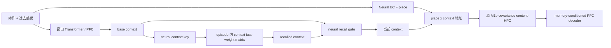

# ReMAP-Former M1d/M1e：时机、身份与关联 Context Memory 收口报告

> 日期：2026-07-13  
> 范围：固定 dev-only 机制诊断；未访问 stress、formal validation 或 test。  
> 结论：M1d 没有整体失效；失败的是严格 hard event gate。M1e 新增的关联 context memory 没有正向因果贡献，不应晋级。

## 1. 这轮到底在回答什么

新奇干扰容量任务中，冻结 M1b 的瓶颈可能来自两件事：

1. **更新时机错误**：模型不知道什么时候应该刷新当前 context；
2. **context 身份错误**：模型到达正确时机，但取回了错误历史 context。

此前 M1d 用“边界事件 precision/recall”判断机制是否成功。该指标后来被证明与最终记忆功能并不一致：很多形式上的 false event 并不会破坏内容回忆，而一个保守的 hard threshold 会漏掉有用刷新。于是本轮先做同 episode 因果分解，再测试一个不含 slot 的 neural associative context memory（M1e）。

## 2. 冻结成对诊断协议

- 固定 generator seed：`2918`；
- 容量：`K = 1, 2, 4, 8, 12`；
- 每个 K：16 episodes、32 个 return-conflict probes；
- 总计：80 episodes、160 probes；
- 所有条件逐 token 使用完全相同的数据；
- M1b、M1d、M1e 共享逐 tensor 完全相同的冻结 M1b slow weights；
- oracle 只用于冻结后因果干预，不进入模型输入、训练目标或 checkpoint 选择。

原始结果：

- `runs/remap_former/m1d_timing_identity_dev2918/summary.json`
- `runs/remap_former/m1e_paired_dev2918/summary.json`

## 3. M1d 并没有“突然拉了”

| 条件 | Return-conflict accuracy | 相对 M1b |
|---|---:|---:|
| M1b，content-HPC ridge=0.001 | 0.4750 | - |
| M1d soft update | 0.6125 | +0.1375 |
| M1d hard threshold=0.43 | 0.3000 | -0.1750 |
| M1d no update | 0.0250 | -0.4500 |
| M1d force all EC proposals | 0.6625 | +0.1875 |
| M1d oracle timing | 0.5375 | +0.0625 |
| Hard timing + correct historical context | 0.7750 | +0.3000 |
| Oracle timing + correct historical context | 1.0000 | +0.5250 |

真正发生的是：

- soft M1d 和 force-proposal M1d 都明显高于 M1b；
- 将 soft gate 硬阈值化后，从 `0.6125` 掉到 `0.3000`；
- 因此低数字属于 **hard gate 决策规则**，不属于整套 PFC+HPC 架构；
- 正确 timing 与正确 historical context 结合时达到 `1.0000/160 probes`，说明冻结 PFC、EC/place、content-HPC 和 decoder 的联合 substrate 足以解题。

诊断结论为 `MIXED_TIMING_AND_CONTEXT_IDENTITY`：时机和身份都重要。

## 4. 为什么旧 event gate 判据误导

M1d 的 EC proposal 对真实目标事件的覆盖率是 `1.0`。force-proposal 条件虽然按严格边界标签计算会产生大量“false events”，但功能准确率达到 `0.6625`；相反，追求事件 precision 的 hard threshold 只有 `0.3000`。

这说明任务需要的是“何时刷新 context 会改善未来内容预测”，而不是“逐 token 精确复刻人工边界标签”。边界 BCE 的 precision/recall 可以作为诊断，但不能再作为主晋级门。

## 5. PFC 本身有没有 context 身份信息

对 80 个固定 dev episodes，把最终 return endpoint 与本 episode 早期 A/B/D endpoints 做 cosine matching：

| 表示 | A/B reference-pair | 全历史 top-1 | 全历史 margin |
|---|---:|---:|---:|
| 原始 PFC `base_context` | 0.9250 | 0.5750 | +0.0410 |

这说明 PFC 已经很好地区分正确 A/B reference；主要错误来自多个 distractor context 抢走最近邻，而不是 PFC 完全没有 room/context 信息。

原始结果：`runs/remap_former/m1d_context_retrieval_key_probe_dev2918.json`。

## 6. M1e 架构

M1e 从冻结 M1b 直接扩展，不继承 M1d 的 boundary BCE：

关键约束：

- context memory 是每个 forward 现场创建的 `[B, 16, 16]` tensor；
- 没有 slot、没有持久 memory list、没有 room table；
- episode 开始清零，episode 结束丢弃；
- 输入不含 room ID、context ID、绝对位置、place ID、segment/path/return ID；
- 当前目标在预测后才用于原 content-HPC 写入；
- 只训练 11,221 个 context-controller 参数；冻结 Transformer/PFC、EC/place、content-HPC 与 decoder；
- 目标只有 conflict sensory CE，没有 boundary/context identity 辅助监督。

测试了两种 context-memory 写入：普通 delta rule 与 covariance dual-key correction。

## 7. M1e 训练期 pilot

两条 arm 均使用 seed `1920`、120 steps、batch 2、训练 K=1/2/4、固定 dev seed `2918`：

| Context memory | 训练期小 dev mean return | 禁用 recall | 因果增益 | 最低 clean | 晋级 |
|---|---:|---:|---:|---:|---|
| Delta | 0.4500 | 0.4500 | +0.0000 | 0.9464 | 否 |
| Covariance | 0.5000 | 0.4500 | +0.0500 | 0.9375 | 否 |

两者 conflict CE 都有下降，但功能门 `mean return >= 0.60` 与 `recall gain >= 0.10` 均未通过。

## 8. Context key 与读出定位

| 表示 | Delta 全历史 top-1 | Covariance 全历史 top-1 |
|---|---:|---:|
| Learned context key | 0.6000 | 0.5750 |
| Recalled context | 0.1000 | 0.2250 |

neural key 没有坍塌；delta 版甚至把原始 `0.575` 略升到 `0.600`。真正的信息损失发生在 fast-weight 写读之后。Covariance 将 recalled-context top-1 从 `0.100` 提到 `0.225`，说明它确实减轻串扰，但仍远低于输入 key，无法可靠恢复身份。

## 9. 160-probe 最终成对收口

| 条件 | Return-conflict | Clean | Target probability margin |
|---|---:|---:|---:|
| M1b ridge=0.001 | 0.4750 | 0.8640 | +0.2854 |
| M1d force proposals | **0.6625** | 0.9426 | +0.4669 |
| M1e delta | **0.6625** | **0.9535** | **+0.5422** |
| M1e delta，禁用 context recall | **0.6625** | 0.9426 | +0.4668 |
| M1e covariance | 0.6250 | 0.9502 | +0.5302 |
| M1e covariance，禁用 context recall | **0.6625** | 0.9426 | +0.4669 |

同 probe 的因果配对更直接：

- Delta 正常 vs no-recall：`98` 都对、`8` 仅正常对、`8` 仅消融对、`46` 都错；净增益 `0`；
- Covariance 正常 vs no-recall：`94` 都对、`6` 仅正常对、`12` 仅消融对、`48` 都错；净增益 `-0.0375`；
- M1d force vs M1b：`46` 个 probe 被救回，`16` 个 probe 被破坏，净增益 `+0.1875`。

最重要的等式是：

`M1d force proposals = M1e delta = M1e delta no-recall = 0.6625`。

因此 M1e 的表面提升来自 **在 EC candidate 时刻刷新为当前 PFC base context**，而不是来自新增的关联 context memory。

## 10. 冻结决定

1. **保留正式 M1b 结果**。本轮没有推翻此前 M1b 的 8-seed headline 与 matched-baseline 结论。
2. **修正 M1d 叙述**。M1d 的 hard event classifier 被拒绝，但 soft/force-proposal 的 functional result 分别为 `0.6125/0.6625`，不能再写成“M1d 整体失败”。
3. **拒绝 M1e associative context memory**。它没有正向 context-recall 因果增益，不跑 stress、formal validation/test 或多 seed。
4. **下一版应从简单机制出发**：EC 只提出少量结构候选，PFC 在候选时刻刷新当前 context；不再加入第二套 context fast-weight memory，也不再用严格 boundary precision 作为主目标。
5. 下一次扩展前，先把“proposal refresh”写成独立、无 diagnostic override、无额外 controller 参数的干净模型，再用三个预注册 dev seeds 检查其 `+0.1875` 是否稳定。通过后才讨论 formal split。

## 11. 可复现入口

- M1d timing/identity：`python diagnose_remap_m1d_timing_identity.py`
- PFC context key：`python probe_remap_m1d_context_retrieval_key.py`
- M1e delta：`python train_remap_m1e.py`
- M1e covariance：`python train_remap_m1e.py --context-memory-backend covariance`
- M1e key probe：`python probe_remap_m1e_associative_key.py --checkpoint <checkpoint>`
- 最终 paired closure：`python evaluate_remap_m1e_paired_dev.py`
- 回归：78 tests passed。
