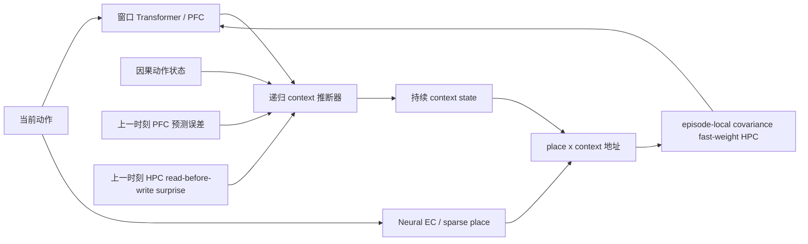

# ReMAP-Former M1d：因果递归 Context 调用实验

> 状态：单种子 train/dev 探索完成，候选未通过晋级门；formal validation、一次性 test 与预留 stress seed 均未访问。日期：2026-07-13。

## 1. 这一轮要回答什么

新奇干扰容量实验已经证明：M1b 的 covariance HPC 在精确地址下可承受 K=1/2/4/8/12，但模型正常运行时从 K>=2 开始失败。因此 M1d 只改一个问题：**Transformer/PFC 能否从因果历史判断何时重建 context，并用它调用正确的 episode-local HPC 地址？**

M1d 不改冻结的 Transformer、EC/place 与 decoder，也不引入 slot 或 content table；它继续使用 episode-local covariance fast synaptic matrix。M1b 的所有 slow-weight tensors 在转换后逐 tensor 相等；HPC ridge 从 dev 诊断得到的 `0.03` 换成容量上界已通过的 `0.001`。

模型输入中不存在 room ID、context ID、绝对位置、place ID、segment ID、path-family ID、return-reference ID，也不会在当前预测前读取当前 sensory target。context 只通过 `place x context` 地址控制 HPC，不直接进入 decoder。

## 2. 实现与因果约束

- 主实现：`remap_former/m1d.py`
- 递归推断器：64 维多信号融合、32 维 GRU state、持续 context 与 retention/update gate。
- 信号：当前动作、因果 action state、冻结 base context、当前因果 PFC hidden、上一时刻 PFC error、上一时刻 HPC surprise。
- 时序：先用旧误差/旧 surprise 推断当前 context，再读 HPC、预测当前 sensory，最后才看到当前 target 并写入 HPC；当前 target 只能影响下一步。
- HPC：每个 episode 在 `forward` 内建立的可微 fast synaptic matrix；先读后写，episode 结束即丢弃，不存在 slot 或跨 episode 内容表。
- 抖动任务：每段可插入 0--4 个额外四步闭环，破坏固定绝对时间和固定 segment 长度；真实 approach 仍为 12 步。
- 测试：当前 target 因果隔离、跨步梯度、episode reset、无 decoder 直连、hard gate 二值化、抖动候选覆盖与 mask 均有单测。

## 3. 预注册晋级门

调用事件在固定 dev 上选择 checkpoint 与 threshold，晋级需要同时满足：

| 门 | 阈值 |
|---|---:|
| Precision | >= 0.99 |
| Recall | >= 0.95 |
| False events / episode | <= 0.05 |
| 因果 cycle proposal 对真边界覆盖 | 1.00 |

只有四门全绿，才允许访问独立 stress seed，随后才考虑多 seed。正式 validation/test 不参与选择。

## 4. 五个单种子分支

### 4.1 自由 candidate residual + sensory CE

目录：`runs/remap_former/m1d_recurrent_seed1914_s180`

180 steps 后固定 dev conflict loss 从 `1.4184` 降到 `0.9658`，但 update gate 在 approach endpoint 与普通位置都约为 `0.970`。K=1/2/4/8/12 的 return-conflict 为 `0.50/0.25/0.50/0.50/0.00`。模型通过 `candidate_delta` 变成逐步 context mapper，没有学出稀疏调用事件，因此拒绝。

### 4.2 只学 gate + sensory CE

目录：`runs/remap_former/m1d_gate_only_seed1914_s180`

关闭 candidate residual 后，180 steps 的 dev loss 仅从 `1.0818` 降到 `1.0481`；endpoint/non-approach update 都约为 `0.415`。容量曲线保持 `0.50/0.50/0.50/0.25/0.00`。纯 sensory CE 对边界 gate 的训练信号不足，因此拒绝。

### 4.3 抖动任务上的全时刻边界 BCE

目录：`runs/remap_former/m1d_boundary_jitter_seed1916_s120`

这是探索性辅助目标，只监督“现在是否为 approach endpoint”，不提供 room/context 身份。120 steps 后 dev BCE 为 `0.5414`，threshold `0.71`：

| Precision | Recall | F1 | False events / episode |
|---:|---:|---:|---:|
| 0.0807 | 0.6190 | 0.1429 | 59.2 |

随 K 增大，误调用从 `24.0` 增至 `116.5` 次/episode，未通过任何 detector gate。

### 4.4 Hard-negative continuation

目录：`runs/remap_former/m1d_hard_negative_seed1917_s120`

从 4.3 的最佳 checkpoint 继续 120 steps，只强化最难负例。dev hard-negative BCE 为 `0.6980`，最终 `precision=0.0552`、`recall=0.5952`、误调用 `85.6/episode`，比上一分支更差，因此拒绝。

### 4.5 EC 提议、PFC 接受

目录：`runs/remap_former/m1d_candidate_gate_seed1918_s120`

EC 使用最近 12 步动作计数构造因果 balanced-cycle proposal。它只提出“这里可能发生 context 更新”，不决定 context 身份；PFC/GRU 再依据多信号历史决定是否接受。训练 BCE 只计算 proposal 时刻，仍只监督边界事件，不监督 room/context 身份。

proposal 对抖动任务真边界的覆盖率为 `1.000`。120 steps 的最佳 checkpoint 在 step 120，dev candidate BCE `0.6087`，threshold `0.43`：

| 指标 | 总体 | K=1 | K=2 | K=4 | K=8 | K=12 |
|---|---:|---:|---:|---:|---:|---:|
| Precision | 0.347 | 0.667 | 0.400 | 0.387 | 0.267 | 0.328 |
| Recall | 0.786 | 1.000 | 0.800 | 0.857 | 0.727 | 0.733 |
| False events / episode | 12.4 | 2.0 | 6.0 | 9.5 | 22.0 | 22.5 |
| Hard return-conflict | - | 0.75 | 0.50 | 0.00 | 0.25 | 0.50 |

候选 proposal 本身成功缩小了搜索空间，但 PFC acceptance 仍不能可靠区分真正重入与周期相似的负例；四个晋级门只有 proposal recall 通过。

## 5. 结论

正式决策：`M1D_RECURRENT_ACCEPTANCE_GATE_REJECTED_ON_DEV`。

这轮不是任务损坏：抖动 generator 的真实边界始终被因果 proposal 覆盖，新增测试全部通过。失败也不是 HPC 容量：ridge `0.001` 的精确地址上界此前在 K=1..12 均为 `1.0`。当前失败点被进一步定位为：**已有动作/PFC hidden/上一时刻 error/surprise 表示不足以把真正 context re-entry 与周期相似时刻高精度分开。**

因此：

1. M1d 不替换 M1b，不进入 stress、不铺 5 seed，也不访问 formal validation/test。
2. 冻结 M1b 仍是当前正式 ReMAP-Former；其旧 random-return、8-seed test 与长延迟结论不受影响。
3. `cyclic proposal` 可保留为 EC 时序候选机制，但当前 supervised acceptance head 只算失败诊断，不算论文正结果。
4. 下一次再开 context-reentry 路线，应先改变可辨识表示或训练任务，而不是继续在同一 BCE head 上扫阈值、加 steps 或堆 hard negatives。

## 6. 可复现资产

- 模型：`remap_former/m1d.py`
- 抖动 generator：`remap_former/capacity.py`
- 因果与结构测试：`test_remap_former_m1d.py`
- generator 测试：`test_remap_former_capacity.py`
- 训练脚本：`train_remap_m1d.py`
- 边界分支：`train_remap_m1d_boundary.py`
- hard-negative 分支：`train_remap_m1d_hard_negative.py`
- candidate-gate 分支：`train_remap_m1d_candidate_gate.py`
- 最终回归：`69 passed in 10.70s`
- 五个完整训练分支累计 wall-clock：约 `34.9 min`，不含 smoke 与评估开销。
