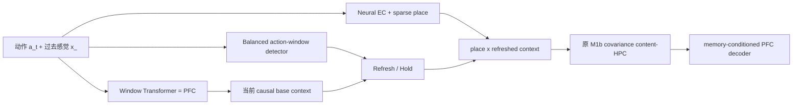

# ReMAP-Former M1f：零新增参数 Proposal-Refresh 三 Seed Dev 结果

> 日期：2026-07-13  
> 范围：冻结 dev-only paired stability gate；未访问 stress、formal validation 或 test。  
> 冻结决定：`PROMOTE_M1F_TO_FORMAL_PROTOCOL_DESIGN`。这表示可以设计下一阶段协议，不表示已经获得 formal 结果。

## 1. 为什么做 M1f

M1d/M1e 的 160-probe 收口发现：

- M1b：`0.4750`；
- M1d force structural proposals：`0.6625`；
- M1e delta：`0.6625`；
- M1e delta no-context-recall：`0.6625`；
- M1e covariance：`0.6250`；
- M1e covariance no-context-recall：`0.6625`。

因此有效部分不是 hard event classifier，也不是第二套 associative context memory，而是：**在某些结构窗口上，把持续 context 刷新为当前 PFC 已经算出的 causal base context。**

M1f 将这条路径独立实现，删除所有没有通过因果消融的机制。

## 2. M1f 架构

M1f 相对 M1b：

- 新增 trainable parameters：`0`；
- 新增持久 buffer：`0`；
- M1b slow weights：逐 tensor 完全相同；
- 训练：不存在；
- checkpoint 选择：不存在；
- room/context/position/place/segment/path/return ID：全部禁止；
- 当前 sensory target：预测后才揭示给 content-HPC 写入。

context 更新为：

\[
c_t = \mathrm{norm}\left((1-u_t)c_{t-1}+u_t c_t^{PFC}\right),
\]

其中 `u_t` 是固定 structural detector 的 0/1 输出。初始 context 为 `t=0` 的 causal PFC base context。

## 3. Proposal 的真实定义

必须纠正旧表述：proposal **不是 neural EC 输出，也不是人工 room boundary，更不保证稀疏**。

它只查看截至当前步的动作历史。在长度为 12 的 sliding window 中，如果四种动作各出现 3 次，则 `u_t=1`。它不知道 room、位置、path family 或 return reference。

在本次 240 episodes 中：

- proposal 数：`11,362`；
- 总 token：`105,632`；
- token 触发率：`10.756%`；
- 平均每 episode：`47.342` 次。

因此论文中应称为 **balanced-window context refresh**，不能称为“少量 EC 边界调用”。

## 4. 看结果前冻结的协议

协议文件：`runs/remap_former/m1f_three_seed_dev_protocol.json`。

- M1b model seeds：`712/713/714`；
- 独立 dev generator seeds：`2918/2919/2920`；
- 一一配对，不换 seed；
- K：`1/2/4/8/12`；
- 每颗每 K：16 episodes、32 return-conflict probes；
- 每颗：160 probes；总计：480 probes；
- 条件：M1b ridge=0.001、M1f refresh、M1f no-refresh；
- 所有条件逐 token 使用相同 episodes。

预注册 gates：

1. 三 seed 平均 paired gain `>= +10 pp`；
2. 正增益 seed 数 `3/3`；
3. 最差 seed gain `>= +5 pp`；
4. 最大 clean drop `<= 2 pp`；
5. M1f 相对 no-refresh 的平均因果增益 `>= +10 pp`。

## 5. 三 Seed 结果

| Model seed | Episode seed | M1b | M1f refresh | No refresh | M1f-M1b | Clean drop |
|---:|---:|---:|---:|---:|---:|---:|
| 712 | 2918 | 0.4750 | **0.7375** | 0.0250 | **+0.2625** | -0.0828 |
| 713 | 2919 | 0.3375 | **0.5375** | 0.0250 | **+0.2000** | -0.1301 |
| 714 | 2920 | 0.4250 | **0.5500** | 0.0000 | **+0.1250** | -0.0625 |

`clean drop` 为 `M1b clean - M1f clean`；负数表示 M1f 更高。三颗均无 clean 退化。

聚合 480 probes：

| 条件 | Return-conflict | Clean | Target probability margin |
|---|---:|---:|---:|
| M1b ridge=0.001 | 0.4125 | 0.8544 | +0.2551 |
| **M1f proposal refresh** | **0.6083** | **0.9462** | **+0.4225** |
| M1f no refresh | 0.0167 | 0.9327 | +0.0161 |

M1f 对 M1b 的平均增益为 `+19.58 pp`；M1f 对 no-refresh 的因果增益为 `+59.17 pp`。

## 6. 同 Probe 配对

M1f vs M1b，480 个相同 probes：

- 两者都对：160；
- 仅 M1f 对：132；
- 仅 M1b 对：38；
- 两者都错：150。

净救回 `132-38=94` 个 probes，即 `94/480=+19.58 pp`。收益不是两组独立样本的均值巧合。

M1f vs no-refresh：

- 两者都对：4；
- 仅 M1f 对：288；
- 仅 no-refresh 对：4；
- 两者都错：184。

方向性非常明确：持续 context 如果从不刷新，re-entry 基本消失。

## 7. 容量分解与 K=8 风险

| K | M1b | M1f refresh | No refresh | M1f-M1b |
|---:|---:|---:|---:|---:|
| 1 | 0.4792 | **0.8125** | 0.0000 | **+0.3333** |
| 2 | 0.5208 | **0.8333** | 0.0000 | **+0.3125** |
| 4 | 0.5625 | **0.7083** | 0.0000 | **+0.1458** |
| 8 | **0.3333** | 0.2917 | 0.0417 | **-0.0417** |
| 12 | 0.1667 | **0.3958** | 0.0417 | **+0.2292** |

K=8 是明确的非单调异常：seed712 为 `+0.0625`，seed713/714 为 `-0.0625/-0.1250`。当前预注册 gate 的 primary endpoint 是跨 K 总体，因此全部通过；但不能把总体通过改写成“每个容量都提升”。

正式协议设计必须：

- 将 K=8 列为预声明 secondary risk；
- 保留逐 K 与逐 seed 报告；
- 不根据 K=8 结果修改 detector、初始化或 ridge；
- 在 formal split 之前，最多允许一个另行冻结、只增加样本而不改模型的 K=8 dev confirmation。

## 8. Gate 判定

| Gate | 冻结阈值 | 结果 | 通过 |
|---|---:|---:|---|
| Mean paired gain | >= +0.1000 | +0.1958 | 是 |
| Positive seeds | >= 3/3 | 3/3 | 是 |
| Minimum seed gain | >= +0.0500 | +0.1250 | 是 |
| Maximum clean drop | <= +0.0200 | -0.0625 | 是 |
| Mean refresh causal gain | >= +0.1000 | +0.5917 | 是 |

五个 gates 全部通过。

## 9. 冻结决定与边界

决定：`PROMOTE_M1F_TO_FORMAL_PROTOCOL_DESIGN`。

这支持以下有限表述：

> 在三个独立 M1b slow-weight seeds 和三个独立 dev episode seeds 上，无新增参数的 balanced-window PFC-context refresh 稳定提高跨容量 return-conflict recall，并通过 no-refresh 因果消融。

目前不支持：

- “M1f 已通过 formal test”；
- “M1f 在所有 K 都优于 M1b”；
- “Neural EC 学会了何时调用”；
- “proposal 是稀疏 room boundary detector”；
- “新增 associative context memory 有效”。

## 10. 可复现入口

- 模型：`remap_former/m1f.py`
- 专项测试：`test_remap_former_m1f.py`
- 冻结协议：`runs/remap_former/m1f_three_seed_dev_protocol.json`
- 运行器：`evaluate_remap_m1f_three_seed_dev.py`
- 结果：`runs/remap_former/m1f_three_seed_dev/summary.json`
- 精简报告：`runs/remap_former/m1f_three_seed_dev/report.md`
- 完整相关回归：`85 passed`。
