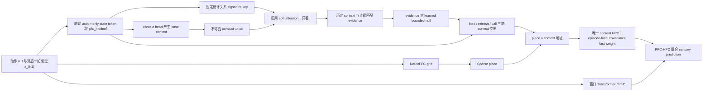

# M1i：可靠辅助结构历史调用完整结果

> 结论先行：M1i 把独立 K=8 return-conflict 从冻结 M1f 的 `0.3906` 提高到 `0.6406`，并通过增益、必要性、clean 保持和 context identity 四道门；但没有达到预注册绝对门槛 `0.75`，因此正式分类为 `M1I_RELIABLE_HISTORY_PILOT_REJECTED`。随后在全新 seed10932 上完成的 G2 只读审计把 68 个错误分为：context 精度不足 `50`、正确 context 下游仍答错 `14`、archival value 几何错误 `4`，其余历史、attention 来源、安装和覆盖错误均为 `0`。不扩三训练 seed，不复用盲测或审计 seed 调参，正式模型继续保持 frozen M1b。

## 1. 这一版到底是什么

M1i 不是新建一套内容记忆，也没有显式 context slot。它在 M1f 上只增加一个小型 PFC-side 辅助结构历史调用器；这个 caller 不读取主干 `pfc_hidden`：

**张量级澄清**：主 sensory prediction 骨干确实是窗口 Transformer/PFC，`pfc_hidden` 在末端接收 HPC retrieval 并输出预测；但本次 M1i caller 的 query/controller、history key 和 value 都**不读取 `pfc_hidden` 或 Transformer 原生 KV**。它们来自共享 action encoder 后的独立 action-only `state_token`、该 state 的 fixed cyclic signature，以及 `context_head(state)`。因此 M1i 更准确的名称是“挂在 PFC 系统旁的辅助结构历史 caller”，本 pilot 不能证明 Transformer hidden 自己完成了 context inference/call。

新增机制只有三件：

1. **锚定 key**：直接使用固定、归一化的 causal cyclic relation signature，不训练 Q/K，避免 M1h 的 key 漂移。
2. **隔离 value**：历史 value 永远是 prior proposal 时刻的 `base_context`；被调用后的 active context 不写回历史，避免递归污染。
3. **软拒答**：连续 evidence 与一个限制在 `[0.75, 0.99]` 的可学习 null similarity 比较，再决定是否 call；没有 exact match、硬阈值、top-k、index lookup 或 persistence counter。

没有增加：room ID、context label、switch flag、segment/path metadata、绝对位置、place ID、context slots、第二套 fast-weight matrix 或额外辅助 loss。

## 2. 训练协议

| 项目 | 冻结值 |
|---|---|
| 来源模型 | seed 712 frozen M1f / covariance HPC |
| 新增可训练参数 | `2,479` |
| 冻结部分 | PFC、EC、place、context head、content HPC、fusion、decoder |
| 训练 seed | `1813` |
| 课程 | K=`1,2,4,8` 等频确定性循环 |
| 预算 | `600 × batch 4` |
| 优化 | AdamW，LR `1e-3`，weight decay `1e-4`，clip `1.0` |
| 目标 | 唯一、无权重的全 token sensory CE |
| checkpoint | 不早停、不选择；只认 final step 600 |
| 协议 digest | `2ec6cadba803325b99f3a4292608f55fac31acc31b1120fb6698db02deec568b` |

训练约 `1202.2 s`。最长 K=8 CUDA smoke 序列为 560 步，loss 与梯度均有限；checkpoint loader 会重新施加冻结，读回后仍只有 2,479 个参数可训练。

### 训练轨迹

| Step | Dev loss | K8 return-conflict | K8 clean | Hold | Refresh | Call | Null |
|---:|---:|---:|---:|---:|---:|---:|---:|
| 0 | 1.7584 | 0.3750 | 0.9250 | 0.064 | 0.444 | 0.492 | 0.9000 |
| 100 | 1.6451 | 0.3750 | 0.9563 | 0.317 | 0.203 | 0.480 | 0.9043 |
| 200 | 1.6306 | 0.3750 | 0.9563 | 0.326 | 0.207 | 0.467 | 0.9091 |
| 300 | 1.6147 | 0.3750 | 0.9563 | 0.378 | 0.169 | 0.453 | 0.9140 |
| 400 | 1.6148 | 0.3750 | 0.9688 | 0.358 | 0.202 | 0.440 | 0.9182 |
| 500 | 1.6032 | 0.5000 | 0.9563 | 0.424 | 0.150 | 0.426 | 0.9231 |
| 600 | 1.5947 | 0.3750 | 0.9688 | 0.399 | 0.188 | 0.413 | 0.9274 |

固定 dev 的 K8 子集只有 16 个 return-conflict query，只用于监控数值健康，不用于选 checkpoint 或作最终结论。

## 3. 一次性 K=8 盲测

盲测使用训练前冻结的新 generator seed `9931`，K=8、16 batches、64 episodes、128 个 return-conflict probes。四个条件共享完全相同的 episodes。

| 条件 | Return-conflict | Clean | Context pair | Context margin | Target prob margin |
|---|---:|---:|---:|---:|---:|
| 冻结 M1f | 0.3906 | 0.9594 | 0.9062 | +0.2031 | +0.2361 |
| **M1i 可靠历史调用** | **0.6406** | **0.9750** | **0.8750** | **+0.1857** | **+0.3922** |
| M1i no-call | 0.2812 | 0.9688 | 0.7812 | +0.1063 | +0.1931 |
| M1i force-call（只诊断） | 0.3125 | 0.8914 | 0.9531 | +0.2662 | +0.1964 |

### 预注册五门

| Gate | 观测 | 门槛 | 结果 |
|---|---:|---:|---|
| M1i 绝对 return-conflict | 0.6406 | ≥ 0.75 | **FAIL** |
| M1i - M1f | +0.2500 | ≥ +0.20 | PASS |
| M1i - no-call | +0.3594 | ≥ +0.15 | PASS |
| Clean drop vs M1f | 0.0000 | ≤ 0.02 | PASS |
| Context pair | 0.8750 | ≥ 0.80 | PASS |

冻结分类：`M1I_RELIABLE_HISTORY_PILOT_REJECTED`。它距离绝对门槛还差 `0.1094`，即 128 个 probes 中还少 14 个正确答案。

## 4. 调用动态与归因

正常 M1i 在 proposal 上的平均 `hold/refresh/call` 为 `0.420/0.157/0.423`；call 成为 argmax 的比例为 `0.552`。历史 attention max 为 `0.406`，归一化 entropy 为 `0.501`；evidence/null 为 `0.884/0.927`。

这组消融支持四个判断：

1. **锚定历史调用方向有效。** M1i 比同 episode M1f 高 `25.00 pp`，也提高正确目标相对错误房间目标的概率 margin。
2. **调用确实被模型使用。** 禁用 call 后下降 `35.94 pp`；收益不能解释成仅靠 hold/refresh MLP 或 clean 改善。
3. **拒答与选择性是必要机制。** 强制 call 的 context pair 虽高达 `0.9531`，实际 return 只有 `0.3125`，clean 也降到 `0.8914`。因此“能找到像正确房间的历史 context”不等于“每次都应该覆盖当前 context”。
4. **当前剩余瓶颈位于调用决策到功能性 recall 的转化。** 正常 M1i 的 context identity 已过门，但 return 仍少 14/128；继续单纯锐化地址或增加调用率没有依据。

需要注意：no-call 是“同一个已训练 M1i controller 禁用 call”，其 `0.2812` 低于原始 M1f 的 `0.3906`。因此必要性门说明 call 对该 controller 必要；总机制是否优于 M1f 则由独立的 `+0.2500` 门确认。

## 5. G2：全新 Seed 的 Call-to-Recall 只读审计

G2 在看结果前冻结 seed、互斥类别优先级和分支规则。它加载固定 step-600 M1i，不训练、不修改参数，不访问 formal/test；room/segment metadata 只在 forward 后标注错误来源。为避免 oracle 自身改变后续记忆状态，每次 oracle rollout 只替换当前被测 query 的 context，同 episode 其他 return query 保持正常。

| 条件 | Return-conflict |
|---|---:|
| 冻结 M1f | 0.3125 |
| 冻结 M1i | 0.4688 |
| 仅当前 query 换入正确历史 context | **0.8594** |

query-only oracle 相对正常 M1i 提高 `+39.06 pp`，证明剩余误差主要仍位于 context 调用结果，而不是内容 HPC 的总体容量。正常 M1i 共错 `68/128`：

| 互斥错误类别 | 数量 | 错误占比 |
|---|---:|---:|
| Pair 正确但 exact context 精度不足 | **50** | **73.53%** |
| 正确 query context 下游仍答错 | 14 | 20.59% |
| Archival value 几何错误 | 4 | 5.88% |
| 无因果历史 / 无正确 exact 历史 | 0 / 0 | 0% / 0% |
| Attention 来源错误 / 正确历史未安装 | 0 / 0 | 0% / 0% |
| 成功 call 后被覆盖 | 0 | 0% |

冻结 family 判定为 `context_precision`，而不是 retention、call rate 或 history availability。正常 query 的 coarse context-pair accuracy 已达 `0.9375`，但许多向量只是在正确半空间里，尚未精确落到足以驱动 conjunctive address 的历史 context。下一版因此不应增加 persistence counter、context slot、第二套 fast weights 或无条件 call；应预注册 **confidence-conditioned transport**，专门把已检索到的 archival context 更精确地运输到当前 query。

零训练几何对照也排除了一个过早捷径：fixed signature 的 correct-segment top-1 为 `0.7500`，raw `pfc_hidden` cosine 只有 `0.0625`，差 `-0.6875`。这不证明 Transformer hidden 没有信息，只证明它的原始 cosine 几何不是现成可用的检索 key；下一版不能直接把 raw `pfc_hidden` 塞进 attention 冒充 native Transformer caller。

## 6. 诚实结论

- **可以说**：固定结构 key、archival value 隔离和 learned null 把上一版 M1h neural 的失败从 `0.1719` 改进为新 seed 上的 `0.6406`；神经调用产生了大且可消融的功能收益。
- **不能说**：M1i 已稳定解决 K=8、已成为正式模型、已超过三 seed 门或可以进入 formal/test。
- **也不能说**：主 Transformer hidden 已经学会从自身 KV 调回 context；当前 caller 仍走独立 action-only structural-state 路径。
- **正式状态**：frozen M1b 仍是当前最干净、已完成预算匹配比较的正式版本；M1f/M1h/M1i/G2 是定位 context re-entry 的机制链。
- **G2 允许的结论**：M1i 的主要剩余问题是“取到了大致正确的 context，却没有精确运输到可用地址”，不是“没有历史”“没有 call”或“call 后保持不住”。
- **G2 不允许的结论**：raw `pfc_hidden` 已经可直接作为 history key，或一个 confidence-conditioned transport 新模型已经有效；两者都尚未训练和盲测。

## 7. 下一步

G2 已经完成只读错误分解。下一步另立一份协议、使用全新训练 seed 和全新一次性盲测 seed，实现最小的 **confidence-conditioned context transport**：

1. 保留 fixed structural signature key、immutable archival `base_context` value 和 learned null；
2. 保留唯一 covariance content HPC，不加 slot 或第二套 fast-weight matrix；
3. 只在 evidence 高且 attention 集中时，把 history context 向 archival value 做精确 transport；低置信度时继续 hold/refresh；
4. 继续只优化全 token sensory CE，不添加 context label、room probe 或 oracle 辅助 loss；
5. 先过单 seed dev 的 context 精度与 clean gate，再使用全新 seed 做一次 K=8 盲测。

由于 raw `pfc_hidden` top-1 远低于 fixed signature，本轮不直接改用 native hidden cosine key。若以后要检验 Transformer hidden caller，必须另立表征学习协议和独立 seed，且不能把 G2 的只读几何诊断冒充训练证据。

## 8. 可复现资产

- 冻结协议：`runs/remap_former/m1i_reliable_history_pilot_protocol.json`
- 模型：`remap_former/m1i.py`
- 训练器：`train_remap_m1i_reliable_history.py`
- 盲测器：`evaluate_remap_m1i_reliable_history_pilot.py`
- 固定 checkpoint：`runs/remap_former/m1i_reliable_history_seed1813_s600/m1i_final.pt`
- 训练摘要：`runs/remap_former/m1i_reliable_history_seed1813_s600/summary.json`
- 盲测摘要：`runs/remap_former/m1i_reliable_history_pilot/summary.json`
- 自动盲测报告：`reports/REMAP_FORMER_M1I_RELIABLE_HISTORY_PILOT_CN.md`
- G2 冻结协议：`runs/remap_former/m1i_failure_audit_g2_protocol.json`
- G2 审计器：`diagnose_remap_m1i_failure_g2.py`
- G2 机器结果：`runs/remap_former/m1i_failure_audit_g2/summary.json`
- G2 自动报告：`reports/REMAP_FORMER_M1I_FAILURE_AUDIT_G2_CN.md`
- 回归：G2 与 M1i 聚焦测试 `26 passed`；整套 `test_remap_former*.py` 回归 `139 passed`。当前 Anaconda 必须先加载 NumPy 再加载 Torch，避免两份 OpenMP runtime 冲突；未使用不安全的 `KMP_DUPLICATE_LIB_OK`。全仓测试另被旧 `memlab`/`hippoformer` 可选依赖缺失阻断在收集阶段。
