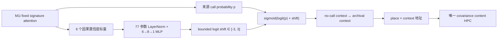

# M1j：置信度条件 Context Transport 完整结果

> 结论先行：M1j 严格按冻结协议完成 77 参数、600 步训练和全新 seed16180 的一次性 K=8 盲测。来源 M1i 与 M1j-disabled 都是 `0.7344`，而训练后的 M1j 只有 `0.0781`；disabled prediction/context 与来源 M1i 的最大差均为 `0`。七门只过 clean 与两条实现等价门，冻结分类 `M1J_CONFIDENCE_TRANSPORT_PILOT_REJECTED`。不铺三 seed，不在 seed16180 上调参，正式模型仍为 frozen M1b。

## 1. 这一版改了什么

M1j 不增加记忆，只在 M1i 已有的 call probability 与最终 context 混合之间插入一个有界、可微的 transport residual：

6 个输入只有：来源 call probability、attention max、`1-entropy`、evidence-null、current-history 相对 current-base alignment、base-history alignment。它们全部来自严格因果 forward；不读取 `pfc_hidden`、Transformer 原生 KV、room/context 标签、位置、place ID、segment、path family 或 return metadata。

最后一层权重和 bias 初始化为精确零，因此 step0 M1j 与来源 M1i 的 prediction/context 都逐位相同。训练后设置 `disable_transport_residual=True` 会把 shift 精确归零，也必须逐位恢复来源 M1i。M1i caller、Transformer/PFC、EC、place、context head、唯一 content HPC、fusion 和 decoder 全部冻结，只有 77 个 transport 参数可训练。

## 2. 冻结协议与实现门

| 项目 | 冻结值 |
|---|---|
| 来源 checkpoint | M1i seed1813，fixed step600 |
| M1j 训练 seed | 31415 |
| 课程 | K=`1,2,4,8` 等频确定性循环 |
| 预算 | `600 × batch4` |
| 目标 | 唯一、无权重的全 token sensory CE |
| 可训练参数 | `77` |
| checkpoint | 只认 final step600；不早停、不选最好 return |
| blind seed | 16180；K=8；64 episodes；128 probes |
| 协议 digest | `211c2baaccd0ffc37a365a4f9b251a190d191e3adbe7619cb10c9f05bfa521ba` |

最长 K=8 CUDA smoke 序列为 576 步，loss `1.9847`、gradient norm `0.6893`，transport final gradient 绝对和 `1.3146`。训练前四条 source/disabled prediction/context 等价差全部为 `0`；整套 ReMAP-Former 回归 `146 passed`。

## 3. 训练轨迹

| Step | Dev CE | K8 return-conflict | Source call | Transport strength | Logit shift |
|---:|---:|---:|---:|---:|---:|
| 0 | 1.5002 | 0.6250 | 0.450 | 0.450 | 0.000 |
| 1 | 1.4999 | 0.6250 | 0.450 | 0.449 | -0.007 |
| 100 | 1.4510 | 0.2500 | 0.450 | 0.276 | -1.104 |
| 200 | 1.4229 | 0.2500 | 0.450 | 0.154 | -1.961 |
| 300 | 1.4160 | 0.2500 | 0.450 | 0.120 | -2.269 |
| 400 | 1.4133 | 0.2500 | 0.450 | 0.112 | -2.327 |
| 500 | 1.4126 | 0.1250 | 0.450 | 0.097 | -2.508 |
| 600 | 1.4118 | 0.1250 | 0.450 | 0.099 | -2.474 |

训练耗时约 `1147.9 s`。CE 持续下降，但 transport 在 100% history events 上学出负 shift；call argmax 最终为 `0`。这不是梯度断开、NaN 或 checkpoint 选择偏差，而是均匀主 CE 下实际收敛出的策略。

## 4. 全新 K=8 盲测

| 条件 | Return-conflict | Clean | Context pair | Context margin |
|---|---:|---:|---:|---:|
| 冻结 M1f | 0.3750 | 0.9305 | 0.7969 | +0.1574 |
| **来源 M1i** | **0.7344** | **0.9664** | **0.8906** | **+0.1403** |
| M1j confidence transport | **0.0781** | 0.9477 | 0.5469 | +0.0023 |
| **M1j disabled** | **0.7344** | **0.9664** | **0.8906** | **+0.1403** |

M1j 相对来源 M1i 和 disabled 都是 `-65.625 pp`。disabled 的 prediction/context 最大差为 `0/0`，因此退化被严格归因到 learned transport residual，而不是 checkpoint、backbone、数据或 evaluator 差异。

### 冻结七门

| Gate | 结果 |
|---|---|
| M1j return ≥0.75 | FAIL |
| M1j - source M1i ≥+0.10 | FAIL |
| M1j - disabled ≥+0.10 | FAIL |
| Clean drop ≤0.02 | PASS |
| Context pair ≥0.85 | FAIL |
| Disabled prediction diff ≤1e-6 | PASS |
| Disabled context diff ≤1e-6 | PASS |

冻结分类：`M1J_CONFIDENCE_TRANSPORT_PILOT_REJECTED`。

## 5. 这否定了什么，没有否定什么

- **明确否定**：当前“允许正负 transport residual + 77 参数 confidence head + 均匀全 token sensory CE”的组合。它没有精确化 context，而是把几乎所有 call 压掉。
- **强烈提示**：训练信用分配与 return recall 目标冲突。CE 从 `1.5002` 降到 `1.4118` 的同时 return 大幅下降，且每个 history event 的 shift 都是负数。
- **尚未否定**：transport 几何本身。G2 的 query-only correct-context oracle 仍为 `0.8594`；M1j 失败说明当前 loss 没把 transport 推向那个方向，不等于正向 transport 没有功能空间。
- **不能升级 M1i**：来源 M1i 在 seed16180 达到 `0.7344`，很接近 `0.75`，但它是 M1j 协议中的对照条件，不能据此追溯改写 M1i 原先 4/5 门的拒绝结论。
- **仍未测试**：native Transformer hidden caller。M1j 和 M1i 都不读取 `pfc_hidden` 作为 call key。

## 6. G3 梯度信用审计

后续 G3 已在全新 dev seed17181 上完成。审计使用 step0 source-equivalent M1j、K=8、64 episodes、128 return-conflict probes；同一次 causal forward 后分别切 all-token、clean-query 与 return-conflict sensory CE，只用 `torch.autograd.grad` 读取最后 9 维 transport 参数的首次更新方向，无 optimizer、无参数修改。

- 聚合 `cos(all-token, return-conflict)=-0.9579`；只看 8 个条件权重、不含 bias 时为 `-0.8854`。
- 聚合 return-conflict CE 会让 100% return 段事件提高 transport，均匀 all-token CE 与 clean-query CE 都会让 100% return 段事件压低 transport。
- 但逐 batch 的 all-vs-return cosine 只有 `9/16=0.5625` 为负，没有达到预注册 `0.75` 稳定门；不同 batch 的 return 梯度确实存在两类相反方向。
- 77/9 参数门、source prediction/context 等价、其余 68 参数零梯度、参数哈希不变和 128-probe 数量门全部通过。

因此不能把强聚合反向直接升级成“均匀 CE 信用冲突已证实”；冻结状态是 `MIXED_GRADIENT_CREDIT`。后续按协议另立新 seed 的 probe 级因果信用审计。完整结果见 `reports/REMAP_FORMER_M1J_GRADIENT_CREDIT_AUDIT_G3_CN.md`。

## 7. G4 Probe 级信用审计

G4 已在另一全新 dev seed18182 上完成。每个 return-conflict probe 单独读取 9 维 CE 梯度，只分析同 episode、最终 return 段、query 之前的 causal transport events；room、target、correctness 与 context pair 仅在 forward 后分组。另用 transport 当时本来可见的六个 raw confidence features 做 16-fold leave-one-generator-batch-out ridge probe，不给它 logits、target、room、位置、PFC hidden 或 metadata。

- 新 seed 上 all-token/return 聚合梯度 cosine 为 `-0.9894`，逐 batch `14/16=0.875` 为负；G3 的平均目标冲突在这里复现得更稳定。
- 128 个 probe 中 `112` 个支持提高 transport，`16` 个要求压低；neutral 为 `0`。
- Source 已答对的 `60/60` 全部支持提高 transport；答错的 `52/68` 支持、`16/68` 拒绝。因此正负方向不是“答对就关、答错就开”，预注册的 outcome-conditional gate 失败。
- 六特征预测 support/reject 的 balanced accuracy 为 `0.5000`（把 128 个全判 support）；预测 source incorrect 为 `0.5961`，两条可分门都未到 `0.70`。
- Reference-room / target-index support-rate range 为 `0.1250/0.2143`，均通过无 label-direction 偏置门。9 参数、source 等价、每 probe 非零梯度、每 probe causal event、参数哈希不变和 128-probe 实现门全部通过。

冻结分类为 `PROBE_CREDIT_MIXED`，下一分支是 `STOP_EVENT_BALANCED_TRAINING_AND_RETURN_TO_CONTEXT_VALUE_OR_ADDRESS_GEOMETRY`。这不是说 return CE 平均上不支持 transport，而是说当前共享标量 transport 对少数 query 给出相反局部信用，六个 caller 特征又不能识别它们；直接重加权只会把冲突换一种平均方式。后续只允许只读的同 episode 梯度冲突与 query-only correct-context oracle 分解。完整结果见 `reports/REMAP_FORMER_M1J_PROBE_CREDIT_AUDIT_G4_CN.md`。

## 8. G5 Context/Value/Address 几何分解

G5 已在第三个全新 dev seed19184 上执行。它复现每个 probe 的局部 transport credit，并加入两项严格干预：同 episode 两个 return probe 的 9 维梯度/event-time 配对，以及每次 rollout 每 episode 只替换一个 query 的 frozen-M1f correct-context oracle。

- Source return-conflict 为 `0.4375`，query-only correct-context oracle 为 `0.8594`，再次确认 context/address 仍有很大因果空间。
- 128 probes 为 `88 support / 40 reject / 0 neutral`；G4 的 reject 子集不仅复现，而且从 16 增至 40。
- 40 个 reject 中 `32/40=0.8000` 被正确 query context oracle 救回，`38/40=0.9500` 的最后 archival context pair 本来就是正确的。
- 同 episode 两 probe 为 36 个 support/support、16 个 support/reject、12 个 reject/reject；14 对满足“一正一负、梯度 cosine≤-0.5、causal event Jaccard≥0.5”的共享标量冲突门。
- Reject 互斥桶：source 已答对饱和 `8`、正确 context 仍下游失败 `8`、archival value pair 错 `2`、共享标量 transport 冲突 `6`、局部标量 transport 几何不匹配 `16`。

局部几何是最大桶，但只占 `0.40`，没有达到预注册 `0.50` 主导门；runner-up 为两个 `0.20` 桶。实现门、query isolation 和参数哈希门全部通过，因此冻结分类是 `MIXED_CONTEXT_VALUE_ADDRESS_GEOMETRY`，下一分支 `NO_SINGLE_MECHANISM_YET_AND_DO_NOT_TRAIN`。当前证据不支持继续给 M1j 加 loss、小 gate、只正 residual 或另一套 fast weights；正式模型保持 M1b。完整结果见 `reports/REMAP_FORMER_M1J_SHARED_TRANSPORT_GEOMETRY_G5_CN.md`。

## 9. 可复现资产

- 冻结协议：`runs/remap_former/m1j_confidence_transport_pilot_protocol.json`
- 模型：`remap_former/m1j.py`
- M1i transport hook：`remap_former/m1i.py`
- 训练器：`train_remap_m1j_confidence_transport.py`
- evaluator：`evaluate_remap_m1j_confidence_transport_pilot.py`
- final checkpoint：`runs/remap_former/m1j_confidence_transport_seed31415_s600/m1j_final.pt`
- 训练摘要：`runs/remap_former/m1j_confidence_transport_seed31415_s600/summary.json`
- 盲测摘要：`runs/remap_former/m1j_confidence_transport_pilot/summary.json`
- 自动盲测报告：`reports/REMAP_FORMER_M1J_CONFIDENCE_TRANSPORT_PILOT_CN.md`
- G3 协议/脚本/结果：`runs/remap_former/m1j_gradient_credit_audit_g3_protocol.json`、`diagnose_remap_m1j_gradient_credit_g3.py`、`runs/remap_former/m1j_gradient_credit_audit_g3/summary.json`
- G4 协议/脚本/结果：`runs/remap_former/m1j_probe_credit_audit_g4_protocol.json`、`diagnose_remap_m1j_probe_credit_g4.py`、`runs/remap_former/m1j_probe_credit_audit_g4/summary.json`
- G5 协议/脚本/结果：`runs/remap_former/m1j_shared_transport_geometry_g5_protocol.json`、`diagnose_remap_m1j_shared_transport_geometry_g5.py`、`runs/remap_former/m1j_shared_transport_geometry_g5/summary.json`
- 回归：`test_remap_former*.py` 共 `171 passed`
