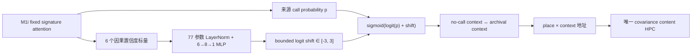

# M1j：置信度条件 Context Transport 完整结果

> 结论先行：M1j 严格按冻结协议完成 77 参数、600 步训练和全新 seed16180 的一次性 K=8 盲测。来源 M1i 与 M1j-disabled 都是 `0.7344`，而训练后的 M1j 只有 `0.0781`；disabled prediction/context 与来源 M1i 的最大差均为 `0`。七门只过 clean 与两条实现等价门，冻结分类 `M1J_CONFIDENCE_TRANSPORT_PILOT_REJECTED`。不铺三 seed，不在 seed16180 上调参，正式模型仍为 frozen M1b。

## 1. 这一版改了什么

M1j 不增加记忆，只在 M1i 已有的 call probability 与最终 context 混合之间插入一个有界、可微的 transport residual：

6 个输入只有：来源 call probability、attention max、`1-entropy`、evidence-null、current-history 相对 current-base alignment、base-history alignment。它们全部来自严格因果 forward；不读取 `pfc_hidden`、Transformer 原生 KV、room/context 标签、位置、place ID、segment、path family 或 return metadata。

最后一层权重和 bias 初始化为精确零，因此 step0 M1j 与来源 M1i 的 prediction/context 都逐位相同。训练后设置 `disable_transport_residual=True` 会把 shift 精确归零，也必须逐位恢复来源 M1i。M1i caller、Transformer/PFC、EC、place、context head、唯一 content HPC、fusion 和 decoder 全部冻结，只有 77 个 transport 参数可训练。

## 2. 冻结协议与实现门

| 项目 | 冻结值 |
|---|---|
| 来源 checkpoint | M1i seed1813，fixed step600 |
| M1j 训练 seed | 31415 |
| 课程 | K=`1,2,4,8` 等频确定性循环 |
| 预算 | `600 × batch4` |
| 目标 | 唯一、无权重的全 token sensory CE |
| 可训练参数 | `77` |
| checkpoint | 只认 final step600；不早停、不选最好 return |
| blind seed | 16180；K=8；64 episodes；128 probes |
| 协议 digest | `211c2baaccd0ffc37a365a4f9b251a190d191e3adbe7619cb10c9f05bfa521ba` |

最长 K=8 CUDA smoke 序列为 576 步，loss `1.9847`、gradient norm `0.6893`，transport final gradient 绝对和 `1.3146`。训练前四条 source/disabled prediction/context 等价差全部为 `0`；整套 ReMAP-Former 回归 `146 passed`。

## 3. 训练轨迹

| Step | Dev CE | K8 return-conflict | Source call | Transport strength | Logit shift |
|---:|---:|---:|---:|---:|---:|
| 0 | 1.5002 | 0.6250 | 0.450 | 0.450 | 0.000 |
| 1 | 1.4999 | 0.6250 | 0.450 | 0.449 | -0.007 |
| 100 | 1.4510 | 0.2500 | 0.450 | 0.276 | -1.104 |
| 200 | 1.4229 | 0.2500 | 0.450 | 0.154 | -1.961 |
| 300 | 1.4160 | 0.2500 | 0.450 | 0.120 | -2.269 |
| 400 | 1.4133 | 0.2500 | 0.450 | 0.112 | -2.327 |
| 500 | 1.4126 | 0.1250 | 0.450 | 0.097 | -2.508 |
| 600 | 1.4118 | 0.1250 | 0.450 | 0.099 | -2.474 |

训练耗时约 `1147.9 s`。CE 持续下降，但 transport 在 100% history events 上学出负 shift；call argmax 最终为 `0`。这不是梯度断开、NaN 或 checkpoint 选择偏差，而是均匀主 CE 下实际收敛出的策略。

## 4. 全新 K=8 盲测

| 条件 | Return-conflict | Clean | Context pair | Context margin |
|---|---:|---:|---:|---:|
| 冻结 M1f | 0.3750 | 0.9305 | 0.7969 | +0.1574 |
| **来源 M1i** | **0.7344** | **0.9664** | **0.8906** | **+0.1403** |
| M1j confidence transport | **0.0781** | 0.9477 | 0.5469 | +0.0023 |
| **M1j disabled** | **0.7344** | **0.9664** | **0.8906** | **+0.1403** |

M1j 相对来源 M1i 和 disabled 都是 `-65.625 pp`。disabled 的 prediction/context 最大差为 `0/0`，因此退化被严格归因到 learned transport residual，而不是 checkpoint、backbone、数据或 evaluator 差异。

### 冻结七门

| Gate | 结果 |
|---|---|
| M1j return ≥0.75 | FAIL |
| M1j - source M1i ≥+0.10 | FAIL |
| M1j - disabled ≥+0.10 | FAIL |
| Clean drop ≤0.02 | PASS |
| Context pair ≥0.85 | FAIL |
| Disabled prediction diff ≤1e-6 | PASS |
| Disabled context diff ≤1e-6 | PASS |

冻结分类：`M1J_CONFIDENCE_TRANSPORT_PILOT_REJECTED`。

## 5. 这否定了什么，没有否定什么

- **明确否定**：当前“允许正负 transport residual + 77 参数 confidence head + 均匀全 token sensory CE”的组合。它没有精确化 context，而是把几乎所有 call 压掉。
- **强烈提示**：训练信用分配与 return recall 目标冲突。CE 从 `1.5002` 降到 `1.4118` 的同时 return 大幅下降，且每个 history event 的 shift 都是负数。
- **尚未否定**：transport 几何本身。G2 的 query-only correct-context oracle 仍为 `0.8594`；M1j 失败说明当前 loss 没把 transport 推向那个方向，不等于正向 transport 没有功能空间。
- **不能升级 M1i**：来源 M1i 在 seed16180 达到 `0.7344`，很接近 `0.75`，但它是 M1j 协议中的对照条件，不能据此追溯改写 M1i 原先 4/5 门的拒绝结论。
- **仍未测试**：native Transformer hidden caller。M1j 和 M1i 都不读取 `pfc_hidden` 作为 call key。

## 6. 下一步

不立刻换 loss，也不把 residual 改成只允许正值。下一步先在全新 dev seed 做**只读 gradient-credit 审计**：在 step0 source-equivalent M1j 上，分别计算均匀全 token CE、clean token CE、return-conflict CE 对同一 transport head 的梯度方向、余弦和量级。metadata 只负责在 forward 后切片 loss，不进入模型输入，也不做 optimizer step。

若 all-token 与 return-conflict 梯度稳定反向，下一独立模型协议才允许研究 event-balanced sensory objective；若 return-conflict 本身也要求负 transport，则停止 transport 路线，回到 context value/地址几何。任何新模型继续只允许一个 content HPC，不加 context slot、第二套 fast weights 或 oracle 输入。

## 7. 可复现资产

- 冻结协议：`runs/remap_former/m1j_confidence_transport_pilot_protocol.json`
- 模型：`remap_former/m1j.py`
- M1i transport hook：`remap_former/m1i.py`
- 训练器：`train_remap_m1j_confidence_transport.py`
- evaluator：`evaluate_remap_m1j_confidence_transport_pilot.py`
- final checkpoint：`runs/remap_former/m1j_confidence_transport_seed31415_s600/m1j_final.pt`
- 训练摘要：`runs/remap_former/m1j_confidence_transport_seed31415_s600/summary.json`
- 盲测摘要：`runs/remap_former/m1j_confidence_transport_pilot/summary.json`
- 自动盲测报告：`reports/REMAP_FORMER_M1J_CONFIDENCE_TRANSPORT_PILOT_CN.md`
- 回归：`test_remap_former*.py` 共 `146 passed`
