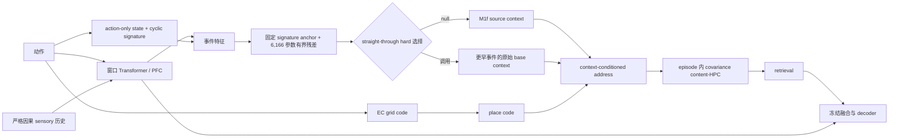

# ReMAP-Former M1m→M1n：事件 Key Ranking 完整收口

> 版本日期：2026-07-15。本文汇总 M1m G0、M1m G1 与 M1n 单 seed 神经排序器试点。正式模型仍是 frozen M1b；formal split 始终未打开。

## 1. 研究问题

K=8 新奇干扰任务中，正确旧 context 是否已经存在于同 episode 历史中？如果存在，剩余失败来自 soft mixing、事件排序、archival value，还是原有 EC/place/content-HPC 下游？一个不接收 room/context/位置/segment 真值的小型 neural ranker，能否只靠统一 sensory CE 学会在正确时刻调用正确历史事件？

## 2. M1n 架构

- **Transformer 是 PFC 主干**：接收动作与严格因果 sensory 历史，窗口内形成 `pfc_hidden`。
- **M1n 不是第二个海马**：它没有 slot、没有新 fast weights，只给既有 archival events 排序。
- **固定锚点不允许被删**：cyclic-signature cosine 经 `temperature=0.05` 形成主分数；神经部分只能加 `±3` 有界 residual。
- **值不递归污染**：调用值只能是更早 event 的 frozen M1f `base_context`，不能写回 ranker output。
- **前向是离散调用**：要么 source/null，要么一个更早事件；softmax 只用于 straight-through 反传。
- **下游全部冻结**：Transformer、state、context head、EC、place、address、content-HPC、融合与 decoder 均不更新。
- **唯一训练目标**：600 步、batch4、K=`1/2/4/8` 循环课程、均匀 all-token sensory cross-entropy；不加 room/context/event/ranking/return loss。

模型只接收 `actions` 与 `sensory`。`room_ids`、绝对位置、place ID、segment、return/conflict/query mask、reference ID、target index 和 oracle event 均只用于离线审计，不进入 `forward`。

## 3. G0：正确值是否存在

三个全新 seeds、384 个 K=8 return-conflict probes，零训练、query-only 干预：

| Source | Soft | Hard top-1 | Oracle-best archival | Exact correct | Exact wrong |
|---:|---:|---:|---:|---:|---:|
| 0.3542 | 0.6927 | 0.7448 | 1.0000 | 1.0000 | 0.0052 |

- Hard 只比 soft 高 `+0.0521`，不足以把问题归为 soft mixing。
- Oracle-best 比 hard 高 `+0.2552`，且 3/3 seed 正向。
- Oracle-best 与 exact-correct 同为 `1.0000`，说明正确 archival value 已在合法候选集，原 context→address→HPC→decoder 链路健康。
- 22 个实现门全过；完整 serial rollout 与局部 query replay 最大 prediction 差 `1.79e-6`。

冻结分类：`M1M_KEY_RANKING_DOMINANT`。

## 4. G1：零参数 context basin 是否够用

另三个全新 seeds、384 probes，用当前 causal base-context 对更早 event base-context 做 nearest-neighbor：

| Source | Signature hard | Context basin | Shuffled value | Oracle-best | Exact correct |
|---:|---:|---:|---:|---:|---:|
| 0.3958 | 0.7135 | 0.4167 | 0.2812 | 0.9896 | 0.9896 |

- Context-basin 只比 source 高 `+0.0208`，比 fixed signature 低 `-0.2969`。
- Correct-segment top-1 仅 `0.3333`；confidence AUROC `0.6519`。
- 22 个实现门全过；exact/oracle 控制健康，所有 retrieval/confidence 科学门失败。

冻结分类：`CONTEXT_BASIN_RANKING_INSUFFICIENT`。这一步只解锁一次受限 neural ranker pilot，不解锁 formal。

## 5. M1n 训练轨迹

训练 seed827151，monitor seed837151；checkpoint 选择规则为 **none**，只能使用固定 step600。

| Step | Overall CE | K8 return | K8 clean | K8 archival call | K8 correct segment | Overall null hard-select |
|---:|---:|---:|---:|---:|---:|---:|
| 0 | 1.7053 | 0.2500 | 0.9500 | 0.0000 | 0.0000 | 1.0000 |
| 100 | 1.8845 | 0.2500 | 0.9375 | 1.0000 | 0.8750 | 0.3241 |
| 200 | 1.7983 | 0.6250 | 0.9500 | 0.2500 | 0.2500 | 0.6899 |
| 300 | 1.7769 | 0.7500 | 0.9562 | 0.3750 | 0.3750 | 0.7395 |
| 400 | 1.7619 | 0.3750 | 0.9375 | 0.0000 | 0.0000 | 0.9104 |
| 500 | 1.7228 | 0.3750 | 0.9250 | 0.0000 | 0.0000 | 0.9737 |
| 600 | 1.7358 | 0.3750 | 0.9438 | 0.2500 | 0.0000 | 0.9455 |

step300 的 `0.75` 不能选，因为协议在训练前已固定 final step600。最终 checkpoint SHA256 为 `bd823861b9266fb9d9ec579a90d3175d512228448493e337b1701f336378cc28`；冻结骨干训练前后哈希一致。

## 6. Fresh K8 Blind

blind seed847151；64 episodes；128 return-conflict probes：

| 条件 | Return-conflict | Clean | Context pair | Context margin |
|---|---:|---:|---:|---:|
| Frozen M1f source | 0.5000 | 0.9469 | 0.8906 | +0.1481 |
| M1n full ranker | 0.5312 | 0.9289 | 0.8906 | +0.1394 |
| M1n disabled | 0.5000 | 0.9469 | 0.8906 | +0.1481 |

M1n 相对 source/disabled 都只增 `+0.0312`，clean drop 为 `0.0180`。History-available tokens 上 null hard-selection 为 `0.9214`；128 个 return probes 只调用 archival context `10` 次，这 10 次都来自正确 reference segment，但覆盖率仅 `0.0781`。Attention max/entropy 为 `0.2841/1.3106`。

### 科学门

| 门 | 结果 |
|---|---|
| M1n return ≥0.80 | FAIL |
| 相对 M1f 增益 ≥0.20 | FAIL |
| 相对 disabled 增益 ≥0.20 | FAIL |
| Clean drop ≤0.02 | PASS |
| Context pair ≥0.90 | FAIL |
| 正确 segment ≥0.90 | FAIL |

14 个实现门全部通过：source digest、disabled prediction/context 严格等价、前缀因果、当前 sensory 隔离、当前 event 排除、选择行归一、context 精确取值、冻结骨干、无 metadata 输入、128 probes 与有限数值均健康。

冻结分类：`M1N_ANCHORED_RESIDUAL_RANKER_REJECTED`。

冻结分支：`STOP_M1N_WITHOUT_TUNING_AND_RETAIN_FORMAL_M1B`。

## 7. 机制结论

1. **海马内容与下游不是当前瓶颈**：正确 archival context 一旦选中，G0 可达 `1.0`。
2. **固定结构签名比当前 context basin 更可靠**，但仍不足以完成 K=8 精确 event ranking。
3. **M1n 没有学成乱调用器**。它学成了高精度、极低召回的 caller：少量调用来自正确 segment，但 92% 以上 history tokens 退回 source。
4. **统一 all-token CE 与稀疏 re-entry credit 不匹配**：绝大多数 source 已健康的 token 奖励 abstain，稀疏 return 的调用收益不足以支撑高覆盖检索。
5. **不能在 blind 上补救**：不得调 null logit、residual scale、loss 权重、checkpoint 或阈值，也不得扩 seeds。任何新目标必须另立 research reset、全新训练/monitor/blind seeds。

当前可发表主线仍以 frozen M1b 的内容串扰修复和已完成的 matched Hippoformer / M-delta 对照为正式结果；M1m→M1n 是一条有实现门保护、能定位到 key-ranking 与 sparse-credit 冲突的负结果链。

## 8. 关键文件

- 模型：`remap_former/m1n.py`
- 训练：`train_remap_m1n_anchored_ranker.py`
- Blind evaluator：`evaluate_remap_m1n_anchored_ranker_pilot.py`
- 冻结协议：`runs/remap_former/m1n_anchored_residual_ranker_pilot_protocol.json`
- 训练摘要：`runs/remap_former/m1n_anchored_ranker_seed827151_s600_recovery/summary.json`
- Blind 机器结果：`runs/remap_former/m1n_anchored_ranker_pilot/summary.json`
- G0 报告：`reports/REMAP_FORMER_M1M_PRECISION_CHAIN_G0_CN.md`
- G1 报告：`reports/REMAP_FORMER_M1M_CONTEXT_BASIN_G1_CN.md`
- M1n 自动报告：`reports/REMAP_FORMER_M1N_ANCHORED_RESIDUAL_RANKER_PILOT_CN.md`
