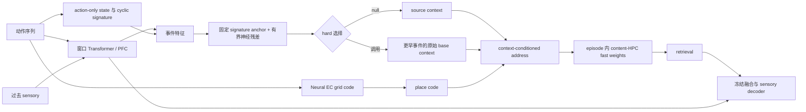

# M1n：锚定残差事件检索器单 seed 盲测

> 固定 step600；全新 K=8 blind seed847151；64 episodes / 128 return-conflict probes。模型输入仍只有 actions 与因果 sensory 历史，没有 room/context/位置/segment/target 输入，没有新增记忆槽或第二套 fast weights。

## 架构边界

M1n 冻结 Transformer、EC、place、content-HPC、融合与 decoder。它只在结构事件上排序：固定 cyclic-signature anchor 永远保留，6,166 个可训练参数只提供有界残差，并在 source/null 与更早事件的原始 base_context 之间做 straight-through hard 选择。前向地址使用的 context 必须精确等于这两类值之一。训练只有均匀 all-token sensory CE。

| 条件 | Return-conflict | Clean | Context pair | Context margin |
|---|---:|---:|---:|---:|
| 冻结 M1f source | 0.5000 | 0.9469 | 0.8906 | +0.1481 |
| M1n 锚定残差事件检索 | 0.5312 | 0.9289 | 0.8906 | +0.1394 |
| M1n 禁用事件检索 | 0.5000 | 0.9469 | 0.8906 | +0.1481 |

## 冻结六门

- M1n return-conflict：`0.5312`。
- M1n - M1f：`+0.0312`。
- M1n - disabled：`+0.0312`。
- M1n clean drop：`+0.0180`。
- M1n context pair：`0.8906`。
- 选中正确 reference segment：`0.0781`。

- `m1n_return_absolute`：`FAIL`
- `m1n_gain_vs_m1f`：`FAIL`
- `ranker_necessary`：`FAIL`
- `m1n_clean_preserved`：`PASS`
- `m1n_context_identity`：`FAIL`
- `m1n_event_segment_identity`：`FAIL`

## 实现门

- `source_checkpoint_digest`：`PASS`
- `disabled_prediction_equivalence`：`PASS`
- `disabled_context_equivalence`：`PASS`
- `prefix_context_causality`：`PASS`
- `prefix_prediction_causality`：`PASS`
- `current_sensory_context_isolation`：`PASS`
- `current_sensory_prediction_isolation`：`PASS`
- `current_event_excluded`：`PASS`
- `selection_rows_normalized`：`PASS`
- `exact_source_or_archival_context`：`PASS`
- `frozen_backbone_unchanged`：`PASS`
- `forward_has_no_task_metadata`：`PASS`
- `expected_return_conflict_probes`：`PASS`
- `finite_outputs`：`PASS`

冻结分类：`M1N_ANCHORED_RESIDUAL_RANKER_REJECTED`。
冻结分支：`STOP_M1N_WITHOUT_TUNING_AND_RETAIN_FORMAL_M1B`。

## 检索动态

- 历史 attention max / entropy：`0.2841` / `1.3106`。
- 全历史 token 的 null 概率 / null hard-selection：`0.4705` / `0.9214`。
- Return probes 的 archival 调用率：`0.0781`。
- 有界 residual 绝对均值：`0.1424`。

## 失败判读

- 128 个 return-conflict probes 中，M1n 只调用 archival context `10` 次，其中 `10` 次来自正确 reference segment。它不是乱调，而是退化成高精度、极低召回的 caller。
- 正确 probe 仅从 source 的 `64/128` 增至 `68/128`；稀疏的正确调用不足以达到绝对值和相对增益门。
- M1n 与 source 的 context pair 都是 `0.8906`，主要因为 `92.14%` 的 history-available tokens 仍走 source；不能把这个 pair 数解读为 neural event ranking 成功。
- Attention max 只有 `0.2841`、entropy 为 `1.3106`，说明固定 anchor 没被删除，但 learned residual 没把长候选集压成可靠的高覆盖排序。
- 单一 all-token sensory CE 在绝大多数 source 已健康的 token 上奖励 abstain，稀疏 return probe 的调用收益不足以改变最优策略；这是本冻结目标下的机制性负结果，不允许在 blind seed 上补权重或 auxiliary loss。

## 结论边界

本 blind 只决定 M1n 是否允许进入全新 seeds 的稳定性阶段。seed847151 不得用于任何调参、换 checkpoint 或改阈值；无论结果如何，既有 frozen M1b 正式结论不被追溯修改。
