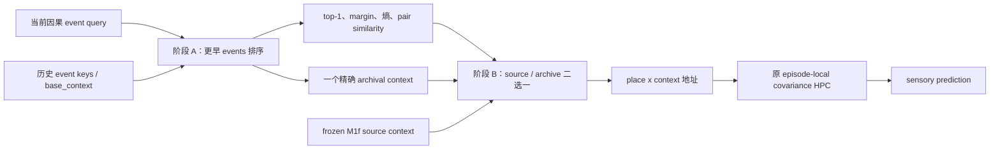

# ReMAP-Former M1o：证据耦合调用与 Dense Re-entry 结果

更新日期：2026-07-15

## 1. 一句话结论

M1o 的实现和训练任务均通过预注册 gate，但固定 step 800 的 original-K8 monitor 只从 frozen source `0.3438` 提高到 `0.3750`，return archive 调用覆盖仅 `2/64=0.03125`。两次调用都选对 room，clean 完全不降；模型仍是一个高精度、极低召回的调用器。

正式状态：`M1O_TRAINING_GATE_REJECTED`。

按冻结协议，fresh blind seed `1257151` **未打开**，不进行任何 blind 调参或三 seed 扩展。

## 2. M1o 改了什么

M1n 的 null scorer 只读当前 event feature；它看不到历史候选的绝对匹配强度。M1o 改为两阶段结构：

调用头显式读取 8 个检索证据：absolute fixed top-1、top-1/top-2 margin、learned/context/state similarity、event max probability、event entropy、source/archive cosine。

保持不变：

- Transformer/PFC、action-state、context head、EC、place、address、content-HPC、fusion 和 decoder 全冻结；
- 前向 context 只能是 source，或一个严格更早 event 的原始 `base_context`；
- 不增加 slot，不增加第二套 fast weights，不递归写回 ranker 输出；
- 模型输入仍只有 action 与严格滞后的 sensory；
- 训练仍只有一个不加权的 all-token sensory CE。

新增可训练参数 `6,150` 个。Smoke implementation gates 为 `17/17 PASS`；全套回归为 `223 passed`。

## 3. 为什么先做四轮 G0

前三个分布都在训练前被 gate 正确拦截，没有优化 M1o：

| G0 | 分布 | 密度倍率 | source | fixed hard | 增益 | 正确 event/room | 决策 |
|---|---|---:|---:|---:|---:|---:|---|
| v1 | K4/K8，4 个冲突 target | 1.515x | 0.5312 | 0.7422 | +0.2109 | 0.8672 | 密度不足 |
| v2 | 内环+外环 8-target | 2.283x | 0.5273 | 0.5859 | +0.0586 | 0.7695 | 内环内容通路不健康 |
| v3 | 外环+对角 8-target | 2.020x | 0.2656 | 0.5156 | +0.2500 | 0.7773 | 未过冻结 absolute floor |
| **v4** | **每 4 个 novel distractors 后 re-entry，K8/K12** | **2.743x** | **0.6781** | **0.8938** | **+0.2156** | **0.9469** | **10/10 gates PASS** |

v4 没有引入新目标位置。它保留原来的四个外环 target，只在每连续 4 个 novel contexts 后插入一次合法 re-entry：K8 有两次返回，K12 有三次返回。模型输入、地图、HPC 和 loss 均未改变。

## 4. 冻结训练协议

| 项目 | 设置 |
|---|---|
| source | frozen M1f / covariance HPC ridge 0.001 |
| train seed | 1237151 |
| train families | train split |
| curriculum | K8 / K12 交替 |
| steps / batch | 800 / 4 |
| optimizer | AdamW，LR 3e-4，WD 1e-4 |
| loss | 单一、均匀、全 token sensory CE |
| checkpoint | 只认固定 final step 800 |
| monitor seed / split | 1247151 / validation |
| transfer monitor | 原始四目标、两冲突、jittered K8 |
| blind | seed1257151，仅在所有 training gates 通过后打开 |

训练耗时 `2643.4 s`。Frozen backbone 前后 hash 完全一致。Final checkpoint SHA256：`b94e8629be2626b8709312aadd226042922ca68ae0dfd38003d65fd885502f1f`。

## 5. Original-K8 学习轨迹

| Step | Candidate | Source | Return call | Correct-room coverage | Soft call | Distractor null |
|---:|---:|---:|---:|---:|---:|---:|
| 0 | 0.3438 | 0.3438 | 0.0000 | 0.0000 | 0.265 | 1.000 |
| 100 | 0.3438 | 0.3438 | 0.0000 | 0.0000 | 0.265 | 1.000 |
| 200 | 0.3438 | 0.3438 | 0.0000 | 0.0000 | 0.267 | 1.000 |
| 300 | 0.3438 | 0.3438 | 0.0000 | 0.0000 | 0.277 | 1.000 |
| 400 | 0.3438 | 0.3438 | 0.0000 | 0.0000 | 0.339 | 1.000 |
| 500 | 0.2500 | 0.3438 | 0.0000 | 0.0000 | 0.321 | 0.967 |
| 600 | 0.2812 | 0.3438 | 0.0312 | 0.0312 | 0.287 | 0.978 |
| 700 | 0.4062 | 0.3438 | 0.0625 | 0.0625 | 0.300 | 0.937 |
| **800** | **0.3750** | **0.3438** | **0.0312** | **0.0312** | **0.271** | **0.937** |

Step 700 不是合法 checkpoint，不能选择。固定 step 800 才是唯一决策点。

## 6. 固定终点结果

### Original jittered K8 transfer monitor

| 指标 | Frozen source | M1o | 差值 |
|---|---:|---:|---:|
| Return-conflict | 0.3438 | 0.3750 | +0.0313 |
| Clean | 0.9516 | 0.9516 | 0.0000 |
| Correct-target probability | 0.2727 | 0.3525 | +0.0798 |
| Target-vs-other margin | 0.2057 | 0.2889 | +0.0832 |

M1o 在 `64` 个 return-conflict probes 中只调用 `2` 次；两次都选对 room，因此 call precision 为 `1.000`，但 coverage 只有 `0.03125`。全 history hard-call rate 为 `0.0607`，distractor null 为 `0.9368`。

### Dense training-distribution monitor

| Level | Source | M1o | Return call | Clean |
|---|---:|---:|---:|---:|
| K8 | 0.6250 | 0.6250 | 0.0000 | 0.9453 |
| K12 | 0.7292 | 0.7292 | 0.0000 | 0.9271 |

即使 dense G0 的 fixed hard intervention 明显有效，uniform CE 训练后的 hard router 在 dense return 上仍选择 source。这排除了“只是原任务 OOD，训练任务内已经学会调用”的解释。

## 7. Training Unlock Gates

| Gate | 结果 |
|---|---|
| Original K8 absolute >= 0.65 | FAIL |
| Gain vs source >= 0.10 | FAIL |
| Clean drop <= 0.03 | PASS |
| Return archive coverage >= 0.35 | FAIL |
| Correct-room coverage >= 0.50 | FAIL |
| Distractor null >= 0.50 | PASS |
| Frozen backbone unchanged | PASS |
| All metrics finite | PASS |

结论：`4/8` gates 通过，training gate 拒绝。Fresh blind 未打开。

## 8. 机制解释

### 8.1 M1o 修复了“调用头看不到检索证据”，但没有修复信用分配

一旦调用，M1o 的 room precision 仍为 `1.0`；G0 hard archive 也达到 `0.8938`。正确候选存在，检索证据存在，下游 HPC 健康。失败仍集中在“何时把 soft preference 推过 hard-call 阈值”。

### 8.2 把有效 token 密度提高 2.743 倍仍不够

Soft call 曾在 step400 升到约 `0.339`，随后少量非 return 调用先跨过阈值，并通过 episode-local memory rollout 影响后续预测。全 token CE 会同时奖励保守 source、惩罚错误时机；稀疏 return 收益没有形成足够稳定的离散路由信用。

### 8.3 不能把 step700 当成功

Step700 的 `0.4062` 是固定轨迹中的中间波动，仍远低于预注册 absolute 与 coverage gates。选择它既违反 fixed-endpoint 规则，也不能改变核心负结论。

## 9. 下一条合法研究线

不应在本 monitor 或未打开的 blind 上调 bias、阈值、LR 或 checkpoint。若继续，应另立全新协议，改变 **sensory likelihood 如何给路由信用**，而不是再堆一个 caller：

1. 同一 causal history 下分别计算 source 与 archival 两条只读预测分支；
2. 用真实 sensory 的 likelihood 直接训练二者的 latent routing probability；
3. 不使用 room、segment、return 或正确 event 标签；
4. 训练时做概率边缘化，部署时再 hard select；
5. content-HPC、archive 和 formal M1b 继续冻结。

这是一条 objective-level research reset，不能伪装成 M1o 小修。

## 10. 机器产物

- 协议：`runs/remap_former/m1o_evidence_coupled_dense_v4_pilot_protocol.json`
- G0：`runs/remap_former/m1o_training_distribution_g0_v4/summary.json`
- Smoke：`runs/remap_former/m1o_evidence_coupled_v4_smoke.json`
- 训练：`runs/remap_former/m1o_evidence_coupled_v4_seed1237151_s800/summary.json`
- 轨迹：`runs/remap_former/m1o_evidence_coupled_v4_seed1237151_s800/metrics.jsonl`
- Checkpoint：`runs/remap_former/m1o_evidence_coupled_v4_seed1237151_s800/m1o_final.pt`
- 模型：`remap_former/m1o.py`
- 训练器：`train_remap_m1o_evidence_coupled.py`

