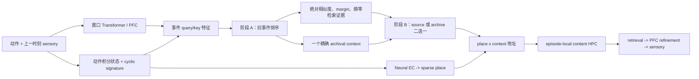

# ReMAP-Former M1o：证据耦合调用与记忆密集训练计划

更新日期：2026-07-15

## 1. 为什么另开 M1o

M1n 的 fresh blind 已冻结为负结果。它通过了 `14/14` 个实现 gate，但只在 `10/128` 个 return-conflict probe 上调用 archival context；这 10 次又全部来自正确 segment。结论不是“archive 里没有正确记忆”，而是一个高精度、极低召回的拒绝调用器。

这条线不修改 M1n，也不重开其 blind。M1o 使用全新训练、monitor 和 blind seeds，是独立研究重启。

## 2. M1n 的两个具体问题

### 2.1 调用头看不到检索证据

M1n 的 null scorer 只读当前 query event feature。它不知道历史候选中是否出现了高相似事件，也不知道 top-1 与 top-2 的间隔。

同时，M1n 把 fixed signature score 写成“减去当前候选集最大值”。这样最强候选的 anchor logit 永远从 `0` 起跑，绝对匹配强度被抹掉。该设计适合候选间排序，却不适合判断“历史是否值得调用”。

### 2.2 单一 CE 中的有效 token 太稀

原训练平均混合 K1/K2/K4/K8，每个 episode 只有两个 return-conflict target。K8 中真正必须依赖旧 context 的 token 约占全部 token 的千分之几，大量普通 token 会奖励 source/null。

已有 interleaved-revisit generator 虽然把冲突密度提高到约 `6%`，但 frozen source 已接近 `0.90`，fixed hard archive 没有正收益，因此它不能作为本次训练分布。

## 3. M1o 架构

阶段 A 只在严格早于当前事件的历史 anchors 中排序，并保持 M1m G0 已验证过的 fixed cyclic anchor。阶段 B 显式读取以下因果证据：

- 历史 top-1 的绝对 fixed similarity；
- top-1 减 top-2 margin；
- learned/context/state pair similarity；
- 历史分布的最大概率与熵；
- source context 与候选 archive context 的 cosine。

前向仍是硬选择：输出 context 只能是 frozen source，或某一个更早事件的原始 `base_context`。没有新 memory slot，没有第二套 fast weights，也不允许递归写回 ranker 输出。

## 4. 训练分布

训练只用原来的 `make_novel_distractor_capacity_batch`，不新造带 oracle 的 task：

| 项目 | M1n | M1o |
|---|---:|---:|
| capacity curriculum | K1/K2/K4/K8 | K4/K8 |
| conflict targets | 2/4 | 4/4 |
| loss | 全 token sensory CE | 全 token sensory CE |
| metadata 输入 | 无 | 无 |
| auxiliary loss | 无 | 无 |

K4/K8 是预检中 source 明显失效、fixed hard archive 能产生正收益的区间。四个 target 全冲突只改变生成分布，不改变模型输入，也不按 query 或 return 对 loss 加权。

## 5. 顺序 gate

### G0：数据机制 gate

在任何训练前，用独立 train-only seed 检查：

1. 新分布的 memory-required token 密度至少是旧分布的 `2x`；
2. fixed hard archive 相对 source 至少提高 `0.15`；
3. fixed hard return-conflict 至少 `0.70`；
4. hard 所选事件来自正确 segment 的比例至少 `0.75`；
5. gauge pair 的 action/sensory 仍逐元素相同。

任一失败就不训练 M1o。

### 单 seed 训练 gate

固定训练 seed `1087151`，固定 step `800`，不挑 checkpoint。monitor 使用未参与训练的 validation families 与 seed `1097151`。只有最终 K8 同时满足准确率、source 增益、clean、调用覆盖和正确 segment gate，才允许打开 blind。

### Fresh blind

blind seed `1107151`、dev families、原始 K8 两冲突设定，共 `64` episodes、`128` probes。一次性比较 frozen M1f、旧 M1n、M1o 和 M1o-disabled。结果打开后不再调本线。

## 6. 这次没有做什么

- 不使用 room/context/segment/path/return labels 训练；
- 不给 call、attention 或 event ranking 加监督；
- 不按冲突 token 重加权；
- 不加入 slot bank、第二套 fast weights 或持久内容表；
- 不复用 M1n blind seed；
- 不根据 monitor 选 checkpoint。

机器协议：`runs/remap_former/m1o_evidence_coupled_dense_pilot_protocol.json`。

## 7. 最终执行结果

初版 G0 因密度只有 `1.515x` 停止；内外环 v2 因 fixed-hard 增益不足停止；外环+对角 v3 因未过冻结 absolute floor 停止。最终 v4 改成每 4 个 novel distractors 后做一次原始四目标 re-entry，G0 达到：密度 `2.743x`、source `0.6781`、fixed hard `0.8938`、增益 `+0.2156`、正确 room `0.9469`，10/10 gates 通过。

M1o v4 随后按新冻结协议运行 seed1237151、800 steps。固定终点 original-K8 的 source/M1o 为 `0.3438/0.3750`，clean 均为 `0.9516`；return 调用只有 `2/64`，两次均选对 room。8 个 training unlock gates 只过 clean、distractor null、frozen backbone 与 finite metrics，正式状态 `M1O_TRAINING_GATE_REJECTED`。fresh blind seed1257151 未打开。

完整结果见 `reports/REMAP_FORMER_M1O_EVIDENCE_COUPLED_V4_RESULT_CN.md`。
