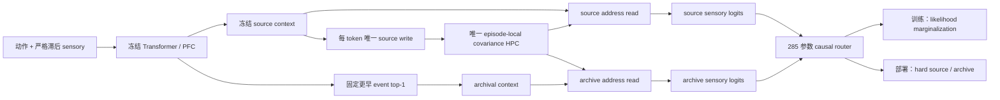

# ReMAP-Former M1p：Likelihood-Marginal 单 HPC 调用路由结果

更新日期：2026-07-15

## 1. 一句话结论

M1p 第一次解决了 M1o 的“几乎不调用”问题：固定 step400 的 original-K8 validation monitor 上，hard archive call coverage 从 M1o 的 `0.03125` 提高到 `0.78125`，correct-room coverage 达 `0.6875`，同时 distractor source selection 保持 `0.8805`。

但正式 hard deployment 只从 frozen source `0.5000` 提高到 `0.59375`，差 2/32 probes 才达到 `0.65` absolute gate，增益 `+0.09375` 也低于 `+0.10` gate。因此正式状态仍是：

`M1P_TRAINING_GATE_REJECTED`

Fresh blind seed `1457151` **未打开**，不得选择中间 checkpoint、调 hard threshold 或在该 monitor 上继续优化。

关键机制进展是：同一固定 checkpoint 的 soft marginal prediction 达到 `0.65625`，clean `0.95156`。当前主要瓶颈已从 sparse call credit 转移到 **soft likelihood training 与 hard deployment 的不一致**。

## 2. M1p 架构

### 不变部分

- Transformer/PFC、action-state、context head、EC、place、address、content-HPC、fusion 和 decoder 全冻结；
- 仍只有一份 episode-local covariance-corrected HPC；
- 每个 token 只写一次，始终用 frozen source address；
- source 与 archive 从同一个写前 memory state 各读一次；
- archive 只能选严格更早 event 的原始 `base_context`；
- 无 slot、无第二套 fast weights、无 parallel memory state；
- 输入仍只有 action 与严格因果 sensory 历史；
- 禁止 room、position、segment、return、conflict、query、event 和 route 标签。

### 新增部分

Router 只训练 `285` 个参数：一个 14 维 LayerNorm 和两层 MLP。它读取：

- fixed top-1、top1-top2 margin、event attention max/entropy；
- source/archive context cosine；
- 两条 retrieval 的 norm 与 cosine；
- 两条 sensory prediction 的 confidence、entropy、L1 disagreement 和 confidence difference。

这些全部在当前 sensory 写入前计算，部署时可用。

## 3. 新目标函数

设两条冻结分支给出：

`p_s(y_t | history)` 与 `p_a(y_t | history)`

Router 给出因果调用概率：

`q_t = sigmoid(router(features_t))`

训练只最小化一个均匀 all-token marginal sensory NLL：

`L = -mean_t log[(1-q_t)p_s(y_t) + q_t p_a(y_t)]`

没有 route label、return weighting、query mask、auxiliary gate loss 或 oracle distillation。真实 sensory 只进入 loss，不进入 router features。

正式部署仍按 `q_t >= 0.5` hard 选择 source 或 archive。

## 4. 实现审计

- M1p 定向测试：`9 passed`；
- ReMAP 全回归：`233 passed`；
- CUDA implementation smoke：`19/19 PASS`；
- source branch 对 frozen M1f prediction 最大绝对差：`0`；
- marginal probability row sum error：小于 `1e-6`；
- frozen backbone hash 训练前后完全一致；
- trainable parameter count：`285`；
- 模型中 HPC module 数量：`1`。

根目录裸 `pytest` 会收集另外两个独立项目，并因其未安装的 `memlab` / `hippoformer` 环境依赖在 collection 阶段报错；按既有 ReMAP 测试口径运行的 233 项全部通过。

## 5. G0 v1：按冻结门拒绝，未训练

| 指标 | 结果 |
|---|---:|
| Source return | 0.78125 |
| Fixed archive return | 0.94375 |
| Gain | +0.16250 |
| Target-likelihood oracle | 0.98125 |
| Fixed archive correct room | 0.97500 |
| Return archive-likelihood positive rate | 0.60625 |
| Distractor source-likelihood positive rate | 0.77315 |

v1 的 12 个 gates 通过 11 个。唯一失败是无条件 return likelihood-sign rate `0.60625 < 0.65`。该指标把 source/archive 都预测正确、路由不改变分类结果的 probes 也计入分母。

按协议，v1 被封存为 `INVALID_G0_LIKELIHOOD_GEOMETRY`，没有启动 optimizer。

## 6. G0 v2：Utility-conditioned gate

v2 没有降低 v1 threshold，也没有复用 v1 seed。它改用全新 seed `1427151`，只在路由会改变正确性的 utility subsets 上检查 likelihood 方向：

- memory-benefit：archive 正确、source 错误；
- source-benefit：source 正确、archive 错误。

| 指标 | 结果 |
|---|---:|
| Source return | 0.72500 |
| Fixed archive return | 0.82500 |
| Gain | +0.10000 |
| Target-likelihood oracle | 0.92500 |
| Fixed archive correct room | 0.93750 |
| Return memory-benefit fraction | 0.20625 |
| Memory-benefit likelihood alignment | 1.00000 |
| Distractor source-benefit fraction | 0.52585 |
| Source-benefit likelihood alignment | 1.00000 |
| Mean return archive log-likelihood advantage | +0.41437 |
| Mean distractor archive log-likelihood advantage | -2.60799 |

G0 v2 为 `16/16 PASS`。第一次运行时 `0.825 - 0.725` 的浮点表示略小于 `0.1`，导致 `>=0.10` 被错误判为 false；只给 gate comparator 增加 `1e-12` 数值容差后，模型输出、seed、阈值与所有原始指标完全不变，G0 正确通过。

## 7. 冻结训练协议

| 项目 | 设置 |
|---|---|
| train seed | 1437151 |
| validation monitor seed | 1447151 |
| sealed blind seed | 1457151 |
| train generator | dense re-entry K8/K12 交替 |
| steps / batch | 固定 400 / 4 |
| optimizer | AdamW，LR 1e-3，WD 1e-4 |
| loss | 唯一 all-token marginal sensory NLL |
| trainable | router only，285 params |
| checkpoint | 只认固定 final step400 |
| transfer monitor | original jittered K8 |

训练耗时 `1208.9 s`。Final checkpoint SHA256：

`db4c24d8e988088c97e8aaa763f858f98c77091ac1573d3c2dbc37194f2bef1b`

## 8. Original-K8 训练轨迹

| Step | Hard | Source | Soft marginal | Return call | Correct-room coverage | Distractor source |
|---:|---:|---:|---:|---:|---:|---:|
| 0 | 0.5000 | 0.5000 | 0.5938 | 0.0000 | 0.0000 | 1.0000 |
| 1 | 0.5000 | 0.5000 | 0.5938 | 0.0000 | 0.0000 | 1.0000 |
| 50 | 0.5000 | 0.5000 | 0.5625 | 0.0000 | 0.0000 | 1.0000 |
| 100 | 0.5000 | 0.5000 | 0.5938 | 0.0000 | 0.0000 | 1.0000 |
| 150 | 0.5938 | 0.5000 | 0.6563 | 0.6563 | 0.6563 | 0.8996 |
| 200 | 0.5938 | 0.5000 | 0.6563 | 0.7500 | 0.6875 | 0.8738 |
| 250 | 0.5938 | 0.5000 | 0.6563 | 0.7500 | 0.6563 | 0.8777 |
| 300 | 0.5938 | 0.5000 | 0.6563 | 0.7188 | 0.6250 | 0.8970 |
| 350 | 0.5938 | 0.5000 | 0.6563 | 0.7813 | 0.6875 | 0.8805 |
| **400** | **0.5938** | **0.5000** | **0.6563** | **0.7813** | **0.6875** | **0.8805** |

Step150 到 350 均不是合法 checkpoint。正式裁决只使用固定 step400。

## 9. 固定终点结果

### Original jittered K8 validation monitor

| 条件 | Return-conflict | Clean | Query | Conflict |
|---|---:|---:|---:|---:|
| Frozen source | 0.50000 | 0.95000 | 0.93750 | 0.87500 |
| Fixed archive always | 0.65625 | 0.30625 | 0.34375 | 0.53125 |
| Soft marginal diagnostic | 0.65625 | 0.95156 | 0.94531 | 0.91406 |
| **Hard M1p deployment** | **0.59375** | **0.94219** | **0.93490** | **0.89844** |
| Target-likelihood oracle | 0.71875 | 0.96719 | 0.96094 | 0.92969 |

Hard M1p 的 return archive selected rate 为 `0.78125`，correct-room coverage 为 `0.6875`，call precision 为 `0.88`，全 history 平均 q 为 `0.23249`，distractor source selection 为 `0.88054`。

Soft marginal 与 oracle 仅是预注册诊断，不是本协议认可的 deployment 成绩。

### Dense training-distribution monitor

| Level | Source | Hard | Soft marginal | Oracle | Return call | Correct room | Distractor source |
|---|---:|---:|---:|---:|---:|---:|---:|
| K8 | 0.78125 | 0.81250 | 0.81250 | 0.87500 | 0.68750 | 0.68750 | 0.91051 |
| K12 | 0.75000 | 0.75000 | 0.81250 | 0.95833 | 0.29167 | 0.29167 | 0.87358 |

K12 仍显示容量泛化问题：soft prediction 有收益，但 hard router 没有稳定跨过阈值。

## 10. Training unlock gates

| Gate | 结果 |
|---|---|
| Original K8 absolute >= 0.65 | FAIL：0.59375 |
| Gain vs source >= +0.10 | FAIL：+0.09375 |
| Clean drop <= 0.03 | PASS：0.00781 |
| Return archive coverage >= 0.35 | PASS：0.78125 |
| Correct-room coverage >= 0.50 | PASS：0.68750 |
| Distractor source selection >= 0.50 | PASS：0.88054 |
| Source branch equals M1f | PASS：max diff 0 |
| Frozen backbone unchanged | PASS |
| All metrics finite | PASS |

总计 `7/9 PASS`。Fresh blind 未打开。

## 11. 机制解释

### 11.1 Objective-level reset 确实修复了 sparse call credit

M1o 只调用 `2/64`；M1p 在相同 original-K8 类型任务上调用 `25/32`。Likelihood marginalization 给 router 的梯度直接由两条 sensory branch 的解释能力决定，不再需要梯度穿过 hard context、HPC trajectory 和最终 CE 才间接发现调用收益。

### 11.2 现在失败的是 hard deployment，不再是完全 abstain

Soft marginal 为 `21/32=0.65625`，hard 为 `19/32=0.59375`，oracle 为 `23/32=0.71875`。因此：

- 分支内容与 likelihood objective 已有足够信号；
- hard threshold 丢失了 2 个 soft marginal 能答对的 probe；
- 仍有另外 2 个 probe 需要更好的因果 route feature 或 archive candidate；
- 不能据此在当前 monitor 上调 threshold，因为那会污染裁决。

### 11.3 不能把 soft diagnostic 追认为成功

当前协议预注册的是 hard deployment。Soft marginal 虽然过了 absolute 与 gain 数值，并且 clean 更好，但它总是计算两条读分支，语义从“离散调用”变成“Bayesian latent retrieval marginalization”。这需要全新协议和全新 seeds，不能在结果出来后改 headline。

## 12. 下一条合法研究线

有两个清晰但语义不同的方向：

1. **保持严格调用语义**：另立 hard-consistent objective，例如预注册 Binary-Concrete temperature schedule，让训练分布逐步接近部署的离散选择；仍不使用 route label、metadata 或额外 memory。
2. **接受概率化海马调用**：把 soft marginal 作为正式预测规则，用全新 development seeds 做预注册稳定性测试；它不是第二套 memory，但每步会读取 source 与 archive 两条分支。

若研究叙事坚持“Transformer 决定是否调用 HPC”，优先方向 1。若目标是最强的无监督 latent retrieval，方向 2 更简洁、当前证据也更直接。

## 13. 机器产物

- 模型：`remap_former/m1p.py`
- 执行器：`train_remap_m1p_likelihood_router.py`
- v2 执行入口：`train_remap_m1p_likelihood_router_v2.py`
- v1 协议：`runs/remap_former/m1p_likelihood_marginal_router_pilot_protocol.json`
- v1 G0：`runs/remap_former/m1p_likelihood_g0/summary.json`
- v2 协议：`runs/remap_former/m1p_likelihood_marginal_router_v2_pilot_protocol.json`
- v2 G0：`runs/remap_former/m1p_likelihood_g0_v2/summary.json`
- v2 smoke：`runs/remap_former/m1p_likelihood_router_v2_smoke.json`
- 训练 summary：`runs/remap_former/m1p_likelihood_router_v2_seed1437151_s400/summary.json`
- 训练轨迹：`runs/remap_former/m1p_likelihood_router_v2_seed1437151_s400/metrics.jsonl`
- 固定 checkpoint：`runs/remap_former/m1p_likelihood_router_v2_seed1437151_s400/m1p_final.pt`
