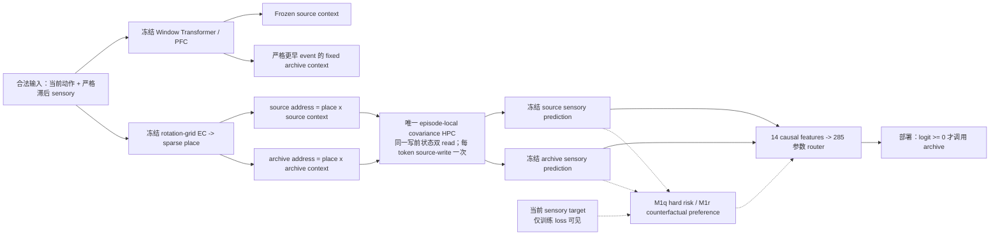

# ReMAP-Former M1q / M1r：硬调用目标与反事实偏好路由

> 冻结实验结果，2026-07-16。M1q 与 M1r 都不增加记忆槽、第二套 fast weights、parallel memory state、room/context/位置输入或 oracle event。M1p blind seed1457151 与 M1q blind seed1557151 均未打开；M1r blind seed1657151 在训练 9/9 解锁后只打开一次。

## 1. 结论先行

1. **M1q 否定了“把 soft marginal 换成 Binary-Concrete 硬采样就够了”。** Fresh G0 为 16/16 PASS，固定 archive 明显有效；实现 smoke 24/24、全回归 242 passed。但固定 400 步后，original-K8 的 source/hard/soft 全为 `0.28125`，hard call 为 `0`，training gates 只过 5/9。
2. **M1q 失败不是梯度符号错误，而是无条件 hard risk 的信用质量失衡。** Fresh G0 的 18,966 个 history tokens 中，source-better/archive-better 为 `13,772/5,186`；累计 regret mass 为 `48,118.41/9,167.06`，source 方向是 archive 的 `5.2491x`。最终 history/return 最大 router logit 为 `-1.4223/-4.1600`，因此所有 deterministic calls 都关闭。
3. **M1r 只改为 class-balanced counterfactual preference objective，真实学会了离散调用。** 架构、285 参数 router、初始 bias、数据、400 步预算与 hard deployment 均不变。训练 monitor 上 source/hard 为 `0.34375/0.75000`，增益 `+0.40625`；call/correct-room/distractor-source 为 `0.96875/0.90625/0.56213`，九个 unlock gates 全过。
4. **一次性 fresh blind 是强正结果，但按预注册仍为拒绝。** Blind seed1657151 上 source/disabled/hard 为 `0.40625/0.40625/0.734375`，hard 增益 `+0.328125`；clean drop 仅 `0.003125`，call/correct-room 为 `0.8750/0.765625`。7 个 blind gates 过 6 个，唯一失败为 absolute `0.734375 < 0.75`，即 `94/128`，比门槛 `96/128` 少 2 个 probes。
5. **冻结状态：`M1R_COUNTERFACTUAL_ROUTER_REJECTED`。** 不能把近失追认为通过，不能重跑 blind、调 hard threshold 或扩 seed。正式模型仍为 M1b；但 M1r 已给出本线最强证据：在同一单 HPC 上，一个 causal neural router 可以学会何时真正调用历史海马地址。

## 2. 不变的模型架构



### 2.1 唯一 HPC 的边界

- Source 与 archive 只是两条**读地址**，读取同一个 pre-write memory state。
- 当前 sensory 每个 token 只按 frozen source address 写一次。
- Episode 结束后 memory state 丢弃；它不是训练期间持久的参数矩阵。
- M1q/M1r 都没有 slot、第二套 content store、archive memory 或 parallel fast weights。

### 2.2 Router 输入

Router 与 M1p 完全相同，只看 14 个 causal features：固定 event top-1/margin/entropy、source/archive context cosine、两条 retrieval 的 norm/cosine、两条预测的 confidence/entropy/L1 disagreement。当前 sensory target、branch winner、room、return、query/conflict mask 都不是 forward 输入。

## 3. M1q：Straight-through Binary-Concrete

### 3.1 冻结假设

M1p 的 soft marginal 为 `0.65625`，hard deployment 只有 `0.59375`。M1q 测试：如果训练前向本身就是二值调用，是否能把连续偏好推过 hard threshold？

令 router logit 为 `l_t`，训练噪声为 `u_t ~ Uniform(0,1)`：

```text
z_soft = sigmoid((l_t + log(u_t) - log(1-u_t)) / temperature)
z_hard = 1[l_t + log(u_t) - log(1-u_t) >= 0]
z_ST   = z_soft + stop_gradient(z_hard - z_soft)
L_M1q  = mean_t [(1-z_ST) * NLL_source + z_ST * NLL_archive]
```

- 前向值严格等于实际采样分支的 NLL。
- 反向信号正比于 `NLL_archive - NLL_source`。
- 温度从 step1 的 `1.0` 几何退火到 step400 的 `0.1`；每 token 一个 sample。
- 没有 route label、metadata weighting 或辅助 loss。

### 3.2 G0 与实现门

| 项目 | 结果 |
|---|---:|
| Fresh G0 seed | 1527151 |
| Source return-conflict | 0.71250 |
| Fixed archive | 0.95000 |
| Fixed archive gain | +0.23750 |
| Target-likelihood oracle | 0.96875 |
| Fixed archive correct-room | 0.97500 |
| Memory/source-benefit fraction | 0.25625 / 0.53153 |
| 两类 likelihood alignment | 1.000 / 1.000 |
| G0 gates | 16/16 PASS |
| CUDA smoke | 24/24 PASS |
| 当时 ReMAP 回归 | 242 passed |

### 3.3 固定训练轨迹

| Step | Temperature | Sampled call | Hard | Source | Soft | Deterministic call |
|---:|---:|---:|---:|---:|---:|---:|
| 0 | - | - | 0.28125 | 0.28125 | 0.34375 | 0.00000 |
| 1 | 1.0000 | 0.188 | 0.28125 | 0.28125 | 0.34375 | 0.00000 |
| 50 | 0.7537 | 0.141 | 0.28125 | 0.28125 | 0.31250 | 0.00000 |
| 100 | 0.5648 | 0.070 | 0.28125 | 0.28125 | 0.25000 | 0.00000 |
| 150 | 0.4232 | 0.025 | 0.28125 | 0.28125 | 0.28125 | 0.00000 |
| 200 | 0.3171 | 0.011 | 0.28125 | 0.28125 | 0.28125 | 0.00000 |
| 250 | 0.2377 | 0.008 | 0.28125 | 0.28125 | 0.28125 | 0.00000 |
| 300 | 0.1781 | 0.010 | 0.28125 | 0.28125 | 0.28125 | 0.00000 |
| 350 | 0.1334 | 0.008 | 0.28125 | 0.28125 | 0.28125 | 0.00000 |
| **400** | **0.1000** | **0.005** | **0.28125** | **0.28125** | **0.28125** | **0.00000** |

### 3.4 固定终点

| 条件 | Return-conflict | Clean | Query | Conflict |
|---|---:|---:|---:|---:|
| Frozen source | 0.28125 | 0.94531 | 0.92057 | 0.79688 |
| Fixed archive always | 0.75000 | 0.27813 | 0.32552 | 0.56250 |
| Soft marginal diagnostic | 0.28125 | 0.94531 | 0.92057 | 0.79688 |
| **M1q hard** | **0.28125** | **0.94531** | **0.92057** | **0.79688** |
| Target-likelihood oracle | 0.78125 | 0.96719 | 0.95964 | 0.92188 |

Training gates 为 5/9。失败项是 absolute、gain、archive-call coverage 与 correct-room coverage；clean、distractor-source、source 等价、frozen hash 与 finite 均通过。Fresh blind seed1557151 未打开。

### 3.5 Regret-mass 审计

| 子集 | Tokens | Archive better | Source better | Archive regret mass | Source regret mass | Source/Archive |
|---|---:|---:|---:|---:|---:|---:|
| History | 18,966 | 5,186 | 13,772 | 9,167.06 | 48,118.41 | **5.2491x** |
| Return-conflict | 320 | 198 | 122 | 370.70 | 100.80 | 0.2719x |
| Distractor history | 14,080 | 3,150 | 10,926 | 6,630.93 | 44,587.14 | 6.7241x |

Return probes 的局部梯度确实偏 archive，但大量 distractor history 的 source regret 更大。M1q 优化的是所有 history token 的平均 hard risk，因此全局最容易的解是关闭调用。最终 history logit mean/max 为 `-5.9666/-1.4223`，return logit max 为 `-4.1600`。这解释了为什么 sampled calls 随退火从 18.8% 降至 0.5%，而 deterministic call 始终为 0。

## 4. M1r：Class-balanced Counterfactual Preference

### 4.1 哪条限制被明确放宽

M1r **允许当前 sensory target 在训练 loss 内比较两条冻结分支的 NLL**。因此它不是“完全无 target 的无监督路由”。但以下边界保持：

- Target 和 winner 不进入 model forward，也不在部署时可见。
- 不使用 room、return、query、conflict、event 或 generator route metadata。
- 两条 NLL 立即 detach，不更新 PFC、EC、HPC、decoder 或 branch predictions。
- 只有一个 counterfactual preference BCE，没有 sensory CE、marginal NLL 或辅助 loss。

令 `A_t = stop_gradient(NLL_source - NLL_archive)`。只在 history exists 的 token 上：

```text
P_archive = {t | A_t > 0}
P_source  = {t | A_t < 0}
L_M1r = 0.5 * mean_{P_archive} softplus(-l_t)
      + 0.5 * mean_{P_source}  softplus( l_t)
```

两组分别取均值再 1:1 合并，因此 token 数和 regret magnitude 都不能把全局 bias 压向一侧。NLL 完全相同的 ties 不参加两组。

### 4.2 Fresh G0

| 项目 | 结果 |
|---|---:|
| G0 seed | 1627151 |
| Source / fixed archive | 0.76250 / 0.91875 |
| Fixed archive gain | +0.15625 |
| Oracle | 0.96875 |
| Fixed archive correct-room | 0.91250 |
| History tokens | 18,998 |
| Archive/source preferred | 5,216 / 13,772 |
| Archive/source fraction | 0.27456 / 0.72492 |
| Mean absolute NLL gap | 3.06110 |
| G0 gates | 18/18 PASS |
| CUDA smoke | 24/24 PASS |
| 最终 ReMAP 回归 | 250 passed |

### 4.3 固定训练轨迹

| Step | Preference loss | Hard | Source | Soft | Call | Correct room | Distractor source |
|---:|---:|---:|---:|---:|---:|---:|---:|
| 0 | - | 0.34375 | 0.34375 | 0.37500 | 0.00000 | 0.00000 | 1.00000 |
| 1 | 0.9521 | 0.34375 | 0.34375 | 0.37500 | 0.00000 | 0.00000 | 1.00000 |
| 50 | 0.8388 | 0.34375 | 0.34375 | 0.40625 | 0.00000 | 0.00000 | 1.00000 |
| 100 | 0.6741 | 0.46875 | 0.34375 | 0.59375 | 0.31250 | 0.28125 | 0.63828 |
| 150 | 0.6623 | 0.53125 | 0.34375 | 0.59375 | 0.53125 | 0.50000 | 0.64286 |
| 200 | 0.6488 | 0.50000 | 0.34375 | 0.62500 | 0.68750 | 0.65625 | 0.61231 |
| 250 | 0.6154 | 0.59375 | 0.34375 | 0.62500 | 0.78125 | 0.75000 | 0.58914 |
| 300 | 0.6159 | 0.68750 | 0.34375 | 0.68750 | 0.87500 | 0.84375 | 0.56730 |
| 350 | 0.5939 | 0.71875 | 0.34375 | 0.68750 | 0.93750 | 0.87500 | 0.55756 |
| **400** | **0.5634** | **0.75000** | **0.34375** | **0.68750** | **0.96875** | **0.90625** | **0.56213** |

### 4.4 固定 step400 monitor

| 条件 | Return-conflict | Clean | Query | Conflict |
|---|---:|---:|---:|---:|
| Frozen source | 0.34375 | 0.94531 | 0.92578 | 0.82813 |
| Fixed archive always | 0.78125 | 0.31563 | 0.35677 | 0.56250 |
| Soft marginal diagnostic | 0.68750 | 0.94063 | 0.93359 | 0.89844 |
| **M1r hard** | **0.75000** | **0.94688** | **0.94141** | **0.91406** |
| Target-likelihood oracle | 0.81250 | 0.97031 | 0.96615 | 0.94531 |

九个 training unlock gates 全过。Dense K8 的 source/hard/soft/oracle 为 `0.59375/0.84375/0.87500/1.00000`；Dense K12 为 `0.95833/1.00000/1.00000/1.00000`。Frozen state hash 前后完全相同，checkpoint SHA256 为 `fae8c87a6841cf78b5099245c61bead3b14a24705b378056cc839542ff365c9e`。

## 5. 一次性 Fresh Blind

Blind seed1657151：64 episodes，128 个 return-conflict probes。只运行一次。

| 条件 | Return-conflict | Clean | Query | Conflict |
|---|---:|---:|---:|---:|
| Frozen source | 0.40625 | 0.93906 | 0.92253 | 0.83984 |
| Router disabled | 0.40625 | 0.93906 | 0.92253 | 0.83984 |
| Fixed archive always | 0.78125 | 0.28125 | 0.31966 | 0.51172 |
| Soft marginal diagnostic | 0.71875 | 0.93281 | 0.92448 | 0.88281 |
| **M1r hard** | **0.734375** | **0.93594** | **0.92839** | **0.89063** |
| Target-likelihood oracle | 0.859375 | 0.96172 | 0.96094 | 0.95703 |

### 5.1 Blind 机制指标

| 指标 | M1r hard |
|---|---:|
| Gain vs source / disabled | +0.328125 / +0.328125 |
| Clean drop vs source | 0.003125 |
| Archive call coverage | 0.87500 |
| Correct-room coverage | 0.765625 |
| Call correct-room precision | 0.87500 |
| Distractor source selection | 0.55568 |
| History selected-call rate | 0.52407 |
| Memory/source-benefit likelihood alignment | 1.000 / 1.000 |

### 5.2 Blind gates

| Gate | Threshold | Result | 状态 |
|---|---:|---:|---|
| Return-conflict absolute | >= 0.75 | 0.734375 | **FAIL** |
| Gain vs M1f | >= 0.20 | +0.328125 | PASS |
| Gain vs disabled | >= 0.20 | +0.328125 | PASS |
| Clean drop | <= 0.02 | 0.003125 | PASS |
| Archive call coverage | >= 0.50 | 0.87500 | PASS |
| Correct-room coverage | >= 0.70 | 0.765625 | PASS |
| Disabled equals M1f | <= 5e-6 | 0 | PASS |

最终为 6/7。`0.734375 = 94/128`，门槛 `0.75 = 96/128`。这个差距很小，但门槛在 blind 前已冻结，因此状态只能是 `M1R_COUNTERFACTUAL_ROUTER_REJECTED`。

## 6. 科学解释

### 6.1 已经成立的部分

- **调用可以是 neural 的。** M1r 没有 room ID、return mask 或 hard-coded call rule，部署时仅凭 causal router features 做离散调用。
- **外挂海马仍只有一份。** 性能提升来自选择同一 HPC 的读地址，不来自新增槽位、查表或第二份记忆。
- **M1q 与 M1r 构成干净的 objective ablation。** 架构与训练预算相同；只改变信用聚合方式，hard monitor 从 `0.28125` 提到 `0.75000`。
- **Room 选择不是假象。** Blind correct-room coverage `0.765625`、call precision `0.875`，而 disabled 与 source 完全相同。

### 6.2 尚未成立的部分

- M1r 没有通过预注册 blind absolute gate，因此不能宣称稳定达到 `>=0.75`。
- 只有一个 train seed 和一个 blind seed；协议拒绝后不能补 seeds 作为事后稳定性证明。
- M1r 的训练信用明确依赖 target-derived counterfactual branch preference。它不是 generator oracle，但也不是只靠最终 sensory CE 自发涌现的调用策略。
- 正式论文 headline 仍应使用已冻结的 M1b；M1r 目前是最强机制 pilot，不是 formal replacement。

## 7. 冻结决策

```text
M1q: M1Q_TRAINING_GATE_REJECTED
      -> blind1557151 unopened

M1r training: M1R_TRAINING_GATE_PASSED (9/9)
      -> open blind1657151 once

M1r blind: M1R_COUNTERFACTUAL_ROUTER_REJECTED (6/7)
      -> STOP_M1R_WITHOUT_TUNING_AND_RETAIN_FORMAL_M1B
```

不得执行：

- 重跑 seed1657151；
- 把 hard threshold 从 0 改到别处；
- 把 absolute gate 从 0.75 改为 0.734375；
- 选择 step350 或其他中间 checkpoint；
- 因只差 2 probes 而直接铺多 seed；
- 把 soft diagnostic 追认为正式部署结果。

若后续另立新课题分支，必须先定义不同于 M1r 的机制改变与全新 seeds；不能把“再跑几颗直到过”当作新实验。

## 8. 复现命令

```powershell
$env:KMP_DUPLICATE_LIB_OK='TRUE'
$tests = Get-ChildItem -File -Name 'test_remap_former*.py'
pytest -q $tests

python train_remap_m1q_binary_concrete_router.py --device cuda --smoke
python train_remap_m1q_binary_concrete_router.py --device cuda --g0
python train_remap_m1q_binary_concrete_router.py --device cuda
python diagnose_remap_m1q_regret_mass.py --device cuda

python train_remap_m1r_counterfactual_router.py --device cuda --smoke
python train_remap_m1r_counterfactual_router.py --device cuda --g0
python train_remap_m1r_counterfactual_router.py --device cuda
python train_remap_m1r_counterfactual_router.py --device cuda --blind
```

现有输出目录启用 refusal-to-overwrite；以上训练与 blind 命令不是建议重跑，而是记录首次冻结执行的入口。

## 9. 关键文件

- `remap_former/m1q.py`
- `remap_former/m1r.py`
- `train_remap_m1q_binary_concrete_router.py`
- `train_remap_m1r_counterfactual_router.py`
- `diagnose_remap_m1q_regret_mass.py`
- `runs/remap_former/m1q_binary_concrete_router_pilot_protocol.json`
- `runs/remap_former/m1r_counterfactual_preference_router_pilot_protocol.json`
- `runs/remap_former/m1q_binary_concrete_seed1537151_s400/summary.json`
- `runs/remap_former/m1q_binary_concrete_seed1537151_s400/regret_mass_audit.json`
- `runs/remap_former/m1r_counterfactual_seed1637151_s400/summary.json`
- `runs/remap_former/m1r_counterfactual_seed1637151_s400/blind_seed1657151.json`
