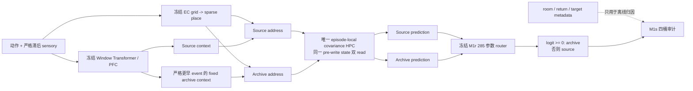

# ReMAP-Former M1s：M1r Fresh-Seed 剩余错误分解

> 冻结只读诊断，2026-07-16。M1s 不训练模型、不改 checkpoint、不重跑 M1r blind，也不新增 slot、fast weights 或 memory state。诊断 seed1727151 与 M1p/M1q/M1r blinds 1457151/1557151/1657151 全部不同。

## 1. 结论

M1s 在 128 个 fresh validation episodes、256 个 return-conflict probes 上，将 M1r hard 的 80 个错误精确拆为：

| 互斥错误桶 | 数量 | 占全部错误 |
|---|---:|---:|
| 漏调 archive | 16 | 20.0% |
| 误调 archive | 14 | 17.5% |
| 两分支都错，archive event room 错 | 28 | 35.0% |
| 两分支都错，archive event room 对 | 22 | 27.5% |
| 未分类 | 0 | 0% |

合并后：

- Router decision：`30/80 = 37.5%`
- Archive event identity：`28/80 = 35.0%`
- Correct-room branch recall：`22/80 = 27.5%`

预注册 dominance 门为 `>=50%`。三条机制均未达到，因此冻结分类为：

```text
M1S_MIXED_NO_SINGLE_MECHANISM
STOP_MODEL_STACKING_AND_RETAIN_FORMAL_M1B
```

这不是说 M1r 没有效果。Fresh 数据上 M1r hard 从 source `0.3672` 提高到 `0.6875`，增益 `+32.03 pp`。结论是：**剩余误差已经分散到 router、事件身份和正确 room 下游三处，不能再用一个单机制补丁干净归因。**

## 2. 为什么必须另用 fresh seed

M1r one-shot blind seed1657151 已经运行过一次，并以 `0.734375 < 0.75`、6/7 gates 冻结拒绝。M1s 不重新生成或逐 probe 检查该 blind；它使用：

- Seed：1727151
- Split：validation
- K：8
- Batch：32 × 4 episodes
- 总 episodes：128
- 每 episode return-conflict probes：2
- 总 probes：256

M1s 只读取冻结 step400 checkpoint：

```text
fae8c87a6841cf78b5099245c61bead3b14a24705b378056cc839542ff365c9e
```

脚本没有 optimizer、`backward()`、checkpoint 写入或参数 mutation。

## 3. 仍然是哪一个模型



M1s 的 metadata 只在所有 model forward 完成后用于评价。模型输入仍只有 `actions` 与 `sensory`。

## 4. Task 与实现门

### 4.1 Task health：6/6 PASS

| Gate | 结果 |
|---|---:|
| Paired observable identity | 1.000 |
| Unique pre-return family | 1.000 |
| Unique pre-return content | 1.000 |
| Return-conflict / episode | 2 |
| 仅 actions + sensory 为模型输入 | True |
| Return-reference one rate | 0.500 |

### 4.2 Implementation：10/10 PASS

- Parent protocol/result/checkpoint/blind-result digests 全部匹配。
- Checkpoint step 为 400。
- Seed1727151 不属于三个旧 blind seeds。
- Source branch 与 frozen M1f 最大差：0。
- Disabled router 与 frozen M1f 最大差：0。
- Hard prediction 与所选 source/archive branch 最大差：0。
- 完整 model state hash 前后不变。
- Probe count 精确为 256。
- 四桶 + hard-correct 精确覆盖全部 probes，未分类为 0。
- 全部指标 finite。

当前 ReMAP 回归为 `258 passed`。

## 5. Fresh 条件主表

| 条件 | Return-conflict | Clean | Query | Conflict |
|---|---:|---:|---:|---:|
| Frozen source | 0.36719 | 0.94844 | 0.92806 | 0.82617 |
| Router disabled | 0.36719 | 0.94844 | 0.92806 | 0.82617 |
| Fixed archive | 0.72656 | 0.30273 | 0.33952 | 0.52344 |
| Soft marginal diagnostic | 0.71094 | 0.93320 | 0.92839 | 0.90430 |
| **M1r hard** | **0.68750** | **0.94063** | **0.93359** | **0.89844** |
| Target-likelihood oracle | 0.79688 | 0.97109 | 0.96484 | 0.93359 |

差值：

- M1r hard vs source：`+0.32031`
- Oracle vs M1r hard：`+0.10938`
- Fixed archive vs source：`+0.35938`

M1r 的 archive call coverage 为 `0.88281`，correct-room coverage 为 `0.76563`，distractor source selection 为 `0.57467`。

## 6. 四桶定义与结果

对每个 return-conflict probe，先比较 source/archive/hard 的 argmax 是否等于 target，再看 hard call 与 selected archive event room：

1. **漏调 archive**：archive 对、source 错、router 仍选 source。
2. **误调 archive**：source 对、archive 错、router 却选 archive。
3. **两分支都错 + wrong room**：source/archive 都错，archive event 来自错误 room。
4. **两分支都错 + correct room**：source/archive 都错，但 archive event 已来自正确 room。

256 probes 中 hard correct `176`，hard error `80`：

```text
80 errors
├── 30 router decision
│   ├── 16 missed archive
│   └── 14 harmful archive
├── 28 wrong archive event room
└── 22 correct archive room but both branches wrong
```

任一机制若要 dominant，至少需解释 40 个错误。最大项 router decision 只有 30，因此不得以“37.5% 最大”为由训练一个 router-only M1t。

## 7. Router 诊断

### 7.1 Exactly-one-correct probes

| 指标 | 结果 |
|---|---:|
| Exactly-one-branch-correct probes | 132 |
| Correct branch route accuracy | 0.77273 |
| Archive-only probes | 112 |
| Archive-only call recall | 0.85714 |
| Source-only probes | 20 |
| Source-only retention recall | 0.30000 |

M1r 在 return 上明显倾向调用 archive：能覆盖多数 archive-only probes，但 20 个 source-only probes 中只保住 6 个，产生 14 次 harmful call。

### 7.2 Detached likelihood preference

| 子集 | Archive-preferred | Selected archive | BA | AUROC | Archive recall | Source recall |
|---|---:|---:|---:|---:|---:|---:|
| All history | 0.29225 | 0.50286 | 0.69471 | 0.73294 | 0.77847 | 0.61095 |
| Return-conflict | 0.79688 | 0.88281 | 0.52300 | 0.59502 | 0.89216 | 0.15385 |
| Distractor history | 0.25451 | 0.42525 | 0.70606 | 0.75458 | 0.73247 | 0.67964 |

Router 在普通 history 与 distractor 上有可用区分度，但 return-conflict 内 archive-preferred 占 79.7%，class-balanced 训练后的 hard policy进一步偏向 archive，source-preference recall 只有 15.4%。这解释了 14 次 harmful call，但仍只解释全部 80 个错误中的一部分。

## 8. 科学判断

### 8.1 已成立

- M1r 的 neural hard call 能在 fresh seed 上稳定产生约 `+32 pp` 增益。
- Source/disabled 精确等价，收益来自 router 调用同一 HPC 的另一条读地址。
- Router 不是随机的：exactly-one-correct route accuracy 为 0.773。
- Archive event identity 与正确-room downstream 都是可测的独立瓶颈。

### 8.2 不能声称

- 不能说“只需再校准 router”：router error share 仅 37.5%。
- 不能说“只需修 event ranker”：wrong-room share 仅 35.0%。
- 不能说“只需修 HPC/fusion”：correct-room branch ceiling share 仅 27.5%。
- 不能用已打开的 blind1657151 选择阈值、checkpoint 或新 feature。
- 不能把三个补丁一起加进下一版后再声称单一机制解释。

## 9. 冻结决策

```text
M1S_MIXED_NO_SINGLE_MECHANISM
-> STOP_MODEL_STACKING_AND_RETAIN_FORMAL_M1B
```

因此本轮**不创建 M1t 训练协议**。课题下一阶段应从模型堆叠转向结果收口：

1. 正式 headline 继续使用已冻结、多 seed、预算匹配的 M1b。
2. M1p→M1q→M1r 作为 objective ablation：概率边缘化、无条件硬风险、class-balanced counterfactual preference。
3. M1s 作为诚实停止证据，说明 M1r 剩余误差不再由一个局部模块主导。
4. 若未来重开模型线，必须提出能联合解释三桶的新核心假设，并使用全新任务协议与 seeds；不能将三个局部修补简单相加。

## 10. 文件

- `runs/remap_former/m1s_fresh_error_decomposition_protocol.json`
- `diagnose_remap_m1s_fresh_error_decomposition.py`
- `test_remap_former_m1s_diagnostic.py`
- `runs/remap_former/m1s_fresh_error_decomposition.json`

结果 JSON 包含全部 256 条 `probe_rows`，可逐条复核分类。
