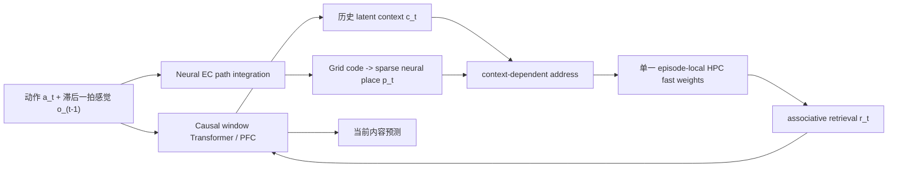
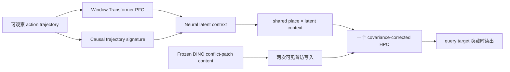

# ReMAP-Former 下一阶段 2D / 3D 执行报告

**执行日期：2026-07-26**

**对应计划：** `ReMAP_Former_Next_2D_3D_Experiment_Plan.md`

**计划 SHA256：** `5f7a2a6194c998699622d9186b2b984cf52a335bd4564239962f75282403c9b3`

## 摘要

本轮完成了四个高优先级工作包，并启动了地址形式审计：

1. P0 canonical release 已建立为独立 Git snapshot，commit 为 `b951334bcfc7174078d9a21cadd584fa3a71459b`；checkpoint、dataset、split 与因果合同均可自动验证。
2. 2D-R2 排除了固定时间表、当前 observation、短 action window 与当前路径签名等 shortcut。三种子中 full-history relation probe 均为 `1.000`，其余局部 probe 均接近 chance。
3. 3D-D0 证明 frozen DINOv2 spatial conflict-patch feature 可区分内容，同时 ambiguous current frame 与 cue 的 context probe 都严格为 `0.500`。
4. 最小 3D visual A-B-A 在三个训练种子上稳定通过：Full return-conflict 为 `0.9975 ± 0.0014`，PFC-only 为 `0.3338 ± 0.0046`，fixed-context 为 `0.4993 ± 0.0010`；wrong-history 将预测推向另一 context 的比例为 `0.9936`。

因此，3D 已从“普通视觉 rollout 中 HPC 有小幅趋势”推进到一个清楚的 hidden-context 机制桥：

> **Transformer/PFC 从可观察历史推断 latent context；同一 episode-local neural HPC 用 context-dependent address 保存并调用 DINO visual content；当前局部视觉本身不能识别 context。**

这仍是 development pilot，不是 fresh sealed test。当前视觉任务只有两个 context、一个共享 conflict place，且 validation 在 V1→V2 开发中被看过；不能写成完整 3D world model 已解决。

> **2026-07-26 晚间更新：** 后续 multi-place 与 simulator-coupled
> 阶段已经完成。当前最新 3D headline 不再是上述最小 visual pilot：
> 真实 MemoryMaze3D 中每个 action 已逐步绑定 post-action RGB，周期 EC
> 提供四个 view-place，单种子冻结 acceptance 为 `9/9`；Full conflict
> `1.0000`，target cosine `0.9983`。完整说明见
> `reports/MEMORYMAZE3D_SIMULATOR_VIEWPLACE_ABA_SINGLE_SEED_CN.md`。

## 1. 架构与因果合同

### 1.1 论文主模型

- Transformer 本身就是 PFC 主干。
- EC 只由动作生成关系结构，不读取绝对位置或 place ID。
- HPC 是每个 episode 从零开始的可微 fast-weight matrix，不是持久参数表、memory slot bank 或第二套 fast weights。
- 预测顺序严格为 read → predict → reveal target → loss/write。
- evaluation 的 future GT read/write 为 `0/0`。

### 1.2 本轮最小视觉桥

最小 visual A-B-A 有意只实现 Batch 2 所需的两个 context 与一个共享 conflict place：

该 pilot 不输入 room ID、context ID、绝对位置、place ID 或 query target；trajectory signature 是 action history 的可观察摘要。它没有 slot bank，也没有第二套 fast weights。

## 2. P0：Release Integrity

### 结果

| 项目 | 结果 |
|---|---|
| 状态 | `P0_V2_READY` |
| 独立 snapshot commit | `b951334bcfc7174078d9a21cadd584fa3a71459b` |
| snapshot clean | `True` |
| checkpoint hash | `24/24` 匹配 |
| 3D 回归 | `76 passed` |
| 当前 2D 回归 | `353 passed` |
| 严格因果合同 | `4 passed` |
| future GT read/write | `0/0` |

旧 mutable-path P0 的 `memory.py`、`context.py` 与旧计划 hash drift 被保留披露，没有通过改 expected hash 伪造绿色。后续 canonical identity 以独立 snapshot 为准。

## 3. 2D-R2：Anti-Shortcut

### 首次失败与修复

首次强 OOD audit 中 time-only probe 达到 `0.626`，标签正类率只有 `0.326`。根因是把第二个 context 尚未出现之前的 revisit 也计入二选一 context 标签，形成任务定义偏差。该失败结果保留。

修复只改变 probe 的可定义区间：仅在两个 context 均已暴露后评估 ambiguous re-entry；没有改模型、阈值或 path split。

### 三种子结果

| Probe | Balanced accuracy mean ± SD | 范围 |
|---|---:|---:|
| 当前 observation | `0.4906 ± 0.0145` | `0.4802–0.5071` |
| Time-only | `0.5093 ± 0.0181` | `0.4978–0.5302` |
| Action-only | `0.5000 ± 0.0000` | `0.5000–0.5000` |
| 8-step short window | `0.5006 ± 0.0260` | `0.4741–0.5261` |
| 当前路径签名 | `0.5229 ± 0.0152` | `0.5056–0.5344` |
| Full-history relation | `1.0000 ± 0.0000` | `1.0000–1.0000` |

附加合同：

- train segment `6/7/8`，validation segment `9/10/11`；
- train/test sequence length `272–374` / `460–580`；
- path-family overlap `0`；
- 同时间桶、同局部线索、相反历史标签支持率 `0.2624 ± 0.0323`；
- gauge-pair observation mismatch `0`；
- validation 标签正类率 `0.4948 ± 0.0161`。

结论是任务可由完整历史关系决定，但不能由当前 observation、隐式时钟、短 action window 或当前路径独立决定。下一步正式模型比较仍需在这一 generator 上重新训练/冻结，不能只把旧 checkpoint 的数字直接搬过来。

## 4. 3D-D0：Frozen DINOv2 Target Audit

### 视觉 target

- Encoder：`dinov2_vits14_reg`
- 权重 SHA256：`f433177089a681826f849f194ece3bb48f4d63fb38d32fc837e3dc7a4e5641fb`
- 输出：`16 × 16 × 384` spatial patches
- CLS-only：不进入主指标
- RGB：MemoryMaze 原生 `224 × 224`

### 内容与泄漏

| 指标 | 结果 |
|---|---:|
| Object linear probe | `1.0000` |
| Nearest prototype | `1.0000` |
| Within-object cross-view cosine distance | `0.0918` |
| Between-object same-environment distance | `0.1451` |
| Between / within ratio | `1.58` |
| Current-frame context probe | `0.5000` |
| Current-cue context probe | `0.5000` |
| Full-history context probe | `1.0000` |
| Current/cue paired pixel mismatch | `0 / 0` |

第一次 broad-ROI audit 的 nearest-prototype 只有 `0.4722`，因此按 stop rule 没有直接训练 world model。复查发现预注册目标本来就是 conflict-object patch；改为 evaluation-only object mask 覆盖的 DINO patch 后通过。mask 仅用于离线指标选区，不进入 encoder、模型或 context probe。

当前对象是红/绿/蓝 `TargetSphere` identity pilot。正式实验仍需加入 shape/category split，避免将结果缩成颜色分类。

## 5. 3D-D2/D3/D4：最小 Visual A-B-A

### V1 负结果

V1 只从 PFC latent state 生成 context，并使用单一 cosine content loss：

- Full conflict 约 `0.498`
- Fixed context 约 `0.498`
- wrong/correct history 几乎无方向变化

这说明 context address 没有稳定分离，且 cosine loss 接受两个 object feature 的平均。V1 被保留为失败版本。

### V2 唯二修改

1. context head 加入由可观察 action history 计算的完整 trajectory signature 投影；
2. content objective 改为 target-vs-other contrastive feature loss。

没有加入 room/context 监督、位置、place ID、slot bank 或第二套 memory。

### 三种子 Validation OOD

| 条件 | Return conflict mean ± SD | 最差种子 | Clean |
|---|---:|---:|---:|
| **Full** | **`0.9975 ± 0.0014`** | `0.9962` | `1.0000` |
| PFC-only | `0.3338 ± 0.0046` | `0.3284` | `0.3410` |
| Fixed context | `0.4993 ± 0.0010` | `0.4982` | `0.9960` |
| HPC zero | `0.3042 ± 0.0102` | `0.2953` | `0.2291` |
| Wrong history | `0.0064 ± 0.0053` | `0.0021` | `1.0000` |
| Correct history | `0.9933 ± 0.0043` | `0.9890` | `1.0000` |
| Context oracle | `1.0000 ± 0.0000` | `1.0000` | `1.0000` |

成对种子差：

- Full − PFC-only：`0.6637 ± 0.0036`
- Full − fixed-context：`0.4981 ± 0.0017`
- Full − HPC-zero：`0.6933 ± 0.0110`
- Correct-history − wrong-history：`0.9869 ± 0.0096`
- Context-oracle − Full：`0.0025 ± 0.0014`

wrong-history 的 other-context target rate 为 `0.9936`，说明错误不是无方向的性能下降，而是按错误 context 系统性调用了另一内容。

### 边界

- 这是 development validation OOD，不是 fresh sealed test。
- 只有一个共享 conflict-place code，完整视觉 EC/grid/place 尚未接入。
- DINO target 只预测 conflict patch feature，不是完整 spatial feature world model。
- validation 已用于 V1→V2 修正。
- 三种子只提供稳定性描述统计，不能替代 5–8 seed hierarchical CI。

## 6. 2D-R3：地址形式 Pilot

### v1：共享 plain-delta substrate 失败

五种地址统一为 `128D`，动态 content memory 均为 `128 × 64`，基础 PFC/EC checkpoint 冻结。结果：

| 地址 | Correct-context log-K AUC |
|---|---:|
| Place-only | `0.009 ± 0.002` |
| Additive | `0.005 ± 0.005` |
| Concatenation | `0.005 ± 0.005` |
| Learned MLP | `0.005 ± 0.005` |
| Multiplicative | `0.013 ± 0.005` |

所有 contextual forms 都接近零，multiplicative K1 health gate 未过；same-place/cross-context cosine 仍为 `0.963`。因此 v1 只能说明去掉 context covariance 后共享 substrate 不健康，不能用来否定 outer-product。

### v2：共享 context-covariance stage gate

v2 给所有地址形式同一个 latent-context covariance dual-write rule，不使用 oracle context。首次 seed65101 run 在 step 200 因通用分母错误爆炸；根因是负 `dot(read_key, write_key)` 被 `clamp_min` 错误改成正 epsilon。该 run 已终止并排除，代码改为保符号 epsilon，且新增单元测试。

修复后从头重跑 seed `65101`。因这是 stage gate，只跑一个种子：

| 地址 | Correct-context K=1 | Correct-context log-K AUC | K=1 clean |
|---|---:|---:|---:|
| Place-only | `0.000` | `0.000` | `0.833` |
| Additive | `0.109` | `0.047` | `0.839` |
| Concatenation | `0.094` | `0.021` | `0.810` |
| Learned MLP | `0.063` | `0.018` | `0.818` |
| Multiplicative | `0.141` | `0.091` | `0.419` |

结果为 **STOP**：multiplicative K=1 未达到 `0.70`，AUC 未比 place-only 高 `0.15`，clean 也未达到 `0.90`；只有 causal audit 全绿。训练期间 multiplicative loss 仍从正常量级跳到 `477.118`，说明把原始 `512D` 外积压缩到统一 `128D` 后，这个代理底座依然数值与容量不健康。按预注册规则不扩到三种子，也不继续调 ridge/维度；下一次只做 full-model address intervention。

## 7. 当前证据等级

| 命题 | 等级 | 依据 |
|---|---|---|
| 2D hidden-context re-entry 可行 | **强** | 旧 sealed test、8 seeds、组件消融 |
| 2D generator 不依赖 timing/local shortcut | **强任务证据** | R2 三种子、强长度 OOD、反事实支持 |
| Outer-product 是唯一必要地址 | **未成立** | R3 v1/v2 代理 substrate 均未通过健康 gate；公平 full-model 比较未完成 |
| DINO conflict content 可用 | **强 gate 证据** | object/prototype 1.0、distance ratio 1.58 |
| 3D ambiguous current frame 不泄露 context | **强 gate 证据** | current/cue 0.5，history 1.0，像素完全配对 |
| 最小 3D hidden-context A-B-A 可行 | **强 pilot 证据** | 三种子 Full 0.9975，结构化消融与方向性错误 |
| 完整 3D visual world model 已解决 | **否** | 单 conflict place、patch target、非 sealed |
| 3D 公平击败 Hippoformer/Titans | **未检验** | 本轮 visual A-B-A 尚未加入这些 formal baselines |

## 8. 下一阶段实验计划

### 8.1 立即冻结最小 Visual A-B-A

1. 固定 V2 代码、DINO 权重、训练 object/layout/path manifest 与 checkpoint hashes。
2. 新建从未用于 V1/V2 的 held-out layout/route/object split。
3. 将 object split 从颜色 identity 扩到 shape/category identity。
4. 先单 seed 跑 sealed preflight，再铺 `5–8` seeds。
5. 预注册 hierarchical bootstrap，以 training seed 为最高独立单位。

**Go gate：** Full 的 return-conflict 95% CI 高于 PFC-only/fixed-context；wrong-history other-context rate 保持高；clean drop 不超过 `2 pp`；future GT 仍为 `0/0`。

### 8.2 从单 conflict place 升级到视觉 EC/grid/place

1. 使用动作驱动 3D EC 生成 grid code。
2. grid 经 sparse neural place projection 形成多个 place。
3. 同一 place 在不同 latent context 下绑定不同 DINO object content。
4. 不输入 pose、position、place ID、room 或 switch flag。
5. 加入 exact-place、correct-context 与 exact-address oracle waterfall，仅用于诊断。

**Stop rule：**若 place-only clean 先塌，先修 EC/place substrate，不把结果归因给 context。

### 8.3 完成 3D-D1 Feature World Model

1. frozen DINO spatial target 采用约 `8 × 8 × 256` adapter feature。
2. 主 loss 为 patch cosine + normalized feature MSE。
3. copy-last、PFC-only、HPC-zero 与 observed-history 分表。
4. strict rollout 后不再编码或写入未来真实 RGB/DINO feature。
5. pixel decoder 只用于可视化，不作为主训练目标。

### 8.4 2D 正式 reviewer-killer

1. 在 R2 generator 上重训 Full/PFC-only/M-delta/Hippoformer/matched Transformer。
2. 完成 address-form full-model intervention；不要再用不健康的压缩 plain-delta substrate。
3. 报告动态 memory scalars/bytes、read/write FLOPs、window、steps、frames、wall-clock 与 VRAM。
4. 最后再做 context/event/content 的 capacity scale law。

### 8.5 暂停项

- 不重开静态 caller/writer sweep。
- 不把 adaptive validation 写成 sealed test。
- 不把内部 Titans/Hippoformer adaptation 写成官方复现。
- 不追求所有普通 rollout 任务全面获胜。

## 9. 关键产物

- P0：`reports/REMAP_FORMER_NEXT_P0_RELEASE_INTEGRITY_CN.md`
- 2D-R2：`reports/REMAP_FORMER_2D_R2_ANTI_SHORTCUT_POSTFIX_CN.md`
- 3D-D0：`reports/MEMORYMAZE3D_DINO_D0_CONFLICT_PATCH_CN.md`
- Visual A-B-A 三种子：`reports/MEMORYMAZE3D_VISUAL_ABA_V2_3SEED_CN.md`
- Visual A-B-A 机器汇总：`runs/memorymaze3d/visual_aba_v2_3seed_summary.json`
- 2D-R3 v1：`reports/REMAP_FORMER_2D_R3_ADDRESS_PILOT_CN.md`
- 2D-R3 v2 gate：`reports/REMAP_FORMER_2D_R3_ADDRESS_V2_GATE_CN.md`
- R3 v2 勘误：`reports/REMAP_FORMER_2D_R3_V2_SIGNED_DENOM_ERRATUM_CN.md`
- DINO task 配对图：`reports/figures/memorymaze3d_visual_context_pairs.png`
- Visual A-B-A 三种子图：`reports/figures/memorymaze3d_visual_aba_v2_3seed.png`
- Simulator-coupled 单种子报告：
  `reports/MEMORYMAZE3D_SIMULATOR_VIEWPLACE_ABA_SINGLE_SEED_CN.md`
- Simulator-coupled 机器结果：
  `runs/memorymaze3d/simulator_viewplace_aba_v2_align1_seed65101/result.json`
- Simulator-coupled 视觉审计：
  `reports/figures/memorymaze3d_simulator_viewplace_aba_visual_board.png`

## 10. 结论

本轮最重要的推进不是又多了一个小数点，而是 2D 的机制主张第一次得到一个视觉版本的最小对应物：当前帧不能识别 context，PFC 必须用历史；同一 neural HPC 中保存了冲突视觉内容；正确历史恢复旧内容，错误历史则定向调用另一内容。

离 paper-ready 仍有两道硬门：

1. 把最小视觉桥升级成从未看过的 layout/route/object sealed 5–8 seed 结果；
2. 把单 conflict place 换成真正的多 place EC/grid/place，同时完成公平地址形式与 baseline 预算审计。

在这两道门之前，最稳妥的论文措辞是：

> **ReMAP-Former demonstrates hidden-context re-entry through an episode-local neural hippocampus in 2D, and reproduces the same causal mechanism in a minimal high-dimensional visual setting.**

## 11. 晚间增量：Simulator-Coupled View-Place

本节覆盖第 8 节中已经完成的旧 next-step 项，不追改前文开发历史。

### 已完成

- multi-place Visual A-B-A：周期 EC、4 个 sparse neural place、单张
  factorized HPC，三种子核心机制 `3/3`；
- simulator-coupled V1：current-query context probe `0.6667`，按冻结
  stop rule 停止，未训练；
- simulator-coupled V2：A-B-A / B-A-B 成对反事实数据，query RGB
  pixel mismatch `0`；
- 真实 simulator 每个 action/frame 对齐，reset 后无 teleport；
- 单种子 `65101`、200 steps，预训练 gate `11/11`、模型 gate `9/9`；
- Full conflict `1.0000`、target cosine `0.9983`、clean cosine `0.9968`、
  context re-entry `1.0000`；
- HPC-zero `0.5000`，fixed/wrong-history conflict `0.0000`，wrong-history
  other-target rate `1.0000`；
- future ground-truth read/write `0/0`；
- focused regression suite `11 passed`。

### 保留限制

单个正确静态 anchor 替换完整动态 query context 后 conflict 为 `0.375`。
该项不在冻结 V2 acceptance 中，作为 stationarity 次级诊断保留。当前
context 更像随视觉历史演化的动态 PFC 状态，不是时间不变 room vector。

### 更新后的下一步

下一步不再是“接回 simulator”，而是 translated waypoint/revisit：
在同一个连续 simulator episode 中加入真实前进与转向，让 A/B context
在相同物理 waypoint 写入不同内容，再从长路径返回 query。单种子通过
translation EC、context drift、counterfactual RGB 与因果干预 gates 后，
再扩 3 seed，随后才冻结未见 layout/route/object 的 sealed split。
