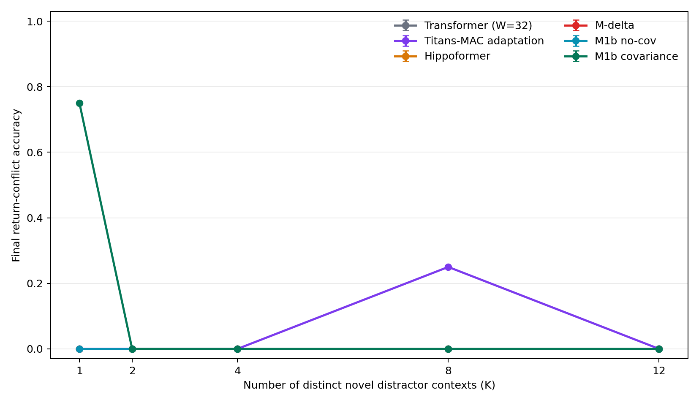

# ReMAP-Former 新干扰容量实验与外部基线

> 2026-07-13，dev-only 阶段报告。正式 validation/test 尚未访问。

## 1. 这轮到底测什么

我们不再只把同一房间内容重复很多次，而是构造真正的 A-B-D1-...-DK-A 情境重入：

- A、B 是两个 reference context。
- 每个 D 都使用新的 held-out 路径族和新的 object map。
- K 取 `1/2/4/8/12`，序列长度依次为 `176/220/308/484/660`。
- 最后回到 A 或 B，并在相同位置查询跨房间冲突标签。
- 模型只接收动作与移位后的感觉历史，不接收 room、context、位置、place、segment、路径族或 return-reference metadata。
- gauge pair 的动作和感觉逐 token 完全相同，隐藏房间身份相反。

任务审计全部通过：K 档严格嵌套、每个新干扰项路径和内容都唯一、每 episode 有两个 return-conflict probes、所有模型输入满足因果约束。

## 2. 本轮加入的基线

| 模型 | 参数量 | 外部记忆 | 当前实现口径 |
|---|---:|---|---|
| Window Transformer | 1,280,960 | 无 | 与主线相同的 `hidden=128, heads=8, window=32` PFC，只靠窗口历史 |
| Titans-MAC | 1,344,260 | neural MLP memory | MAC-style chunked attention、persistent tokens、surprise gradient、momentum 与 adaptive forgetting |
| Hippoformer | 1,494,447 | fast-weight memory | 项目内已有预算匹配 checkpoint |
| M-delta | 1,388,257 | delta fast weight | context-free episode-local memory |
| M1b covariance | 1,398,289 | covariance-corrected HPC | 当前 ReMAP-Former 冻结主候选 |

Titans-MAC 是针对本导航任务实现的机制对齐适配版，不是官方 checkpoint，也不应写成完整复现。其 online associative loss 只用于 episode 内 neural-memory update；外层训练仍只有 all-token sensory cross entropy。机制依据是 Titans 论文中的 surprise-gradient memory、momentum、forgetting 和 MAC 组织方式：[Titans: Learning to Memorize at Test Time](https://papers.nips.cc/paper_files/paper/2025/file/a4ca07aa108036f80cbb5b82285fd4b1-Paper-Conference.pdf)。

## 3. 同预算训练是否正常

Transformer 与 Titans-MAC 都从同一个 PFC checkpoint 出发，使用同一 seed `712`、`600` optimizer steps、`batch=4`、`lr=1e-4`、bf16、AdamW 和固定 dev selection，共见过 `2400` 个训练 episode。

| 模型 | 初始 dev loss | 最佳 dev loss | 最佳 clean | return-conflict | 用时 |
|---|---:|---:|---:|---:|---:|
| Window Transformer | 2.4788 | 1.6909 | 0.550 | 0.000 | 17.6 s |
| Titans-MAC | 3.4636 | 1.6522 | 0.525 | 0.000 | 640.1 s |

两者都满足 finite 和 loss-improved，但都没有通过 `clean_healthy`。结论不是“Titans 无效”，而是这两个同预算 checkpoint 尚未学会当前任务要求的跨情境重入。Titans 比 Transformer 慢约 36 倍，本阶段没有理由直接铺 8 seed。

## 4. 新干扰容量 pilot

以下是冻结模型在 dev generator seed `1909` 上的 return-conflict accuracy。每个 K 只有 4 个 episode、8 个关键 probes，因此这里只用于筛选和诊断，不作正式统计结论。

| K | Transformer | Titans-MAC | Hippoformer | M-delta | M1b delta | M1b covariance |
|---:|---:|---:|---:|---:|---:|---:|
| 1 | 0.00 | 0.00 | 0.00 | 0.00 | 0.00 | 0.75 |
| 2 | 0.00 | 0.00 | 0.00 | 0.00 | 0.00 | 0.00 |
| 4 | 0.00 | 0.00 | 0.00 | 0.00 | 0.00 | 0.00 |
| 8 | 0.00 | 0.25 | 0.00 | 0.00 | 0.00 | 0.00 |
| 12 | 0.00 | 0.00 | 0.00 | 0.00 | 0.00 | 0.00 |

Titans 在 K=8 的 `0.25` 只是 8 个 probe 中命中 2 个，而且相邻 K 都为 0，不能解释为容量优势。当前唯一可靠现象是 M1b 在 K=1 还能工作，K>=2 立即掉到 0。

## 5. M1b 为什么掉下来

冻结诊断把地址和内容分开干预：

| K | 正常 | 正确 context oracle | 精确地址重放 | 精确地址 + 禁干扰写 | HPC read=0 |
|---:|---:|---:|---:|---:|---:|
| 1 | 0.75 | 1.00 | 1.00 | 1.00 | 0.00 |
| 2 | 0.00 | 0.75 | 0.75 | 1.00 | 0.00 |
| 4 | 0.00 | 0.25 | 0.25 | 1.00 | 0.00 |
| 8 | 0.00 | 0.25 | 0.25 | 1.00 | 0.00 |
| 12 | 0.00 | 0.00 | 0.00 | 1.00 | 0.00 |

正常 return address 对正确 reference 的 cosine 约为 `0.76`，对错误 reference 约为 `0.68-0.69`，margin 只有 `0.07-0.08`。因此失败有两层：

1. PFC context 重入不够精确，导致 address 偏离。
2. ridge `0.03` 在更多相关 key 下产生 content crosstalk。

ridge sweep 进一步确认第二层：把 ridge 改为 `0.001` 后，精确地址重放在 K=`1/2/4/8/12` 全部为 `1.00`；但正常地址仍为 `0.75/0.25/0.25/0/0`。也就是说，HPC 容量可通过更小 ridge 修复，剩下的主瓶颈是 context re-entry。

## 6. M1c 候选为何被否决

M1c 在不训练 slow weights 的条件下加入动作 cyclic-signature attractor，并使用 ridge `0.001`。它在 generator seed `1909` 上一度得到 K=`1/2/4/8/12` 全 `1.00`。

随后我们冻结模型，只把最终 target trial 的顺序反转。M1c 的 return-conflict 在所有 K 都掉到 `0.50`；在另一 generator seed `1912` 上，原顺序 K=12 也只有 `0.50`。这证明硬规则会在 target loop 内误触发，成绩依赖生成器顺序。M1c 因此只保留为诊断原型，不升级为主模型。

## 7. 神经事件门结果

为避免硬编码，我们训练了一个只看最近 12 步动作的 19,889 参数神经事件门。训练只使用 train 路径族，checkpoint 和 threshold 只由固定 dev 选择；推理不接收 room、context、位置、segment、path family 或 return id。

最佳 checkpoint 为 step `100`，threshold `0.22`：

| 指标 | 结果 | 验收线 | 是否通过 |
|---|---:|---:|---|
| Precision | 0.5974 | >=0.99 | 否 |
| Recall | 0.9449 | >=0.95 | 否 |
| False events / episode | 5.35 | <=0.05 | 否 |

K=12 时误触发达到 `9.875/episode`。这说明单独的 12-step 动作窗口不足以泛化地定位“真正 context 重入时刻”。该门不接入主模型，也不触碰正式 validation/test。

## 8. 当前决策

**保留：**

- 新干扰容量 generator、审计门和冻结 evaluator。
- Window Transformer 与 Titans-MAC 两个新基线实现和 checkpoint。
- M1b covariance 作为当前已验证主线，ridge `0.001` 作为下一版 HPC 候选。
- M1c 和 neural gate 作为失败诊断资产。

**不做：**

- 不把 M1c 的 dev 1.00 写成主结果。
- 不在主模型尚未通过顺序压力测试时铺 Titans 8 seed。
- 不访问预注册 formal validation/test。

**下一版唯一值得训练的结构变化：**

让 context boundary/re-entry inference 同时读取动作历史、PFC hidden、预测误差和 HPC surprise，并作为 recurrent latent state 端到端训练；HPC 使用已通过 exact-address 容量门的 ridge `0.001`。新模型先过两个 dev gate：原顺序与反转顺序都稳定，然后才解锁外部基线多 seed 和正式 validation。

## 9. 可复现入口

- 新任务与审计：`remap_former/capacity.py`
- Transformer/Titans：`remap_former/external_baselines.py`
- 基线训练：`train_remap_external_baseline.py`
- 容量评估：`evaluate_remap_novel_capacity.py`
- M1b 归因：`diagnose_remap_novel_capacity_m1b.py`
- ridge sweep：`diagnose_remap_capacity_ridge_sweep.py`
- M1c 顺序压力测试：`evaluate_remap_m1c_target_order_stress.py`
- 神经事件门：`remap_former/signature_gate.py`、`train_signature_event_gate.py`
- 预注册 formal 协议：`runs/remap_former/novel_capacity_protocol.json`
- 本轮回归测试：`61 passed`

