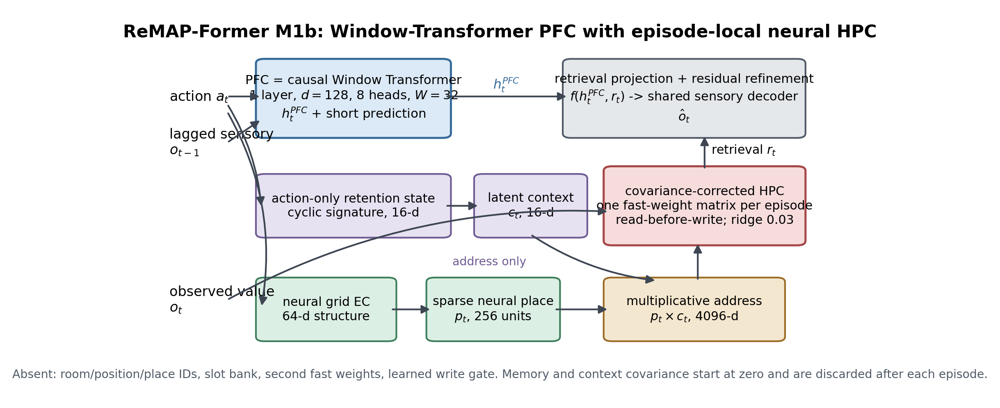
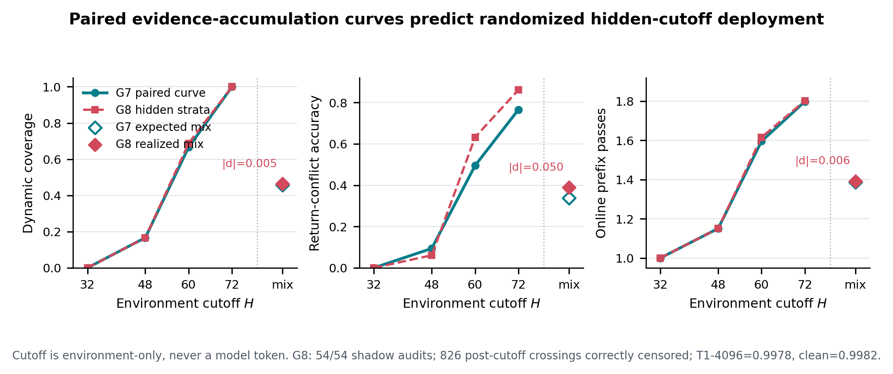

# ReMAP-Former：G8 论文证据包

> 本报告由冻结 JSON 自动生成。旧 P0/P5 release block 原样保留；本包不覆盖或改判历史 manifest。

## 一句话主张

正式 M1b 用 Window Transformer 作为 PFC 主干，以 action-history latent context 调制 neural place address，并调用一个 episode-local covariance fast-weight HPC。G7/G8 进一步证明：合法 retrieval evidence 尚未出现时保持 null，首次 crossing 后再调用 dynamic context；随机隐藏 cutoff 不需要 room、position 或 cutoff token。

## Figure 1：正式 M1b 架构

- PFC：1-layer causal Window Transformer，`d=128`、8 heads、window 32。
- EC/place：64-d neural grid EC -> 256-unit sparse place。
- Address：place x 16-d context -> 4096-d key。
- HPC：每 episode 从零建立一套 covariance-corrected fast weights，read-before-write，episode 后丢弃。
- 不存在：room/position/place ID、slot bank、第二套 fast weights、learned write gate。

## Figure 2：G7 曲线预测 G8 隐藏流

| 指标 | G7 预注册均匀混合 | G8 hidden realized | 绝对差 |
|---|---:|---:|---:|
| Dynamic coverage | 0.4583 | 0.4635 | 0.0052 |
| Return-conflict | 0.3385 | 0.3885 | 0.0499 |
| Online passes | 1.3864 | 1.3923 | 0.0059 |
| T1 strict 4096 | 0.9954 | 0.9978 | 未设误差门 |
| T2 clean | 0.9993 | 0.9982 | 未设误差门 |

G8 为 59/59 gates；shadow audit `54/54`，正确截断 `826` 个 H 后 crossing；online/fixed agreement `1.0`，最大 state/logit error `5.25e-06`。

## Table 1：统一冻结基线

| 模型 | 参数 | steps | T1 strict 4096 (95% CI) | T2 clean | T2 return-conflict (95% CI) |
|---|---:|---:|---:|---:|---:|
| Hippoformer | 1,494,447 | 600 | 0.3049 [0.1874, 0.4439] | 1.0000 | 0.0000 [0.0000, 0.0000] |
| Hippoformer HPC branch | 1,494,447 | 600 | N/A | 0.9868 | 0.0000 [0.0000, 0.0000] |
| M-delta | 1,388,257 | 600 | 0.9925 [0.9880, 0.9964] | 1.0000 | 0.0000 [0.0000, 0.0000] |
| Window Transformer | 1,280,960 | 1200 | N/A | 0.8953 | 0.0134 [0.0098, 0.0176] |
| Parameter-matched Transformer | 1,396,096 | 1200 | N/A | 0.8954 | 0.0122 [0.0089, 0.0159] |
| Titans-MAC adaptation | 1,344,260 | 1200 | N/A | 0.9234 | 0.0095 [0.0063, 0.0129] |
| ReMAP-Former M1b | 1,398,289 | 600 | 0.6736 [0.6461, 0.7024] | 0.9944 | 0.8376 [0.8221, 0.8527] |

边界：T1 4096 只评测了 Hippoformer、M-delta、M1b，其他行必须写 N/A；Transformer/Titans 使用 1200-step best-effort，不能写成完全预算匹配。Titans-MAC 是机制对齐的任务适配版，不是官方 checkpoint；Hippoformer HPC branch 是消融，不是官方 mmTEM。

## 不能隐藏的负结果

- Strict rollout 全曲线 H1：`False`。
- M1b-Hippo log-horizon AUC：`-0.0970`，95% CI `[-0.15441227864117898, -0.0439977950576672]`。
- M1b-Hippo 4096 endpoint：`+0.3688`，95% CI `[0.2288781101077431, 0.48358378056684415]`。
- 旧 P5 状态：`EVIDENCE_COMPLETE_RELEASE_BLOCKED`；P0 hashes match=`False`，release ready=`False`。
- 旧 mismatch 路径：`remap_former/pfc.py`。本包只披露，不重写旧 manifest。

## 当前论文口径

可以主张：在无 oracle 的 hidden-context re-entry 任务中，context-conditioned covariance HPC 显著解决所有健康基线失败的 return-conflict；paired horizon 曲线能够预测随机隐藏 cutoff 部署。

不能主张：通用 autonomous rollout 已解决、Titans/mmTEM 官方复现完成、任意 cutoff policy 均稳定、或旧 P0 release block 已解除。

## 产物

- 机器表：`runs/remap_former/paper_evidence_g8_tables.json`
- 增量 manifest：`runs/remap_former/paper_evidence_g8_manifest.json`
- 架构图：`reports/figures/remap_former_m1b_architecture_g8.png/.pdf`
- G7/G8 主图：`reports/figures/remap_former_g7_g8_hidden_cutoff.png/.pdf`
